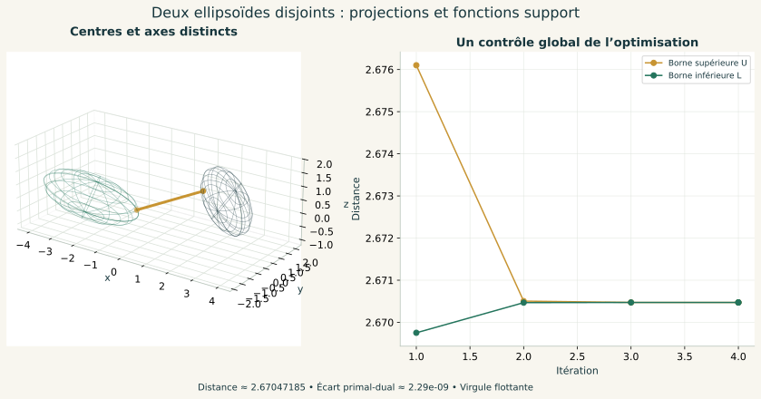

# Python-maths-CPGE

Des mathématiques de **maths sup et maths spé** à expérimenter avec Python :
cours, illustrations, manipulations et exercices corrigés.

Ce dépôt complète les ateliers de physique de
[Symfony-Physique-objets](https://github.com/ar742/Symfony-Physique-objets).
Quatre ateliers sont disponibles : **Rubik & Groupes**, **Optimisation & Distances**,
**Probabilités & Expériences** et **Calcul différentiel & Transformations**. Ils relient
groupes, extrema, modèles aléatoires, espaces tangents et intégrales.

| Volet | Lancement Windows | Programme et parcours |
| --- | --- | --- |
| 01 · Rubik & Groupes | `Lancer_Rubik.cmd` | [Guide](rubik_groupes/LISEZ_MOI.md) · [Parcours](PREMIER-PARCOURS.md) |
| 02 · Optimisation & Distances | `Lancer_Optimisation.cmd` | [Guide](optimisation_distances/LISEZ_MOI.md) · [Parcours](optimisation_distances/PARCOURS.md) · [Cours](optimisation_distances/COURS.md) |
| 03 · Probabilités & Expériences | `Lancer_Probabilites.cmd` | [Guide](probabilites_cpge/LISEZ_MOI.md) · [Parcours](probabilites_cpge/PARCOURS.md) · [Cours](probabilites_cpge/COURS.md) |
| 04 · Calcul différentiel & Transformations | `Lancer_Calcul_Differentiel.cmd` | [Guide](calcul_differentiel/LISEZ_MOI.md) · [Parcours](calcul_differentiel/PARCOURS.md) · [Cours](calcul_differentiel/COURS.md) |

## Volet 04 · Calcul différentiel & Transformations


**8 laboratoires, 14 leçons, 18 exercices corrigés et 8 figures autonomes**, avec
priorité aux **TP du recueil de A. R.**, aux **algèbres de Lie** et à l’**intégrale
gaussienne étendue** du TXT.

- **TP :** jacobiennes polaire, cylindrique et sphérique ; changement de variables sur une ellipse ; déterminant, inverse, quadratiques, Rayleigh et Newton.
- **Lie :** tangents de GL, SL et SO ; exponentielle, trace, rotations et crochet de commutateur.
- **Gaussienne étendue :** anisotropie et décentrage, formule exacte en dimension 2 à 8, dérivées donnant moyenne et covariance.
- **Méthodes :** différentielle, Taylor, Hessienne, classification corrigée des points critiques ; Green et contre-exemple de Fubini.

**Python 3.10+ et NumPy**. Double-cliquer sur `Lancer_Calcul_Differentiel.cmd`.
L’atelier fonctionne sur <http://127.0.0.1:8768>, hors ligne après installation.
**48 tests** confrontent les résultats à des références indépendantes et vérifient
le serveur local. Un TP symbolique facultatif utilise SymPy.
[Présentation, preuves et illustrations](calcul_differentiel/README.md).

## Volet 03 · Probabilités & Expériences


**6 laboratoires, 12 leçons, 16 exercices corrigés et 6 figures autonomes**, avec une
priorité aux **exercices 6, 7 et 8** de la fiche M12 du recueil de A. R.

- **Exercice 6 :** processus de polarisation, moyenne conservée, moments, concentration et limite Bernoulli.
- **Exercice 7 :** maximum/minimum uniformes, statistiques d’ordre, vitesse exponentielle et estimation d’une borne.
- **Exercice 8 :** loi arcsinus, spectre et modes propres d’un chemin ; Wigner, demi-cercle et moments de Catalan en approfondissement.
- Fondations : urnes avec/sans remise, dépendance, marche aléatoire, fréquences, grands nombres et Tchebychev.

**Python 3.10+ et NumPy**. Sous Windows, double-cliquer sur `Lancer_Probabilites.cmd`.
L’atelier fonctionne localement sur <http://127.0.0.1:8767>, hors ligne après installation.
Les expériences sont reproductibles et leurs résultats exportables.
[Présentation et illustrations](probabilites_cpge/README.md).

**39 tests** vérifient dénombrements, moments, lois limites, spectres et serveur local.
Les simulations accompagnent les preuves ; les extensions et les hypothèses sont explicites.

## Volet 02 · Optimisation & Distances



**5 laboratoires, 10 leçons, 14 exercices corrigés et 5 figures autonomes**, à partir
du TP d'approximation affine de cosinus, des exercices 4 et 6 du recueil de A. R.,
et du problème des matrices antisymétriques de déterminant 1.

- Cosinus : projection L², degrés et poids variables, meilleure droite uniforme, descente de gradient.
- Matrices : projection de Frobenius, dimension d'un sous-espace diagonalisable, distance exacte **√n** en dimension paire ; ensemble vide en dimension impaire.
- Ellipsoïde : maximum de \|xyz\|, boîte inscrite de volume maximal, produits pondérés.
- Point–ellipsoïde orienté : distances minimale et maximale à la surface, avec cas singuliers traités.
- Deux ellipsoïdes disjoints : distance des solides, contrôle par bornes inférieure et supérieure, plan à marge maximale et lien avec les SVM.

**Python 3.10+ et NumPy**. Sous Windows, double-cliquer sur `Lancer_Optimisation.cmd` ;
la première ouverture installe NumPy si nécessaire. L'atelier fonctionne ensuite hors ligne sur
<http://127.0.0.1:8766>. [Lancement sur tous systèmes et détails numériques](optimisation_distances/LISEZ_MOI.md).

**29 tests** vérifient les formules, les extrema globaux, les invariances, les bornes et le serveur.
Les bornes sont calculées en virgule flottante ; les conventions surface/solide sont explicites.

## Volet 01 · Rubik & Groupes


### Démarrer Rubik

Télécharger le dépôt avec **Code → Download ZIP**, puis extraire l'archive.
Python **3.10 ou plus récent** est requis ; le volet Rubik ne demande aucune bibliothèque
supplémentaire.

**Windows :** double-cliquer sur `Lancer_Rubik.cmd` à la racine du dossier.

**Windows, Linux ou macOS, dans un terminal :**

```console
git clone https://github.com/ar742/Python-maths-CPGE.git
cd Python-maths-CPGE/rubik_groupes
python rubik_groupes.py
```

Sur Linux et macOS, la commande peut être `python3` selon l'installation.
L'application s'ouvre à l'adresse <http://127.0.0.1:8765>.
Garder le terminal ouvert ; **Ctrl+C** arrête le programme.

GitHub présente les sources et la documentation. Le laboratoire fonctionne sur
votre ordinateur, avec un serveur Python local. Ouvrir le fichier HTML seul
ne démarre pas les calculs.

[Guide du premier parcours](PREMIER-PARCOURS.md) ·
[Documentation complète](rubik_groupes/LISEZ_MOI.md)

## Rubik & Groupes

| Espace | Ce que l'on peut explorer |
| --- | --- |
| Cours & cube | Dix leçons illustrées : groupes, générateurs, inverses, permutations, ordre, commutateurs, conjugaison, invariants, actions et sous-groupes. |
| Laboratoire | Comparer AB et BA, lire les cycles, calculer un ordre exact et observer les pièces déplacées. |
| Résolution | Mélanger, importer une configuration, vérifier sa légalité et jouer une solution geste par geste. |
| Exercices | Douze problèmes progressifs avec corrections et expériences à manipuler. |

Le cube se manipule en trois dimensions ; son patron montre les six faces.
Les permutations et les orientations sont calculées en Python à partir de
rotations géométriques exactes. Les actions de groupes et produits semi-directs
sont proposés en approfondissement selon la filière.

### Des mathématiques aux algorithmes

- **Inverses :** résoudre un mélange connu en inversant le mot des mouvements.
- **Commutateurs et conjugaison :** construire des opérations ciblées, comme un
  cycle de trois coins, et déplacer leur zone d'action.
- **Invariants :** détecter les configurations impossibles par les orientations
  des coins et arêtes et la parité des permutations.
- **Graphe de Cayley :** rechercher une solution minimale jusqu'à six mouvements
  HTM par exploration bidirectionnelle. Un demi-tour compte ici pour un mouvement.
- **Sous-groupes :** comprendre la résolution à deux phases ; un solveur général
  externe peut être installé en option.

Un mot se lit dans l'ordre chronologique : `R U` signifie R, puis U.
La recherche courte a une borne et une limite de temps ; l'inverse d'un historique
et la méthode à deux phases ne garantissent pas une solution minimale globale.
Les conventions et limites sont détaillées dans la documentation.

### Solveur général facultatif

Depuis le dossier `rubik_groupes`, avec le même Python que pour le lancement :

```console
python -m pip install -r requirements-optionnels.txt
```

Redémarrer ensuite l'application. Le module externe
[kociemba](https://github.com/muodov/kociemba), sous licence GPL-2.0, est une
dépendance facultative. Le cours, les illustrations et la recherche courte
fonctionnent sans lui.

## Illustrations


Les [schémas SVG](rubik_groupes/illustrations) peuvent être ouverts séparément
et utilisés pour accompagner un cours. Pour les régénérer :

```console
cd rubik_groupes
python rubik_groupes.py --export-illustrations
```

## Vérifier et étudier le code

```console
cd rubik_groupes
python -m unittest -v test_cube
```

La suite contient **23 tests** : mouvements et références indépendantes,
invariants, imports, ordres, commutateurs, recherche et fonctionnement du serveur.
Les vérifications automatiques du dépôt les exécutent sous Windows et Linux.

| Fichier | Rôle |
| --- | --- |
| [cube.py](rubik_groupes/cube.py) | Moteur mathématique et recherches de solutions. |
| [cours.py](rubik_groupes/cours.py) | Leçons, expériences et exercices corrigés. |
| [rubik_groupes.py](rubik_groupes/rubik_groupes.py) | Serveur local et commandes de lancement. |
| [illustrations.py](rubik_groupes/illustrations.py) | Génération des figures SVG. |
| [test_cube.py](rubik_groupes/test_cube.py) | Vérifications des calculs et de l'application. |

Les principales références sont le cours de
[Janet Chen](https://people.math.harvard.edu/~jjchen/docs/Group%20Theory%20and%20the%20Rubik%27s%20Cube.pdf)
et les explications d'[Herbert Kociemba](https://kociemba.org/math/twophase.htm).
