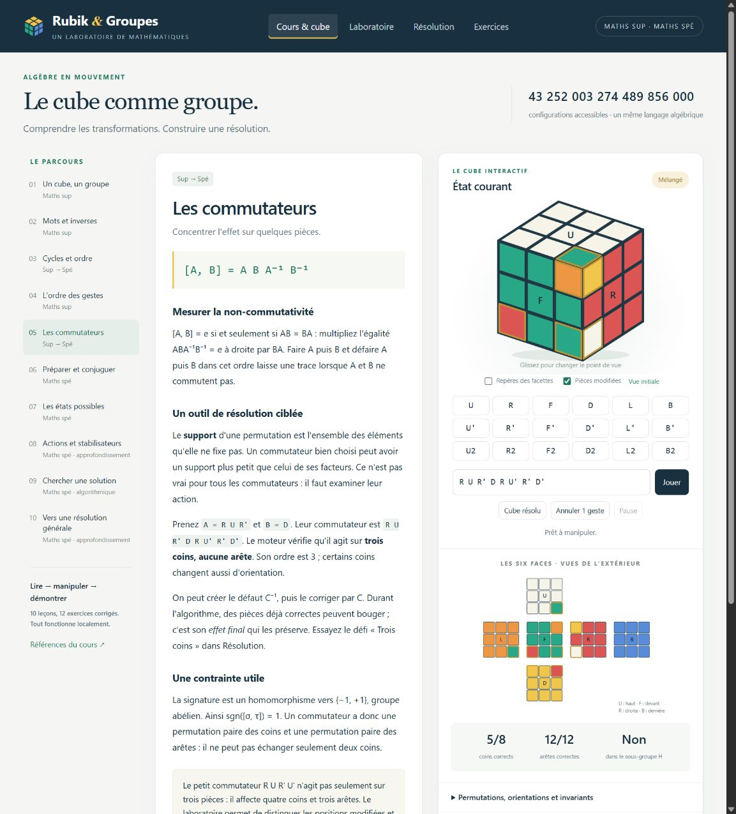
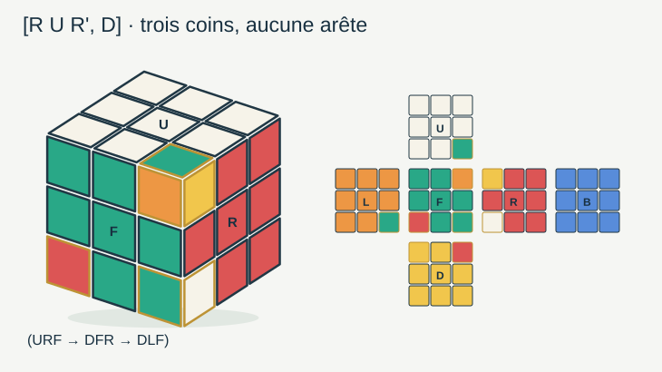

# Python-maths-CPGE

Des mathématiques de **maths sup et maths spé** à expérimenter avec Python :
cours, illustrations, manipulations et exercices corrigés.

Ce dépôt complète les ateliers de physique de
[Symfony-Physique-objets](https://github.com/ar742/Symfony-Physique-objets).
Le premier atelier est **Rubik & Groupes**, consacré à la théorie des groupes
et à son application à la résolution du Rubik's Cube 3×3.



## Démarrer

Télécharger le dépôt avec **Code → Download ZIP**, puis extraire l'archive.
Python **3.10 ou plus récent** est requis ; le cours ne demande aucune bibliothèque
supplémentaire.

**Windows :** double-cliquer sur `Lancer_Rubik.cmd` à la racine du dossier.

**Windows, Linux ou macOS, dans un terminal :**

```console
git clone https://github.com/ar742/Python-maths-CPGE.git
cd Python-maths-CPGE/rubik_groupes
python rubik_groupes.py
```

Sur Linux et macOS, la commande peut être `python3` selon l'installation.
L'application s'ouvre à l'adresse <http://127.0.0.1:8765>.
Garder le terminal ouvert ; **Ctrl+C** arrête le programme.

GitHub présente les sources et la documentation. Le laboratoire fonctionne sur
votre ordinateur, avec un serveur Python local. Ouvrir le fichier HTML seul
ne démarre pas les calculs.

[Guide du premier parcours](PREMIER-PARCOURS.md) ·
[Documentation complète](rubik_groupes/LISEZ_MOI.md)

## Rubik & Groupes

| Espace | Ce que l'on peut explorer |
| --- | --- |
| Cours & cube | Dix leçons illustrées : groupes, générateurs, inverses, permutations, ordre, commutateurs, conjugaison, invariants, actions et sous-groupes. |
| Laboratoire | Comparer AB et BA, lire les cycles, calculer un ordre exact et observer les pièces déplacées. |
| Résolution | Mélanger, importer une configuration, vérifier sa légalité et jouer une solution geste par geste. |
| Exercices | Douze problèmes progressifs avec corrections et expériences à manipuler. |

Le cube se manipule en trois dimensions ; son patron montre les six faces.
Les permutations et les orientations sont calculées en Python à partir de
rotations géométriques exactes. Les actions de groupes et produits semi-directs
sont proposés en approfondissement selon la filière.

### Des mathématiques aux algorithmes

- **Inverses :** résoudre un mélange connu en inversant le mot des mouvements.
- **Commutateurs et conjugaison :** construire des opérations ciblées, comme un
  cycle de trois coins, et déplacer leur zone d'action.
- **Invariants :** détecter les configurations impossibles par les orientations
  des coins et arêtes et la parité des permutations.
- **Graphe de Cayley :** rechercher une solution minimale jusqu'à six mouvements
  HTM par exploration bidirectionnelle. Un demi-tour compte ici pour un mouvement.
- **Sous-groupes :** comprendre la résolution à deux phases ; un solveur général
  externe peut être installé en option.

Un mot se lit dans l'ordre chronologique : `R U` signifie R, puis U.
La recherche courte a une borne et une limite de temps ; l'inverse d'un historique
et la méthode à deux phases ne garantissent pas une solution minimale globale.
Les conventions et limites sont détaillées dans la documentation.

### Solveur général facultatif

Depuis le dossier `rubik_groupes`, avec le même Python que pour le lancement :

```console
python -m pip install -r requirements-optionnels.txt
```

Redémarrer ensuite l'application. Le module externe
[kociemba](https://github.com/muodov/kociemba), sous licence GPL-2.0, est une
dépendance facultative. Le cours, les illustrations et la recherche courte
fonctionnent sans lui.

## Illustrations



Les [schémas SVG](rubik_groupes/illustrations) peuvent être ouverts séparément
et utilisés pour accompagner un cours. Pour les régénérer :

```console
cd rubik_groupes
python rubik_groupes.py --export-illustrations
```

## Vérifier et étudier le code

```console
cd rubik_groupes
python -m unittest -v test_cube
```

La suite contient **23 tests** : mouvements et références indépendantes,
invariants, imports, ordres, commutateurs, recherche et fonctionnement du serveur.
Les vérifications automatiques du dépôt les exécutent sous Windows et Linux.

| Fichier | Rôle |
| --- | --- |
| [cube.py](rubik_groupes/cube.py) | Moteur mathématique et recherches de solutions. |
| [cours.py](rubik_groupes/cours.py) | Leçons, expériences et exercices corrigés. |
| [rubik_groupes.py](rubik_groupes/rubik_groupes.py) | Serveur local et commandes de lancement. |
| [illustrations.py](rubik_groupes/illustrations.py) | Génération des figures SVG. |
| [test_cube.py](rubik_groupes/test_cube.py) | Vérifications des calculs et de l'application. |

Les principales références sont le cours de
[Janet Chen](https://people.math.harvard.edu/~jjchen/docs/Group%20Theory%20and%20the%20Rubik%27s%20Cube.pdf)
et les explications d'[Herbert Kociemba](https://kociemba.org/math/twophase.htm).
