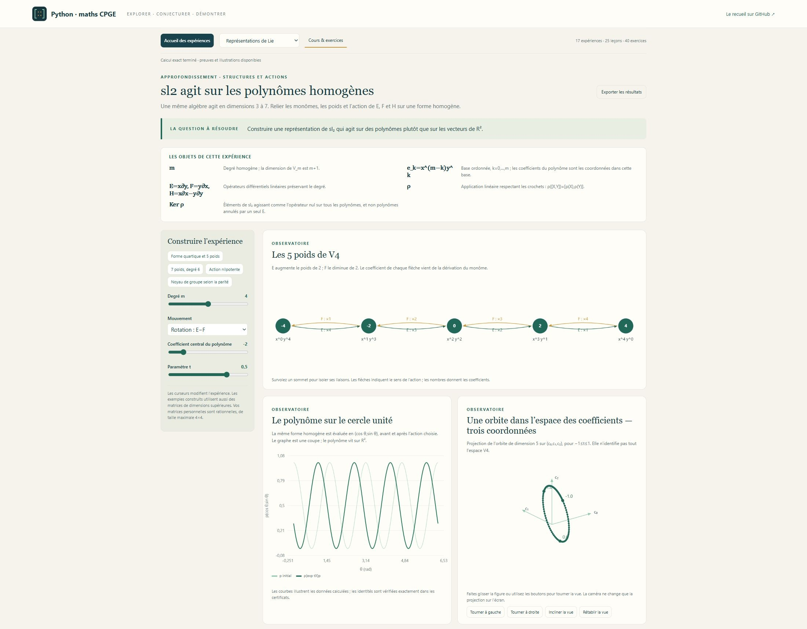

# Algèbre & Réductions — voir l’algèbre agir

**Cinquième volet de mathématiques**, atelier **07** de [Python-maths-CPGE](../README.md).

**17 expériences, 25 leçons, 40 exercices corrigés et dix missions progressives**, à partir des TP des fiches M13–M15 du recueil de **A. R.** (pages imprimées 124–155). Les extensions sont signalées selon la filière. Les méthodes de calcul accompagnent des questions de géométrie, de dynamique et de structure.


## Des problèmes pour choisir les bons invariants

- **Deux matrices denses 6×6 ont le même polynôme caractéristique.** Ont-elles la même forme de Jordan, le même polynôme minimal, les mêmes facteurs invariants ? Lire les chaînes et les noyaux, puis produire les certificats exacts.
- **Un réseau possède un pont fragile.** Relier sa diffusion lente à la deuxième valeur propre du Laplacien ; couper le pont, compter les composantes par le noyau et les arbres par un cofacteur.
- **Une loi stationnaire circule entre six états.** Distinguer stationnarité, convergence et réversibilité ; animer la distribution et identifier des courants à l’équilibre.
- **Deux ou trois oscillateurs sont couplés.** Construire leur Hamiltonien dans l’espace de phase, comparer Cayley à Euler, vérifier la conservation de la forme symplectique et comprendre pourquoi `det M=1` ne suffit pas.
- **Une algèbre agit sur des polynômes homogènes.** Faire varier le degré de 2 à 6, voir les poids et les flèches de E et F, vérifier les relations de sl₂ et comprendre ce qu’est une représentation.
- **Les trois termes de Jacobi sont non nuls.** Voir leur compensation, développer les douze mots et justifier que l’action ad est un morphisme d’algèbres de Lie.
- **Un déterminant antisymétrique est un carré.** Parcourir les 15 ou 105 appariements d’une matrice dense, suivre les signes, puis relier congruence, pfaffien et géométrie symplectique.

Chaque expérience commence par **son but et son lien avec le cours** : les techniques à réinvestir, le résultat attendu et des repères **sup, spé et au-delà**. Des boutons ouvrent directement les leçons utiles ; un premier parcours en trois gestes aide à passer de l'observation à une justification. Les repères distinguent les acquis à utiliser des notions nouvelles, avec les différences de filière précisées lorsqu'elles comptent.

Le TP définit ensuite ses variables, explique comment lire la figure et propose des étapes de preuve. Les matrices et certificats se déplient séparément. Les exemples préconstruits atteignent les dimensions 6 à 8 ; les représentations de degré 6 agissent en dimension 7.




## Ouvrir et explorer

Sous Windows, double-cliquer sur **Lancer_Algebre_Lineaire.cmd** à la racine du dépôt. **Python 3.10+, NumPy et SymPy** sont requis ; le lanceur installe les bibliothèques si nécessaire. Le navigateur ouvre <http://127.0.0.1:8771>. Après installation, l’atelier fonctionne hors ligne.

Sur Windows, Linux ou macOS :

```sh
cd algebre_lineaire
python -m pip install -r requirements.txt
python algebre_lineaire.py
```

Selon le système, utiliser `python3`. Garder le terminal ouvert ; `Ctrl+C` arrête le programme. Pour un autre port : `python algebre_lineaire.py --port 8773`.

[Guide de lancement](LISEZ_MOI.md) · [Dix missions](PARCOURS.md) · [Cours et corrections](COURS.md)

Depuis l’accueil, choisir une question ou utiliser le menu **Explorer un laboratoire**. Faire glisser les vues 3D pour tourner la caméra ; survoler les sommets pour isoler leurs liaisons ; parcourir ou animer les étapes d’un réseau ; faire varier les appariements du pfaffien. **Exporter les résultats** conserve les paramètres et le calcul validé dans un fichier JSON reproductible.

## Les dix-sept laboratoires

| Expérience | Problème et construction |
| --- | --- |
| **GLₙ & Anneaux — TP** | Matrice dense 4×4 sur ℚ, ℤ et ℤ/mℤ ; unités, adjugée, inverse entier ou modulaire, cardinal de GLₙ(Fₚ). |
| **GL₃ & Géométrie — TP** | Cube et parallélépipèdes dans une vue 3D orientable ; volume, orientation, composition AB/BA et perte de dimension. |
| **Groupes & Algèbres de Lie — TP** | Rotations d’axes obliques dans so₃, générateurs denses de sp₄, crochet et commutateur de groupe à petit pas. |
| **Identité de Jacobi** | Trois doubles crochets non nuls, développement en douze mots, produit vectoriel et action ad. |
| **Représentations de Lie** | sl₂ sur Vₘ, espace des polynômes homogènes de degré m ; E=x∂y, F=y∂x, H=x∂x−y∂y, diagramme des poids et action sur une forme. |
| **Mécanique symplectique** | Sp₄/Sp₆, Hamiltonien de modes couplés, transformation canonique, Cayley/Euler, invariants et contre-exemple de volume conservé. |
| **Gauss & Systèmes — TP** | Système 4×4 dépendant ; rang, noyau, image, compatibilité et espace affine de solutions, avec opérations exactes. |
| **Spectre & Jordan — TP** | Matrices denses 6×6 avec chaînes 4+2 ou 3+2+1 ; noyaux successifs, multiplicités et rôle du corps. |
| **Dunford — TP** | Matrice dense 6×6 et TP rationnel 3×3 ; Newton polynomial, partie semi-simple, nilpotence, commutation et dynamique. |
| **Vecteurs cycliques — TP** | Matrice de Krylov et récurrence en dimension 6 ; témoin cyclique, mauvais départ, compagnon et commutant. |
| **Frobenius — TP** | Deux matrices de même χ mais de facteurs invariants différents ; classification rationnelle, divisibilité, compagnon et μ. |
| **Cayley & Traces — TP** | Dense 6×6 et Vandermonde 4×4 du recueil ; Newton/Faddeev, χ(A)=0, grandes puissances et inverse. |
| **Pfaffien — TP** | Matrices alternées denses 6×6 et 8×8 ; appariements signés, dégénérescence et loi de congruence. |
| **Projecteurs** | Bézout, composantes primaires, décomposition d’un vecteur et projection oblique. |
| **Formes quadratiques** | Congruence et inertie ; niveaux, isotropie, dégénérescence et comparaison avec la similitude. |
| **Chaînes de Markov** | Six états et pont réglable ; distributions animées, spectre, classes fermées, mesure stationnaire et équilibre détaillé. |
| **Réseaux & Laplacien** | Six ou huit sommets ; incidence, énergie de Dirichlet, noyau, diffusion, Fiedler et arbres couvrants pondérés. |

## Exactitude, corps et conventions

Les entrées matricielles personnelles acceptent les rationnels, y compris les décimaux exacts : les lignes se séparent par `;`, les coefficients par des espaces. Elles sont limitées à **4 lignes et 4 colonnes** pour maintenir des calculs symboliques réactifs. Les exemples de dimensions supérieures sont construits par le programme. Les lois de Markov et signaux de réseau possèdent leurs propres entrées vectorielles bornées.

Les déterminants, rangs, polynômes, inverses, identités de Jacobi et certificats symplectiques sont calculés **exactement avec SymPy**. Les exponentielles, courbes, valeurs propres de diffusion et trajectoires utilisent des approximations numériques explicitement signalées. La caméra 3D ne change que la projection d’une figure.

- Sur un anneau commutatif unitaire, le déterminant doit être une **unité**, pas simplement non nul.
- Jordan exige le spectre scindé. Frobenius reste sur le corps de départ. La partie D de Dunford est semi-simple ; sa diagonalisation sur ce corps demande une hypothèse supplémentaire.
- Un endomorphisme cyclique possède **au moins un** vecteur cyclique ; un vecteur propre peut être un mauvais départ.
- Une similitude `P⁻¹AP`, une congruence `PᵀAP` et des opérations de Gauss `EA` n’ont pas le même sens.
- Dans l’espace de phase, les coordonnées sont ordonnées `(q₁,…,qₙ,p₁,…,pₙ)` et `J=[[0,I],[-I,0]]`. Les pulsations et temps des expériences mécaniques sont réduits, les masses unitaires.
- Une représentation de Lie est un morphisme vers End(V) muni du crochet ; Vₘ est homogène de degré m, et ne désigne pas les seuls polynômes invariants sous l’échange x↔y.
- Markov utilise des probabilités en **colonne** : `pₖ₊₁=M pₖ`, `Mᵢⱼ=P(j→i)`. Un graphe non connexe peut avoir plusieurs lois stationnaires.
- Les traces avec division par k et la construction de Dunford présentée sont en caractéristique zéro. Le signe du pfaffien dépend de l’ordre de la base ; la loi de congruence reste vraie pour un changement de base singulier.

## Figures et vérifications

Les **19 [illustrations scientifiques SVG](illustrations/README.md)** sont autonomes et réutilisables. Pour les régénérer :

```sh
python -m pip install -r requirements-illustrations.txt
python algebre_lineaire.py --export-illustrations
```

Matplotlib est facultatif pour utiliser l’application. Le cours autonome se régénère avec `python export_cours.py`.

```sh
python -X utf8 -m unittest -v test_modeles test_reductions test_structures test_applications test_interface test_serveur
```

Les **128 tests** comparent les résultats à des références indépendantes : produits exacts, changements de base construits, polynômes, dénombrements, identités de représentations, conservation hamiltonienne, lois stationnaires et arbres couvrants. Les contrôles vérifient aussi chaque exemple visible, la reproduction des exports, les descriptions des objets et les données des scènes. GitHub les exécute sous Windows et Linux avec Python 3.10 et 3.12.

Les sources primaires figurent dans [le cours](COURS.md). Le PDF personnel n’est pas publié.

| Fichier | Rôle |
| --- | --- |
| [calculs_exacts.py](calculs_exacts.py), [modeles.py](modeles.py) | Rationnels, anneaux, groupes, formes et orchestration. |
| [reductions.py](reductions.py) | Jordan, Dunford, Frobenius, Krylov, traces et puissances. |
| [structures.py](structures.py) | Jacobi, représentations et mécanique symplectique. |
| [applications.py](applications.py) | Chaînes de Markov, diffusion et Laplaciens. |
| [explorations.js](explorations.js) | Caméra 3D, graphes, chronologie et scènes pédagogiques. |
| [cours.py](cours.py) | Définitions, exemples résolus et exercices corrigés. |
| [reperes.py](reperes.py) | Buts des TP, techniques du cours, progression sup/spé/au-delà et premiers gestes. |
| [algebre_lineaire.py](algebre_lineaire.py) | Serveur local et lancement. |
