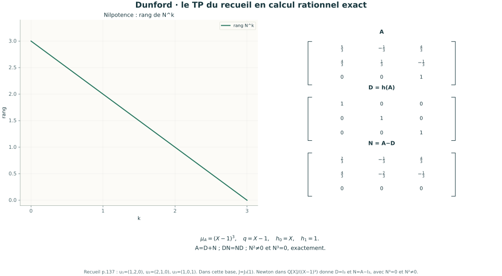
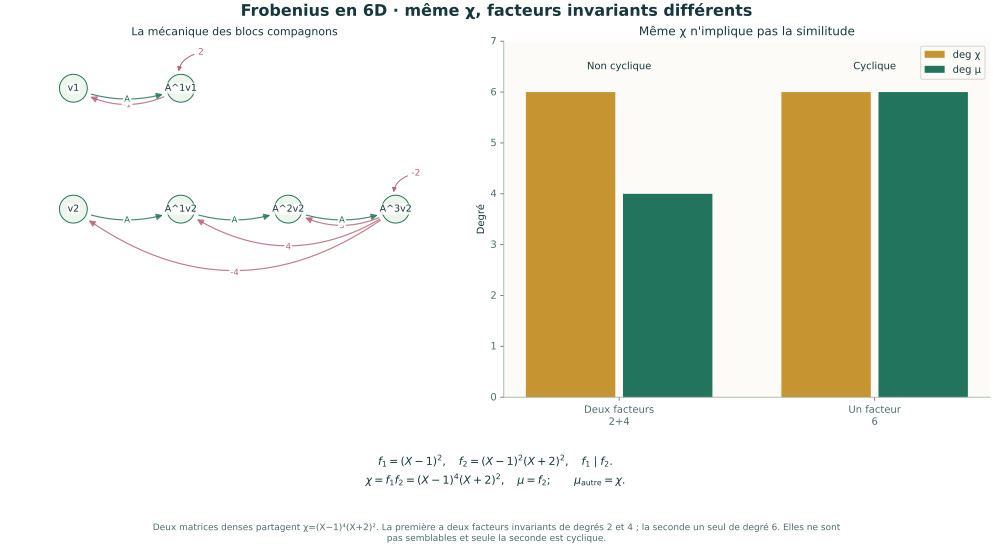
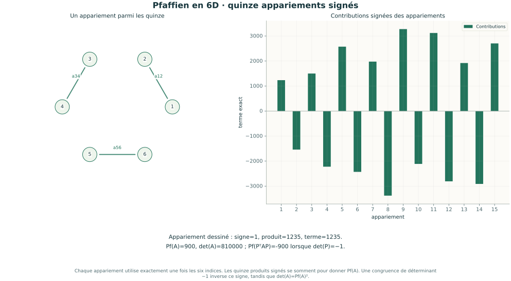

# Algèbre & Réductions

**Cinquième volet de mathématiques**, atelier **07** de [Python-maths-CPGE](../README.md) : **12 laboratoires interactifs, 20 leçons, 30 exercices corrigés, 8 séances et 12 illustrations scientifiques** pour les étudiants de maths sup et maths spé.

Le parcours suit les fiches M13 à M15 du recueil de **A. R.**, pages imprimées 124–155, avec priorité aux **TP** : groupes linéaires, matrices sur un anneau, algèbres de Lie, réduction, endomorphismes cycliques, Cayley–Hamilton, traces et pfaffien. Gauss, Bézout, les projections et les formes quadratiques complètent les techniques de raisonnement. Frobenius, Jordan, Lie et pfaffien disposent d’un accompagnement en approfondissement, selon la filière.


## Ouvrir l’atelier

Sous Windows, double-cliquer sur **Lancer_Algebre_Lineaire.cmd** à la racine du dépôt. **Python 3.10+** est requis ; le lanceur installe NumPy et SymPy si nécessaire. Le navigateur ouvre <http://127.0.0.1:8771>. L’atelier fonctionne hors ligne après installation.

Sur Windows, Linux ou macOS :

```sh
cd algebre_lineaire
python -m pip install -r requirements.txt
python algebre_lineaire.py
```

Garder le terminal ouvert ; `Ctrl+C` arrête le programme. Selon le système, utiliser `python3`. Pour changer de port : `python algebre_lineaire.py --port 8773`. GitHub présente les sources et le cours ; ouvrir le HTML seul ne démarre pas les calculs Python.

[Guide de lancement](LISEZ_MOI.md) · [Parcours en huit séances](PARCOURS.md) · [Cours et corrections](COURS.md) · [Clarifications du recueil](ERRATA.md)

## Les douze laboratoires

| Laboratoire | Manipulations et compétences |
| --- | --- |
| **GL & Anneaux — TP** | Tester `U∈GLₙ(A) ⇔ det(U)∈A*` sur ℚ, ℤ et ℤ/mℤ ; inverse par l’adjugée, unités, cardinal de GLₙ(Fₚ) et théorème chinois. |
| **GL₂ & Géométrie — TP** | Composer des cisaillements et dilatations ; aire, orientation, singularité et non-commutativité de AB et BA. |
| **Algèbres de Lie — TP** | gl₂, sl₂, so₃ et sp₄ ; commutateurs, Jacobi, exponentielles et commutateur de groupe à petit pas. |
| **Gauss & Systèmes — TP** | Saisir une matrice et un second membre ; suivre les pivots rationnels, trouver rang, noyau, image et solutions ou incompatibilité. |
| **Spectre & Jordan — TP** | Choisir ℚ, ℝ ou ℂ ; multiplicité algébrique/géométrique, noyaux généralisés, tailles des blocs et certificats de réduction. |
| **Dunford — TP** | Reprendre la matrice rationnelle 3×3 du recueil ; construire D et N par polynômes, vérifier A=D+N, DN=ND et la nilpotence. |
| **Vecteurs cycliques — TP** | Construire la matrice de Krylov ; comparer un témoin cyclique à un mauvais départ et obtenir un compagnon. |
| **Frobenius — TP** | Facteurs invariants sur ℚ[X], chaîne de divisibilité, blocs compagnons, polynôme minimal et caractéristique. |
| **Cayley & Traces — TP** | Reprendre la Vandermonde 4×4 du recueil ; Newton et Faddeev–LeVerrier, χ(A)=0, division polynomiale pour Aᵏ et inverse. |
| **Pfaffien — TP** | Matrices antisymétriques 4×4, 6×6 ou 8×8 ; signes des appariements, det(A)=Pf(A)² et Pf(PᵀAP)=det(P)Pf(A), même pour P singulière. |
| **Projecteurs** | Bézout et composantes primaires ; orthogonalité des projecteurs spectraux au sens algébrique, somme directe et projection oblique. |
| **Formes quadratiques** | Congruence, signature et inertie de Sylvester ; ellipses, hyperboles, dégénérescence et vecteurs isotropes. |

Des expériences préréglées facilitent les comparaisons. Les flèches du panneau **Suivre la construction** parcourent les étapes des calculs. Les curseurs recalculent les figures ; les données textuelles s’appliquent avec **Appliquer les données**. **Exporter les résultats** enregistre les paramètres et l’ensemble du calcul validé au format JSON.

## Calcul exact et illustration

Les entrées personnelles acceptent les entiers, fractions et décimaux rationnels : `1 2/3 ; 0 1`. Les lignes sont séparées par un point-virgule ou un retour à la ligne ; un tableau JSON est aussi accepté. Les matrices saisies sont limitées à **4 lignes et 4 colonnes** ; la réduction exige une matrice carrée. Pour un vecteur : `1;2;3`. Le zéro et les matrices singulières ont leur place dans les expériences.

Les déterminants, rangs, inverses, polynômes et égalités matricielles sont vérifiés **exactement avec SymPy**. Les coefficients rationnels sont conservés. Les tracés du spectre, transformations géométriques et exponentielles de Lie utilisent des approximations décimales **pour l’illustration**. Une tolérance numérique ne sert pas à décider la taille d’un bloc de Jordan.

- Dans un anneau commutatif unitaire, « déterminant non nul » est insuffisant : il doit être **inversible**. Les divisions modulaires sont réservées aux unités.
- **Cyclicité : il existe un vecteur cyclique.** Tous les vecteurs non nuls ne sont pas nécessairement cycliques.
- **Frobenius** est une réduction sur le corps de départ. **Jordan** demande que le polynôme caractéristique soit scindé. Sur ℚ ou ℝ, Dunford s’écrit avec une partie **semi-simple**, qui devient diagonalisable sur un corps de décomposition ; la formulation avec D diagonalisable sur le corps de départ exige le spectre scindé.
- **Gauss** effectue des opérations inversibles sur les équations. La similitude `P⁻¹AP` représente le même endomorphisme ; la congruence `PᵀAP` représente la même forme bilinéaire.
- Les identités de Newton avec division par k sont utilisées en caractéristique zéro. Le pfaffien utilise l’ordre de base indiqué.

Le parcours signale les points à préciser dans le PDF et donne les formulations et preuves correspondantes dans [ERRATA.md](ERRATA.md). Pour des polynômes irréductibles de degré 3 ou 4, les invariants et multiplicités restent certifiés exactement ; les racines algébriques et leurs approximations remplacent une base de Jordan explicite trop volumineuse.

## Illustrations autonomes







Les [douze figures SVG](illustrations/README.md) sont réutilisables pour accompagner un cours. Elles sont produites par Matplotlib à partir des modèles de l’atelier. Pour les régénérer :

```sh
python -m pip install -r requirements-illustrations.txt
python algebre_lineaire.py --export-illustrations
```

Matplotlib est facultatif pour l’application. Le cours autonome se régénère avec `python export_cours.py`.

## Vérifications et sources

```sh
python -X utf8 -m unittest -v test_modeles test_reductions test_serveur
```

**75 tests**, dont 68 vérifications mathématiques, confrontent les calculs à des résultats indépendants : dénombrements exhaustifs de petits groupes linéaires, produits et inverses exacts, élimination de Gauss, identités de Lie, appariements du pfaffien, bases construites de réduction, Smith versus relations linéaires, Newton/Faddeev versus déterminant, puissances et inverses. Sept tests supplémentaires vérifient le serveur et les exports. Les contrôles automatiques couvrent Windows et Linux avec Python 3.10 et 3.12.

Les références primaires MIT, universitaires et SymPy sont détaillées dans [le cours](COURS.md). L’extrait personnel du recueil sert de fil conducteur ; les fichiers publics contiennent le programme, le parcours et les illustrations.

| Fichier | Rôle |
| --- | --- |
| [calculs_exacts.py](calculs_exacts.py) | Lecture des rationnels, pivots, polynômes matriciels et facteurs invariants. |
| [modeles.py](modeles.py) | Anneaux, GL, Lie, Gauss, pfaffien, projecteurs et formes quadratiques. |
| [reductions.py](reductions.py) | Spectre, Jordan, Dunford, cyclicité, Frobenius et Cayley–Hamilton. |
| [cours.py](cours.py) | Leçons, preuves et exercices interactifs. |
| [algebre_lineaire.py](algebre_lineaire.py) | Serveur local et commandes de lancement. |
| [illustrations.py](illustrations.py) | Figures scientifiques SVG. |
| [test_modeles.py](test_modeles.py), [test_reductions.py](test_reductions.py), [test_serveur.py](test_serveur.py) | Vérifications indépendantes. |
