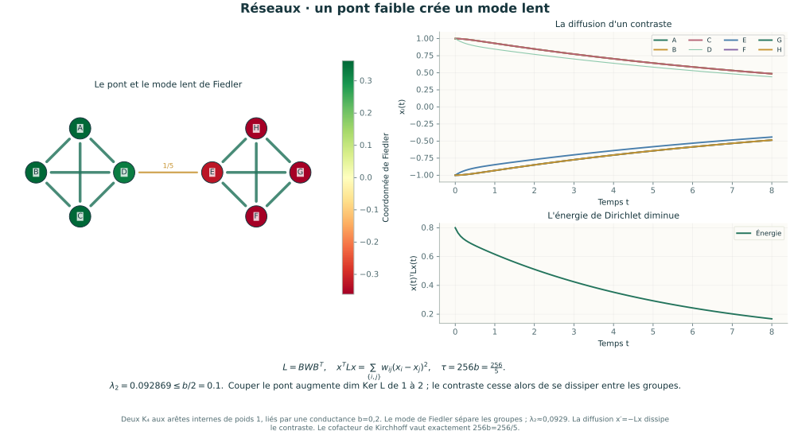
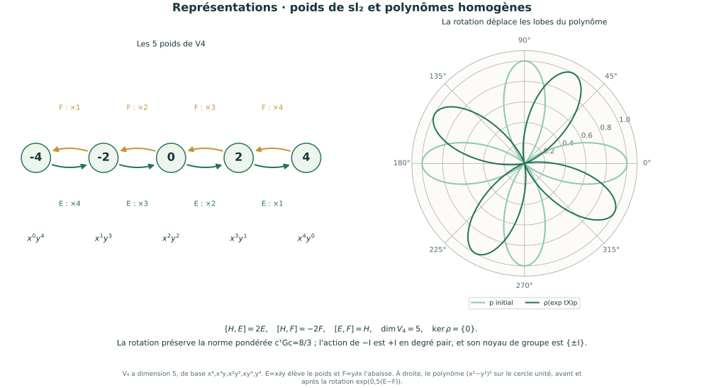
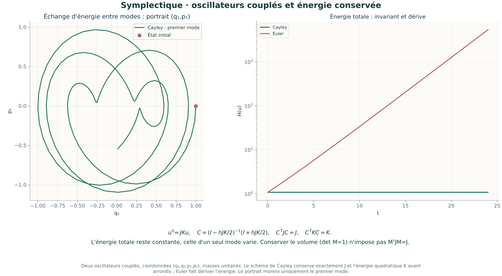
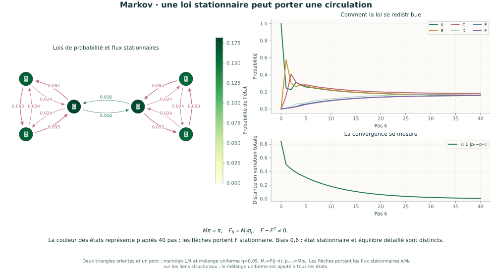

# Dix-neuf illustrations d’Algèbre & Réductions

Figures scientifiques SVG autonomes, calculées à partir des dix-sept laboratoires. Les matrices rationnelles, les polynômes et les certificats sont exacts ; les trajectoires, couleurs et coordonnées de tracé sont numériques lorsque cela est indiqué. Les deux TP historiques conservent leurs figures propres.

| Figure | Point de départ |
| --- | --- |
| [GL et anneaux](anneaux.svg) | Matrice dense 4×4 ; multiplication par son déterminant modulo 6. |
| [Composition géométrique](geometrie.svg) | Deux vues 3D du cube ; volume orienté et AB ≠ BA. |
| [Algèbres de Lie](lie.svg) | Crochet, exponentielles et petit commutateur. |
| [Gauss](gauss.svg) | Quatre équations couplées, redondance et une direction libre. |
| [Spectre et Jordan](spectre.svg) | Matrices denses 6×6 ; même χ et chaînes 4+2 ou 3+2+1. |
| [Dunford](dunford.svg) | Trois valeurs propres en 6D ; D multiplie, N descend les chaînes. |
| [Vecteur cyclique](cyclique.svg) | Diagramme compagnon 6D, suite récurrente et rang de Krylov. |
| [Frobenius](frobenius.svg) | Même χ en 6D, deux facteurs ou un seul ; μ distingue les similitudes. |
| [Cayley et traces](cayley.svg) | Coefficients des restes de puissances et traces exactes en 6D. |
| [Pfaffien](pfaffien.svg) | Quinze appariements signés en dimension 6. |
| [Projecteurs](projecteurs.svg) | Somme directe et projection oblique. |
| [Formes quadratiques](quadratiques.svg) | Relief 3D, selle et deux directions isotropes. |
| [Jacobi](jacobi.svg) | Triangle fermé de trois contributions non nulles dans so₃. |
| [Représentations](representations.svg) | Cinq poids de sl₂, flèches E/F et lobes d’un polynôme homogène. |
| [Dynamique symplectique](symplectique.svg) | Oscillateurs couplés ; portrait de phase et énergie Cayley/Euler. |
| [Chaîne de Markov](markov.svg) | Six états, flux stationnaires, distribution temporelle et distance à la limite. |
| [Réseaux et Laplacien](reseaux.svg) | Deux K₄, mode de Fiedler, pont pondéré et diffusion d’un contraste. |
| [TP Dunford](dunford_tp.svg) | Matrice rationnelle du recueil, Newton et nilpotence d’ordre 3. |
| [TP Cayley–Hamilton](cayley_tp.svg) | Vandermonde 4×4 du recueil, tr A=137 et det A=48. |

Pour les régénérer depuis le dossier `algebre_lineaire` :

```sh
python -m pip install -r requirements-illustrations.txt
python algebre_lineaire.py --export-illustrations
```

[Retour au parcours](../PARCOURS.md) · [Cours et corrigés](../COURS.md)








