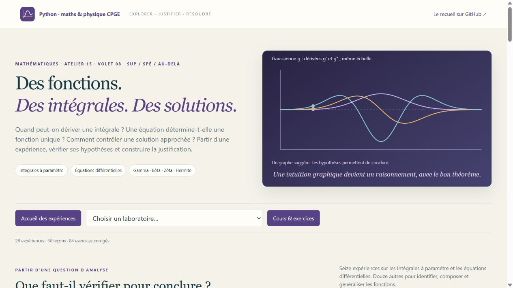

# Fonctions & Équations · Atelier 15 · Mathématiques, volet 08

**28 laboratoires interactifs, 56 leçons, 84 exercices corrigés et 28 figures scientifiques.**
L’atelier prolonge les pages du recueil de A. R. consacrées aux fonctions, aux équations fonctionnelles, aux dérivées et intégrales, puis aux équations différentielles. Chaque expérience part d’une question, explicite les hypothèses et conduit à un résultat à justifier.



## La priorité : intégrales à paramètre et équations différentielles

**Seize laboratoires sur vingt-huit** sont consacrés aux deux priorités demandées. Les applications des trois théorèmes de la **page 63** sont regroupées au début du parcours ; les dix laboratoires d’équations différentielles suivent.

| Outil | Expériences proposées | Technique à réinvestir |
| --- | --- | --- |
| Continuité sous l’intégrale | Transformée de la gaussienne ; concentration d’une intégrande et défaut de passage à la limite | Domaine du paramètre, convergence simple, recherche d’une majorante intégrable |
| Dérivation sous l’intégrale | Frullani et logarithme ; intégrale donnant une arctangente | Majoration locale des dérivées, calcul d’une intégrale par une EDO en son paramètre |
| Dérivations successives | Dérivées de Γ et moments logarithmiques ; transformée de Laplace et moments | Domination à chaque ordre, régularité Cⁿ, signe et convexité |
| EDO d’ordre 1 | TP du recueil avec Euler et RK4 ; facteur intégrant ; unicité et attente ; explosion et logistique | Problème de Cauchy, solution exacte, ordre d’erreur, intervalle maximal |
| EDO d’ordre 2 | Oscillateur forcé ; variation des constantes ; Euler–Cauchy ; transformations d’une équation homogène | Polynôme caractéristique, Wronskien, domaine et prolongement d’une solution |
| Systèmes et conditions aux bords | Trois réservoirs couplés ; modes propres ; problème de Dirichlet et résonance | Réduction à un système, conservation, existence, unicité et compatibilité |

## Identifier et généraliser les fonctions

Quatre TP de recherche de fonctions font utiliser les valeurs particulières, les substitutions, les symétries, la continuité et la dérivation : équations de Cauchy, relations multiplicatives, d’Alembert et identification par changements de variables. Les cartes de résidus permettent de tester une fonction candidate ; la classification est démontrée dans le cours sous des hypothèses de régularité explicites.

Huit laboratoires complètent le parcours : **Γ, β, ζ** et leurs représentations intégrales, convergence de ζ avec encadrement du reste, intégration et dérivation fractionnaires, **Faà di Bruno**, puis **polynômes d’Hermite** et dérivées de la gaussienne. Les dérivées de Riemann–Liouville et de Caputo sont distinguées ; le signal impulsionnel montre la mémoire d’une intégrale fractionnaire.

## Comment aborder un TP

Chaque introduction précise le **but**, les objets, les variables, les domaines et les hypothèses. Les repères **sup / spé / au-delà** indiquent les acquis à mobiliser et les prolongements introduits. Trois premières manipulations guident l’expérience avant la justification.

Les scènes montrent les intégrandes et leurs majorantes, les résidus des équations fonctionnelles, les champs de directions ou les trajectoires de solutions. Survoler le dessin ou déplacer le curseur pour lire les coordonnées ; mettre en pause pour examiner un point. Les courbes et les métriques confrontent plusieurs méthodes ou expressions indépendantes. Les résultats complets se téléchargent au format JSON.

**Une expérience numérique accompagne une preuve.** Une grille finie ne démontre pas une identité partout ni une convergence ; une majoration sur un dessin ne remplace pas la majorante intégrable donnée dans le raisonnement. Les fonctions spéciales, Faà di Bruno, le calcul fractionnaire et certains problèmes non linéaires sont des prolongements accompagnés, selon la filière.

## Lancer l’atelier

**Python 3.10+ et NumPy.** Sous Windows, double-cliquer sur **`Lancer_Analyse_Fonctions.cmd`**, à la racine du dépôt ou dans ce dossier. Une connexion est nécessaire à la première installation de NumPy ; l’atelier fonctionne ensuite hors ligne.

Sous Linux ou macOS, dans ce dossier :

```bash
python3 -m venv .venv
source .venv/bin/activate
python -m pip install -r requirements.txt
python analyse_fonctions.py
```

Ouvrir **http://127.0.0.1:8780**. Le serveur fonctionne sur l’ordinateur local. Matplotlib sert seulement à régénérer les figures : `python -m pip install -r requirements-illustrations.txt`, puis `python analyse_fonctions.py --export-illustrations`.

[Guide de lancement](LISEZ_MOI.md) · [Quatorze séances](PARCOURS.md) · [56 leçons](COURS.md) · [84 exercices corrigés](EXERCICES.md) · [Figures SVG](illustrations/README.md) · [Corrections de formules vérifiées](ERRATA.md).

## Vérifications et sources

Les tests vérifient les identités classiques, les résidus d’EDO, les conditions initiales, les ordres de convergence des méthodes, les conservations des systèmes et les domaines numériques. Les scénarios, les paramètres, les liens pédagogiques, les figures et le serveur local sont également contrôlés.

```bash
python -X utf8 -m unittest discover -v
```

Source principale : extrait du recueil de A. R., **p.48, 52 et 56–72**, fonctions et fiches M5–M6. Les numéros sont les pages imprimées ; le PDF personnel n’est pas redistribué. L’errata autorisé porte uniquement sur des formules vérifiées dans le contexte des pages.

Repères : [programme MPSI](https://prepas.org/ups.php?document=69), [programme MP](https://prepas.org/ups.php?document=85), [NIST DLMF : gamma et bêta](https://dlmf.nist.gov/5), [zêta](https://dlmf.nist.gov/25) et [polynômes orthogonaux](https://dlmf.nist.gov/18).
