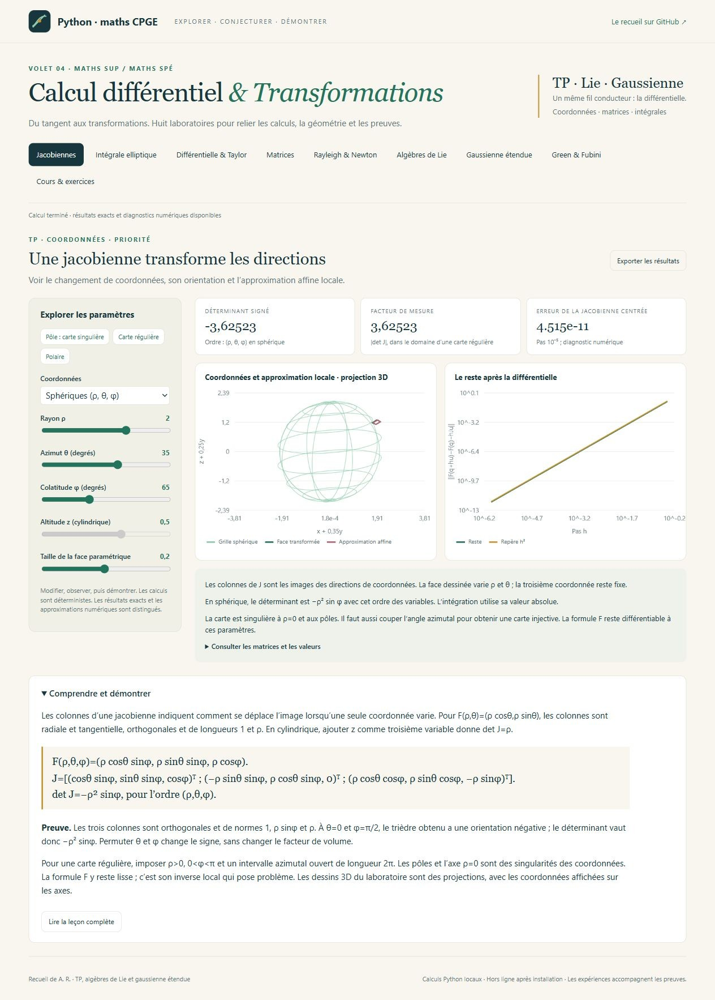
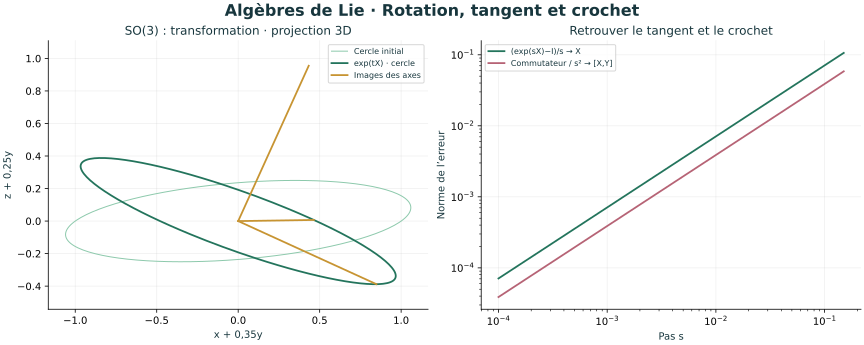
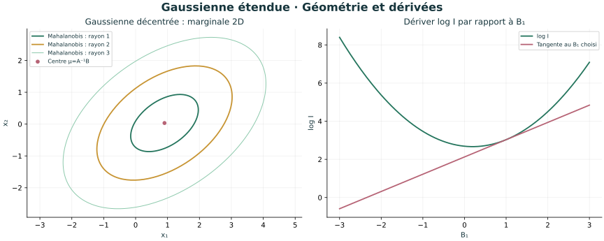

# Calcul différentiel & Transformations

**Volet 04 de [Python-maths-CPGE](https://github.com/ar742/Python-maths-CPGE)**,
pour les étudiants de maths sup et maths spé : **8 laboratoires interactifs,
14 leçons, 18 exercices corrigés et 8 illustrations scientifiques**.



Le parcours privilégie les **TP du recueil de A. R.**, puis les deux exemples de
**Differentielle.txt : algèbres de Lie et intégrale gaussienne étendue**.
Les extensions sont guidées et signalées. Les résultats numériques accompagnent
des preuves rédigées ; leurs hypothèses et leurs limites sont explicites.

## Démarrer

Sous Windows, double-cliquer sur **Lancer_Calcul_Differentiel.cmd** à la racine du
dépôt. Python 3.10+ est requis. Le premier lancement installe NumPy si nécessaire.
L’atelier s’ouvre sur **http://127.0.0.1:8768/** et fonctionne ensuite hors ligne.

Sur Windows, Linux ou macOS, depuis ce dossier :

```console
python -m pip install -r requirements.txt
python calcul_differentiel.py
```

Selon l’installation, utiliser `python3`. Le serveur reste local à votre ordinateur.
Garder son terminal ouvert ; **Ctrl+C** arrête l’atelier.
GitHub présente les sources et les illustrations ; il n’exécute pas ce serveur Python.
[Guide de lancement](LISEZ_MOI.md) · [Parcours TP](PARCOURS.md) · [Cours autonome](COURS.md).

## Les huit laboratoires

| Laboratoire | Manipuler et comprendre |
| --- | --- |
| **Jacobiennes** · TP | Coordonnées polaires, cylindriques et sphériques ; colonnes de J, orientation, facteur de mesure, carte singulière et reste local. |
| **Intégrale elliptique** · TP | Quart d’ellipse variable, changement de variables et facteur `ab r` ; résultat exact et quadrature ; calcul volontaire sans jacobienne. |
| **Différentielle & Taylor** | Coupe selon une direction, gradient, Hessienne, restes d’ordres 1 et 2 ; selles corrigées et dérivées directionnelles sans continuité. |
| **Matrices** · TP | Déterminant et inverse sur `A+tH` ; cofacteurs aux matrices singulières, formule de Jacobi et conditionnement. |
| **Rayleigh & Newton** · TP | Quadratique orientée, descente stable ou divergente, Newton en un pas ; quotient spectral et précision au second ordre. |
| **Algèbres de Lie** · TXT | GL, SL, SO en dimensions 2 et 3 ; trace, tangent, exponentielle, conservation du volume et crochet via le commutateur. |
| **Gaussienne étendue** · TXT | Dimension 2 à 8, anisotropie, rotation, terme linéaire, intégrale exacte, moyenne et covariance ; dérivées en B et en A. |
| **Green & Fubini** | Circulation et orientation ; singularité non absolument intégrable et limites dépendant des coupures. |

Chaque atelier propose des exemples prêts à ouvrir, des curseurs, des graphiques,
des valeurs détaillées et la leçon associée. **Exporter les résultats** télécharge
un fichier JSON contenant paramètres, valeurs et séries numériques. Les expériences
sont déterministes ; les résultats utilisent la précision flottante de NumPy.

## Deux prolongements emblématiques



La différentielle du déterminant à l’identité explique `slₙ={Tr X=0}` ; celle de
`GᵀG=I` explique `soₙ={Xᵀ=−X}`. Les courbes `exp(tX)` donnent les réciproques.
Dans SO(3), le commutateur de petites rotations fait apparaître `s²[X,Y]`.
Référence complémentaire, au-delà du programme :
[Pavel Etingof, MIT, Lie Groups and Lie Algebras](https://ocw.mit.edu/courses/18-755-lie-groups-and-lie-algebras-ii-spring-2024/mit18_755_s24_lec_full.pdf).



Pour A symétrique définie positive :
`I(A,B)=(2π)^(n/2)/sqrt(det A) × exp(BᵀA⁻¹B/2)`.
La complétion du carré, la diagonalisation orthogonale et le changement de variables
donnent la preuve. Les dérivées de `log I` donnent la moyenne `A⁻¹B` et la covariance
`A⁻¹`. La quadrature tronquée distingue erreur d’intégration et masse omise.

## Corrections et vérifications

Le cours indique les errata rencontrés dans le recueil : coefficients **81 et −4**
dans le TP elliptique ; **symétrie** dans les formules des gradients ; convexité et
Hessienne **positive semi-définie** ; les trois points critiques de l’exercice 1
**ne sont pas des extrema**. Les conventions d’orientation sont explicites.

**48 tests** confrontent les résultats à des calculs indépendants : intégration
cartésienne de l’ellipse, Rodrigues pour les rotations, développements exacts,
moments gaussiens par quadrature, limites de coupures et serveur local.

```console
python -X utf8 -m unittest -v test_mathematiques
```

Les vérifications automatiques du dépôt couvrent Windows et Linux, Python 3.10 et 3.12.
Le PDF et le TXT personnels servent de sources, et ne sont pas redistribués.

## TP symbolique et figures autonomes

Le complément facultatif `tp_symbolique.py` retrouve les jacobiennes, leur
déterminant signé, les points critiques, les cofacteurs et la dérivée de l’inverse :

```console
python -m pip install -r requirements-symbolique.txt
python tp_symbolique.py
```

Les [8 figures SVG](illustrations/README.md) sont déjà fournies ; Matplotlib sert
uniquement à les régénérer. Les graphiques du navigateur n’en dépendent pas.

```console
python -m pip install -r requirements-illustrations.txt
python calcul_differentiel.py --export-illustrations
python export_cours.py
```
