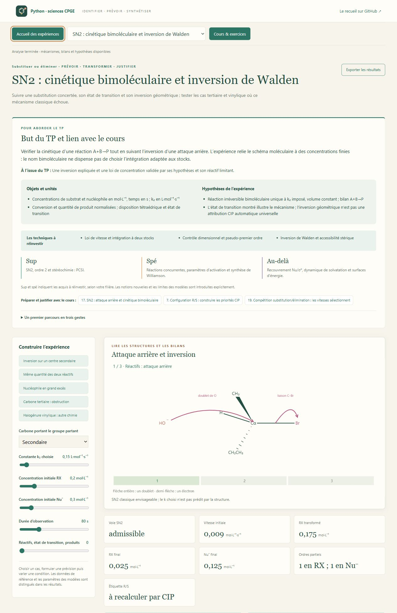

# Liaisons & Synthèses — Chimie organique CPGE

Un atelier Python pour **identifier une structure, déplacer les électrons, choisir une transformation et construire une synthèse**. Il prolonge la fiche C4 du recueil de A. R. : types de réactions, autres exemples et exemples (suite), TP et exercices. Les textes, dessins moléculaires et figures sont originaux.

**30 laboratoires interactifs · 42 leçons · 60 exercices corrigés · 30 figures SVG · 12 missions.** Chaque expérience commence par son but, les objets et variables utilisés, les hypothèses, les techniques CPGE, trois manipulations guidées et les repères **sup / spé / au-delà**. Le cours et les corrigés restent consultables sans lancer Python.



[Voir aussi une rétrosynthèse guidée de l’aspirine](apercu_synthese.png).

La progression concerne principalement **PCSI et PC–PC***. La [matrice du programme](MATRICE_PROGRAMME.md) distingue le tronc commun, l’option PC, la deuxième année et les prolongements accompagnés. Les mécanismes plus avancés ne sont pas attribués indistinctement à toutes les filières.

## Lancer l’atelier

Sous Windows, double-cliquer sur **`Lancer_Chimie_Organique.cmd`**, à la racine du dépôt ou dans ce dossier. Il utilise Python disponible et installe NumPy si nécessaire. Après installation, les cours, modèles et figures fonctionnent hors ligne. Ouvrir <http://127.0.0.1:8775>.

Sur Windows, Linux ou macOS avec **Python 3.10+** :

```sh
python -m pip install -r requirements.txt
python -X utf8 chimie_organique.py
```

Depuis la racine du dépôt, utiliser `python -X utf8 chimie_organique/chimie_organique.py`. Un autre port se choisit avec `--port 8780` ; `--no-browser` laisse ouvrir le navigateur manuellement.

[Premiers pas](LISEZ_MOI.md) · [Cours, introductions et corrigés](COURS.md) · [Douze missions](PARCOURS.md) · [Galerie](illustrations/README.md).

## Trois entrées pour commencer

1. **RMN et IR** : identifier l’acétate d’éthyle, puis distinguer benzaldéhyde, anisole et acétophénone. Relier positions, intégrales, couplages et fonctions chimiques ; vérifier plusieurs indices.
2. **SN2 puis E2** : déplacer les doublets étape par étape, relier cinétique à concentrations, comparer inversion, carbocation et géométrie anti. Faire varier le substrat avant d’appliquer une règle.
3. **Rétrosynthèse** : partir de l’aspirine, du paracétamol ou de la chalcone ; choisir l’ordre des fonctions, tenir compte des incompatibilités et calculer le rendement cumulé.

Les préréglages posent des questions différentes. Les commandes changent les structures, mécanismes, bilans ou courbes ; les explications nomment les variables et indiquent le domaine du modèle. Les résultats et données se téléchargent en JSON depuis le laboratoire.

## Les trente expériences

| Laboratoire | Expérience |
| --- | --- |
| `formule` | Formule brute : insaturations et signatures isotopiques |
| `stereo` | Chiralité : orientation, R/S et excès énantiomérique |
| `conformeres` | Conformations : Newman et populations de Boltzmann |
| `ir` | IR : fonctions chimiques et loi de Beer–Lambert |
| `rmn` | RMN : intégrales, couplages et identification croisée |
| `ccm` | CCM : séparation, suivi et limites de l’identification |
| `extraction` | Extraction : pH, partage et extractions successives |
| `esterification` | Esters : équilibre, hydrolyse et saponification |
| `acylation` | Acylation : activation et bilan du piège à acide |
| `protection` | Protection : rendre une stratégie compatible |
| `aldol` | Aldolisation : créer C–C puis conjuguer |
| `michaelwittig` | Michael et Wittig : deux constructions C–C |
| `dielsalder` | Diels–Alder : géométrie, orbitales et sélection |
| `retrosynthese` | Rétrosynthèse : cibles, ordre et rendement global |
| `polymeres` | Polymères : conversion, stœchiométrie et longueur |
| `electrons` | Flèches : où vont réellement les électrons ? |
| `acidebase` | Acidité, basicité et avancement : choisir avant d’attaquer |
| `sn2` | SN2 : cinétique bimoléculaire et inversion de Walden |
| `sn1` | SN1 : intermédiaire, solvolyse et mémoire stéréochimique |
| `competition` | SN1 / SN2 / E1 / E2 : une compétition explicite |
| `elimination` | E2 : anti-périplanarité et verrou cyclohexanique |
| `alcene` | Alcènes : régiochimie, stéréochimie et réarrangements |
| `alcyne` | Alcynes : deux additions, réduction et tautomérie |
| `radical` | Radicaux : chaîne, effet peroxyde et sélectivité |
| `carbonyle` | Carbonyles : addition, substitution acyle et énolates |
| `grignard` | Organomagnésiens : former C–C et survivre aux protons |
| `oxydoreduction` | Oxydoréduction : choisir une fonction et un réactif |
| `aromatique` | SEA : orientation, activation et ordre de synthèse |
| `orbitales` | Orbitales : CLOA, Hückel et Diels–Alder |
| `cinetique` | Cinétique ou thermodynamique : deux sélectivités |

## Des vues adaptées aux objets étudiés

Les mécanismes montrent les charges, doublets transférés, liaisons qui se créent ou se rompent, intermédiaires et sous-produits. Les flèches courbes partent d’un doublet ou d’une liaison ; les flèches à demi-pointe représentent un électron. Les triangles pleins et liaisons hachurées situent les substituants par rapport au plan.

D’autres laboratoires utilisent des spectres et leurs intégrales, des projections de Newman et chaises, une plaque CCM, une ampoule de séparation, des orbitales de signes opposés, des profils énergétiques et des graphes de synthèse. Les trente figures scientifiques peuvent être ouvertes seules.


## Ce que calculent les modèles

- **Bilans et équilibres** : conservation de matière, avancement, loi d’action de masse, partage entre phases, Henderson–Hasselbalch dans son domaine et rendement cumulé.
- **Structure et analyse** : indice d’insaturation, enveloppes isotopiques Cl/Br, orientation CIP, distributions de Boltzmann, Beer–Lambert et multiplets de premier ordre.
- **Réactivité** : bibliothèque explicite de transformations et mécanismes. Les profils énergétiques, constantes comparatives et distributions de produits sont des modèles pédagogiques, dont les paramètres et hypothèses sont indiqués.
- **Construction** : compatibilité des fonctions, protection/déprotection, rétrosynthèse de cibles définies, conservation du squelette lors de Diels–Alder et relation de Carothers avec déséquilibre stœchiométrique.

Les spectres sont **simulés**, avec positions typiques ; les zones aromatiques ne prétendent pas résoudre des systèmes de spins complexes. Les critères SN/E, Zaitsev, Markovnikov, orientation aromatique et endo sont reliés au mécanisme et aux conditions. Un pourcentage issu d’un modèle de barrières ne remplace pas une mesure expérimentale. L’application ne fournit pas de protocole expérimental de manipulation : les TP sont des expériences numériques.

Les formules semi-développées emploient `Ph` pour phényle, `Me` pour méthyle, `Et` pour éthyle et `R` pour un groupe défini dans le TP. Les hydrogènes implicites et contre-ions pertinents sont explicités dans les étapes. Les concentrations sont en mol·L⁻¹, les températures en K, les énergies molaires en kJ·mol⁻¹ ; δ est en ppm et J en Hz.

## Vérifier et approfondir

```sh
python -X utf8 -m unittest -v test_analyse test_reactivite test_entree test_pedagogie test_serveur
```

Les tests confrontent les calculs à des bilans, distributions, relations stéréochimiques et solutions indépendantes ; ils vérifient aussi les préréglages, domaines des commandes, graphes moléculaires, ressources pédagogiques et serveur. L’intégration continue lance ces vérifications sur **Windows et Linux, Python 3.10 et 3.12**.

NumPy suffit pour l’application. Matplotlib est un complément pour recréer les illustrations :

```sh
python -m pip install -r requirements-illustrations.txt
python -X utf8 chimie_organique.py --export-illustrations
```

Les sources primaires et programmes officiels figurent dans [COURS.md](COURS.md) et [MATRICE_PROGRAMME.md](MATRICE_PROGRAMME.md). Le PDF source reste dans les fichiers de son auteur ; il n’est pas redistribué ici.
