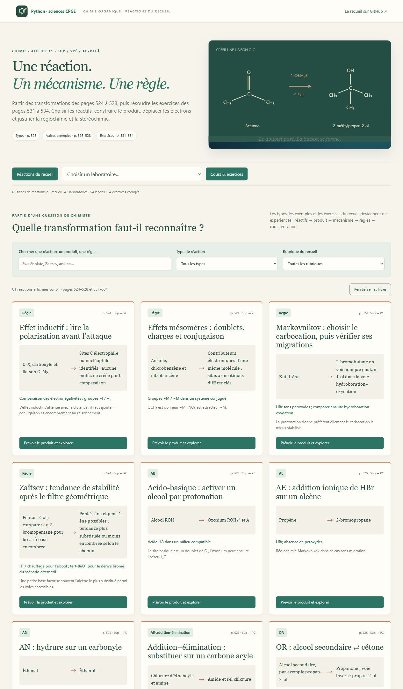
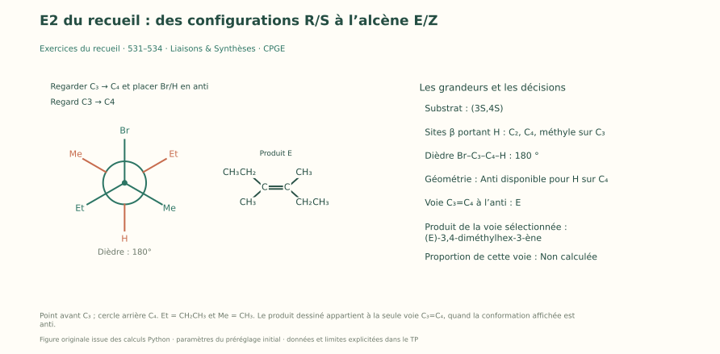
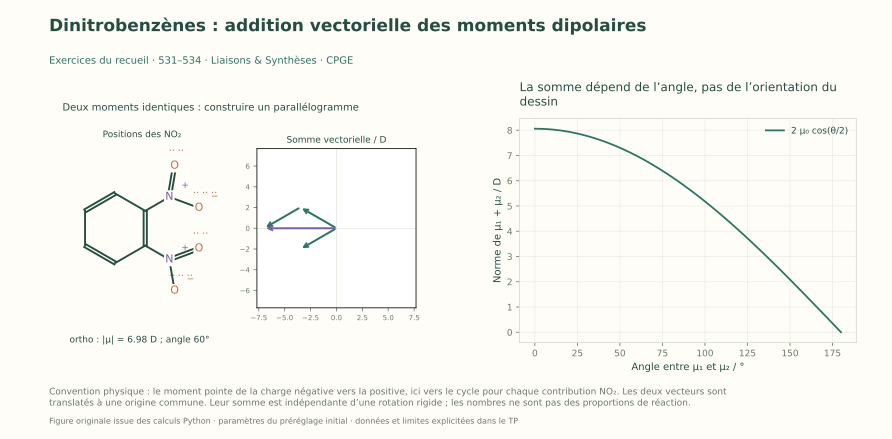

# Liaisons & Synthèses — Réactions de chimie organique CPGE

**Reconnaître une réaction, prévoir son produit, expliquer son mécanisme et contrôler le résultat.** Cet atelier est centré sur les pages **524 à 528**, puis **531 à 534**, de la fiche C4 du recueil de A. R. : effets électroniques et règles, « Types de réactions », « Autres exemples », « Exemples (suite) », exercices et corrections. Les textes, dessins moléculaires et figures sont originaux.

**61 fiches réactions · 42 laboratoires interactifs · 54 leçons · 84 exercices corrigés · 42 figures SVG.** L’accueil permet de chercher par réaction, substrat, produit ou règle, et de filtrer par famille et rubrique. Chaque fiche ouvre le laboratoire avec les paramètres de son exemple.



[Réactions, cours et corrigés du recueil](REACTIONS_DU_RECUEIL.md) · [Parcours guidés](PARCOURS_REACTIONS.md) · [Premiers pas](LISEZ_MOI.md) · [Galerie des 42 figures](illustrations/README.md).

## Une fiche, une question chimique, une expérience

Chaque fiche indique **substrat → réactifs et conditions → produit**, les liaisons créées ou rompues, les règles de régiochimie et de stéréochimie, les diagnostics structuraux ou spectroscopiques et une question corrigée. Le mécanisme peut ensuite être parcouru étape par étape. Modifier les réglages permet d’explorer les variantes annoncées du modèle.

Les introductions précisent les buts, les molécules et variables utilisées, les hypothèses, les techniques CPGE, trois premières manipulations et les repères **sup / spé / au-delà**. La progression concerne principalement **PCSI et PC–PC*** ; la [matrice du programme](MATRICE_PROGRAMME.md) situe les banques de réactions et les prolongements accompagnés.

## Les transformations au premier plan

| Domaine | Exemples et questions travaillés |
| --- | --- |
| Effets et règles, p.524 | I/M, stabilité d’un intermédiaire, Markovnikov, anti-Markovnikov, Zaitsev ; domaine d’application |
| Types, p.525 | Acido-basique, AE/AN, addition–élimination, SN1/SN2, E1/E2, oxydoréduction et SEA |
| Autres exemples, p.526 | Alkylation d’énolate, quaternisation d’amine, esters, hydrolyse des dérivés d’acide, anhydrides, acétals, photochloration du benzène, préparation et emploi des magnésiens |
| Exemples (suite), p.527–528 | Hydrogénation, hydroboration, Friedel–Crafts, aldolisation/crotonisation, amides, Michael, Wittig, époxydation et ouverture des époxydes |
| Exercices, p.531 et 533 | 3-bromo-3,4-diméthylhexane : R/S, Newman anti, E2 et E/Z ; additions, oxydations, réductions et doubles additions aux alcynes |
| Exercices, p.532 et 534 | Nitrobenzène : Lewis, réduction en aniline, nitration, dipôles et stratégie aromatique polysubstituée |

## Trois expériences pour commencer

1. **Élimination et géométrie** : choisir (3S,4S), (3R,4R), (3S,4R) ou (3R,4S), chercher la conformation anti et justifier E/Z pour le 3,4-diméthylhex-3-ène. Changer le carbone β fait apparaître d’autres produits possibles.
2. **Nitrobenzène et ordre de synthèse** : conserver octets et charges dans Lewis, équilibrer la réduction, puis choisir un ordre compatible pour obtenir le noyau portant COCH₃, Cl, Br et NO₂.
3. **Dérivés d’acide et époxydes** : comparer addition–élimination sur chlorure, ester, amide et anhydride, expliquer le piège à acide ; comparer le site d’ouverture d’un époxyde asymétrique en milieu basique et acide.





## Les douze nouveaux laboratoires

| Laboratoire | Expérience |
| --- | --- |
| `effets` | Effets I/M, stabilité et règles de sélectivité |
| `e1` | Ionisation, carbocation et branchements d’élimination |
| `enolatealkyl` | Énolate : ambident, électrophile et création C–C |
| `aminealkyl` | Amine tertiaire : quaternisation et bilan de charge |
| `anhydride` | Formation d’anhydride, alcoolyse, hydrolyse et amidation ; piège à acide |
| `hydrolyseacyle` | Chlorure, ester et amide : mécanisme et bilan acide/base |
| `photochlore` | Benzène + chlore : addition photochimique et substitution aromatique |
| `grignardprep` | Préparer RMgX, compter Mg et comprendre l’anhydrie |
| `e2stereo` | L’exercice du 3-bromo-3,4-diméthylhexane en Newman et E/Z |
| `nitrobenzene` | Lewis, réduction en aniline et ordre de synthèse |
| `dipolesnitro` | Isomères ortho/méta/para : molécule et somme vectorielle |
| `epoxydes` | Époxydation stéréospécifique, argent/éthylène, ouverture acide ou basique |

Les trente laboratoires antérieurs restent disponibles : SN1/SN2, E2 cyclique, alcènes, alcynes, radicaux, carbonyles, magnésiens, oxydoréduction, SEA, estérification, acylation, protection, aldol, Michael/Wittig, Diels–Alder, rétrosynthèse et outils de structure ou d’analyse. IR, RMN, CCM et extraction sont réunis avec les outils complémentaires sur l’accueil. [Cours complémentaire et 60 exercices](COURS.md) · [Douze missions complémentaires](PARCOURS.md).

## Lancer l’atelier

Sous Windows, double-cliquer sur **`Lancer_Chimie_Organique.cmd`**, à la racine du dépôt ou dans ce dossier. Ouvrir <http://127.0.0.1:8775>. Après installation initiale de NumPy, l’atelier fonctionne hors ligne.

Sur Windows, Linux ou macOS avec **Python 3.10+**, depuis ce dossier :

```sh
python -m pip install -r requirements.txt
python -X utf8 chimie_organique.py
```

Depuis la racine, utiliser `python -X utf8 chimie_organique/chimie_organique.py`. `--port 8780` choisit un autre port ; `--no-browser` permet d’ouvrir la page manuellement.

## Conventions et calculs

Les flèches courbes représentent le transfert d’un doublet ; les demi-pointes celui d’un électron. Charges, intermédiaires, sous-produits et réactifs nécessaires sont indiqués dans les étapes. Coins, hachures et Newman explicitent la géométrie. `Ph`, `Me`, `Et` désignent phényle, méthyle, éthyle ; les groupes `R` sont définis dans leur TP.

Bilans de matière et charges, avancements, équilibres et relations stéréochimiques sont calculés. Les règles sont reliées aux substrats et conditions ; les pourcentages cinétiques reposent sur les hypothèses indiquées. Profils énergétiques illustratifs et spectres simulés ne sont pas des mesures. La formation sur argent montre le bilan global pour l’éthylène et explique la catalyse de surface. Les expériences sont numériques.

La caractérisation figure dans chaque fiche : fonctions, formule, connectivité, stéréochimie, IR, RMN ou suivi chromatographique selon le cas. Plusieurs indices doivent être confrontés ; un signal isolé n’établit pas une structure.

## Vérifier et approfondir

```sh
python -X utf8 -m unittest discover -v
```

Les **360 tests automatiques** confrontent les résultats à des bilans atomiques et électriques, aux produits attendus, aux configurations calculées indépendamment et aux cas ouverts depuis les fiches. Ils vérifient les cours, guides, paramètres, exports et ressources du serveur. L’intégration continue les lance sur **Windows et Linux, Python 3.10 et 3.12** ; les résultats sont consultables dans [GitHub Actions](https://github.com/ar742/Python-maths-CPGE/actions).

Matplotlib permet de recréer les figures :

```sh
python -m pip install -r requirements-illustrations.txt
python -X utf8 chimie_organique.py --export-illustrations
```

Sources et programmes : [réactions du recueil](REACTIONS_DU_RECUEIL.md), [cours complémentaire](COURS.md), [matrice](MATRICE_PROGRAMME.md). Le PDF reste dans les fichiers de son auteur et n’est pas redistribué. L’[errata](ERRATA.md) se limite à une formule de Lewis vérifiée dans son contexte, conformément à la demande de l’auteur.
