# Galerie : Liaisons & Synthèses

Trente figures originales issues des mêmes données et calculs que les laboratoires. Les conditions, paramètres et limites figurent dans chaque TP.

## Formule brute : insaturations et signatures isotopiques

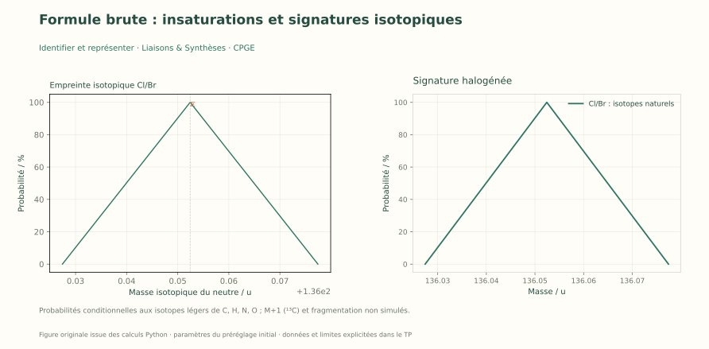

Probabilités conditionnelles aux isotopes légers de C, H, N, O ; M+1 (¹³C) et fragmentation non simulés.

## Chiralité : orientation, R/S et excès énantiomérique

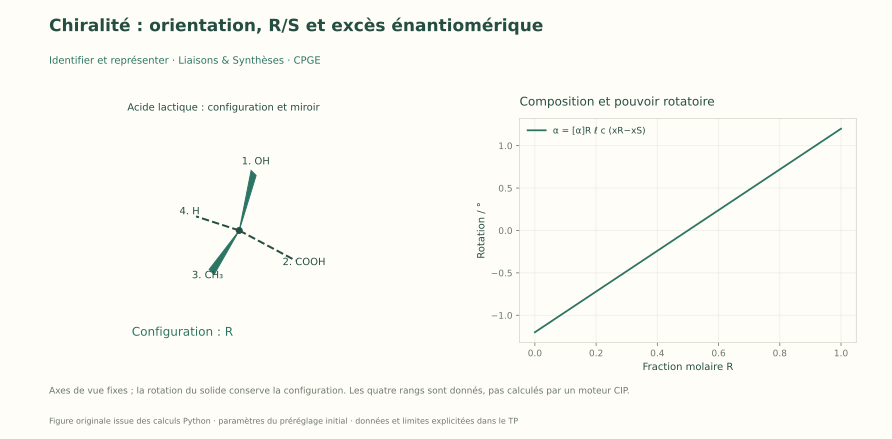

Axes de vue fixes ; la rotation du solide conserve la configuration. Les quatre rangs sont donnés, pas calculés par un moteur CIP.

## Conformations : Newman et populations de Boltzmann

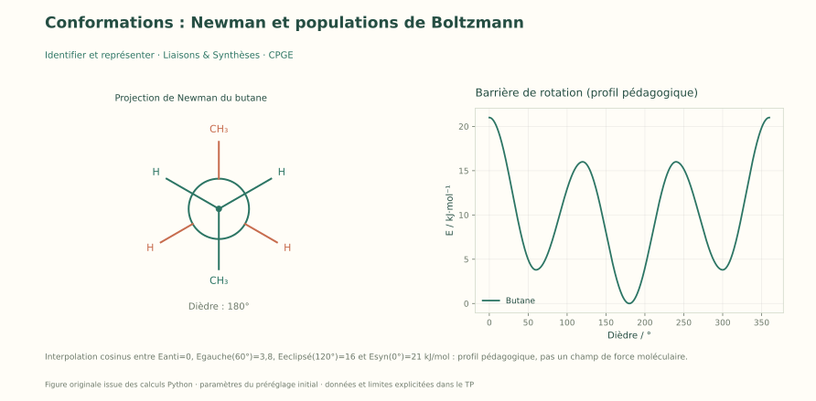

Interpolation cosinus entre Eanti=0, Egauche(60°)=3,8, Eeclipsé(120°)=16 et Esyn(0°)=21 kJ/mol : profil pédagogique, pas un champ de force moléculaire.

## IR : fonctions chimiques et loi de Beer–Lambert

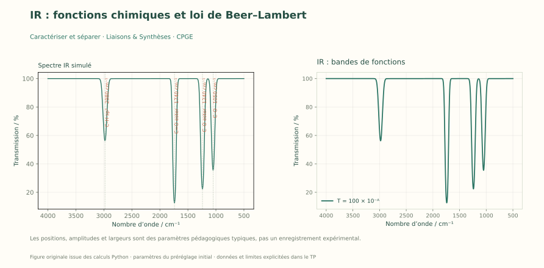

Les positions, amplitudes et largeurs sont des paramètres pédagogiques typiques, pas un enregistrement expérimental.

## RMN : intégrales, couplages et identification croisée

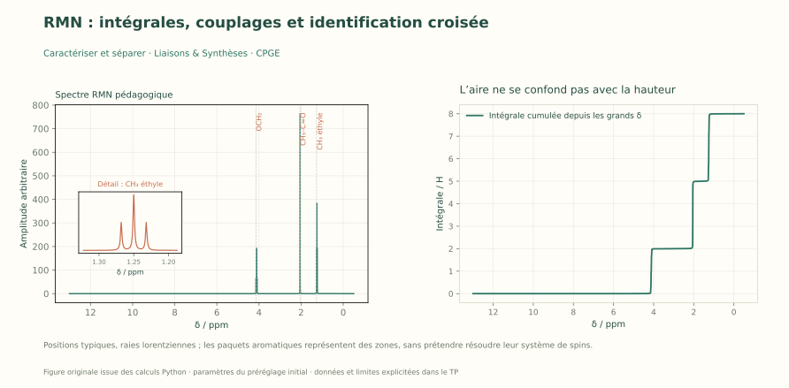

Positions typiques, raies lorentziennes ; les paquets aromatiques représentent des zones, sans prétendre résoudre leur système de spins.

## CCM : séparation, suivi et limites de l’identification

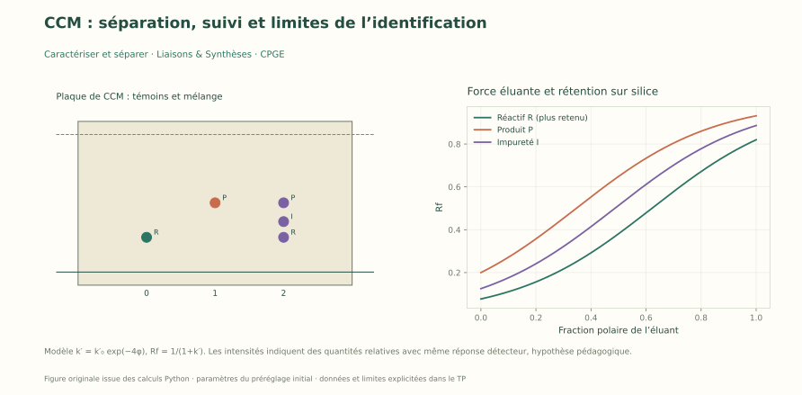

Modèle k′ = k′₀ exp(−4φ), Rf = 1/(1+k′). Les intensités indiquent des quantités relatives avec même réponse détecteur, hypothèse pédagogique.

## Extraction : pH, partage et extractions successives

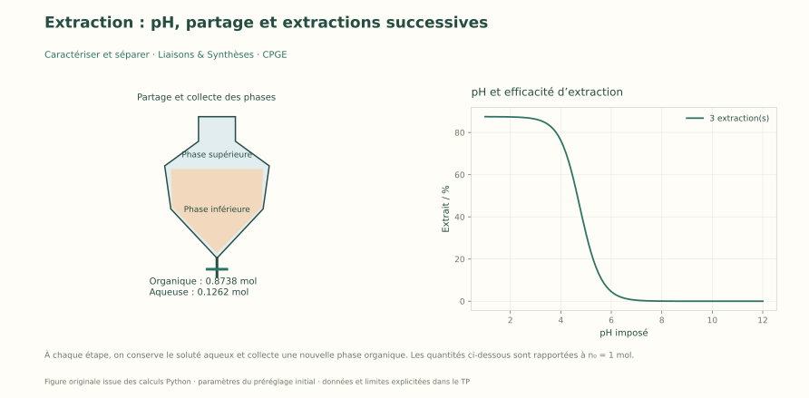

À chaque étape, on conserve le soluté aqueux et collecte une nouvelle phase organique. Les quantités ci-dessous sont rapportées à n₀ = 1 mol.

## Esters : équilibre, hydrolyse et saponification

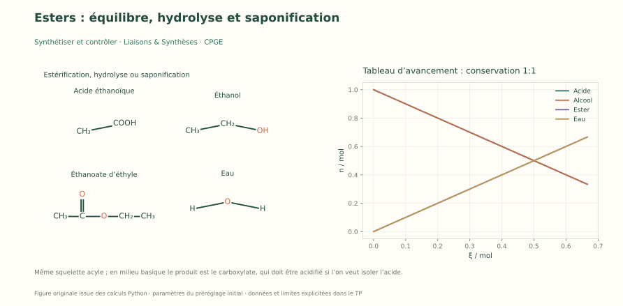

Même squelette acyle ; en milieu basique le produit est le carboxylate, qui doit être acidifié si l’on veut isoler l’acide.

## Acylation : activation et bilan du piège à acide

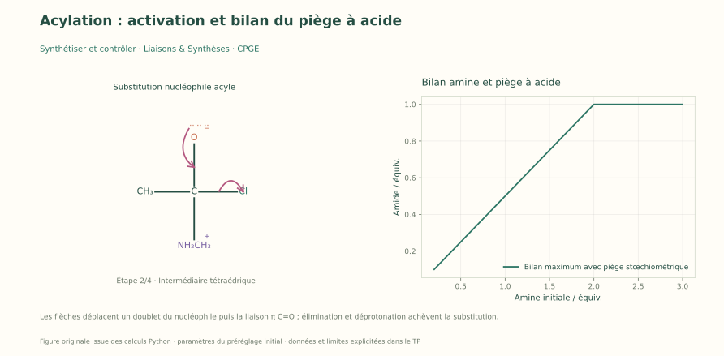

Les flèches déplacent un doublet du nucléophile puis la liaison π C=O ; élimination et déprotonation achèvent la substitution.

## Protection : rendre une stratégie compatible

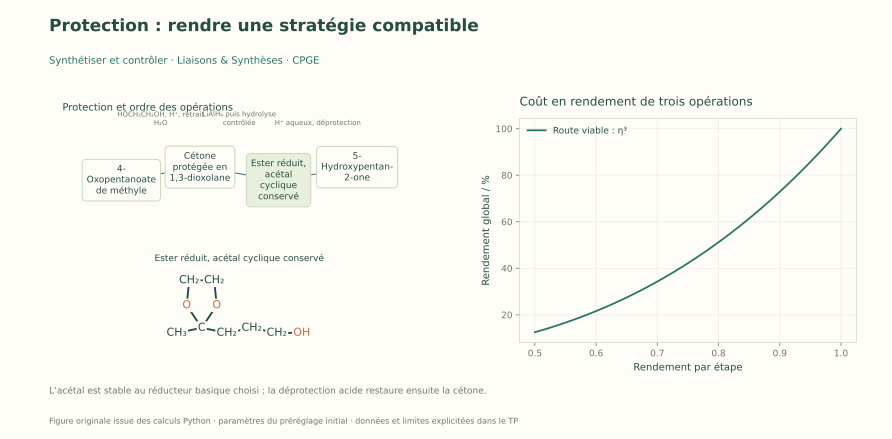

L’acétal est stable au réducteur basique choisi ; la déprotection acide restaure ensuite la cétone.

## Aldolisation : créer C–C puis conjuguer

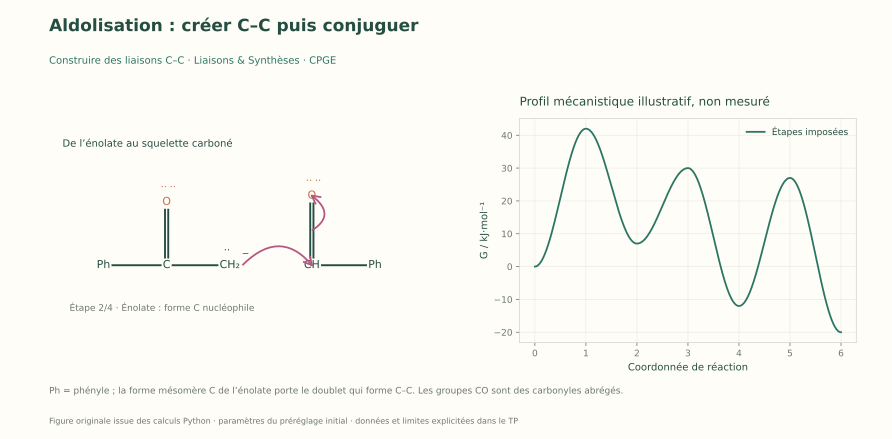

Ph = phényle ; la forme mésomère C de l’énolate porte le doublet qui forme C–C. Les groupes CO sont des carbonyles abrégés.

## Michael et Wittig : deux constructions C–C

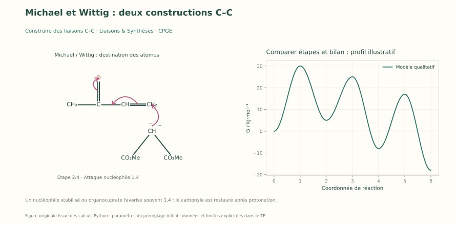

Un nucléophile stabilisé ou organocuprate favorise souvent 1,4 ; le carbonyle est restauré après protonation.

## Diels–Alder : géométrie, orbitales et sélection

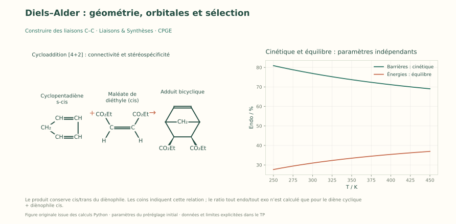

Le produit conserve cis/trans du diènophile. Les coins indiquent cette relation ; le ratio tout endo/tout exo n’est calculé que pour le diène cyclique + diènophile cis.

## Rétrosynthèse : cibles, ordre et rendement global

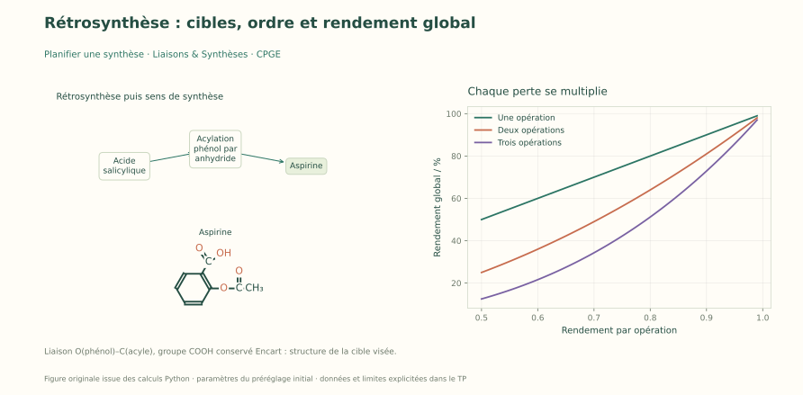

Liaison O(phénol)–C(acyle), groupe COOH conservé Encart : structure de la cible visée.

## Polymères : conversion, stœchiométrie et longueur

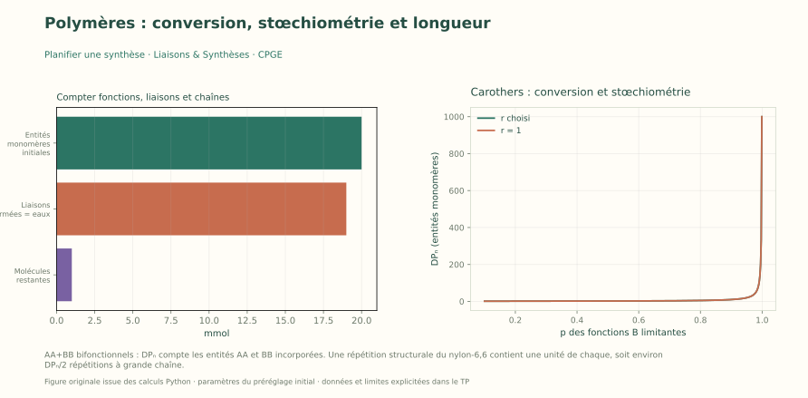

AA+BB bifonctionnels : DPₙ compte les entités AA et BB incorporées. Une répétition structurale du nylon-6,6 contient une unité de chaque, soit environ DPₙ/2 répétitions à grande chaîne.

## Flèches : où vont réellement les électrons ?

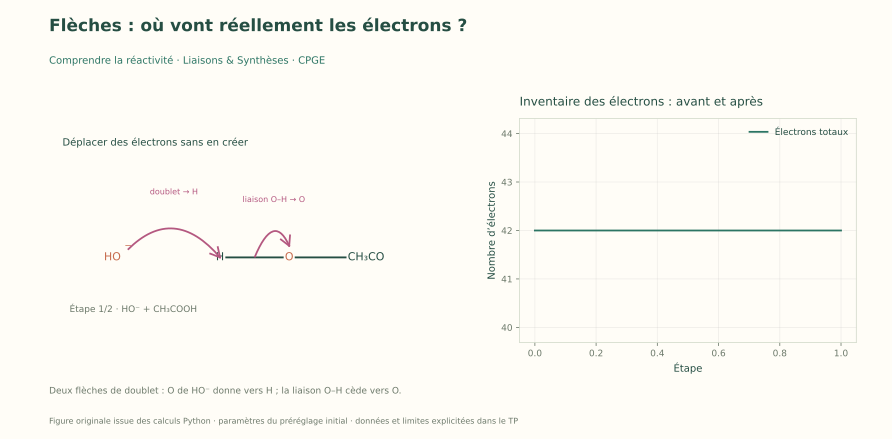

Deux flèches de doublet : O de HO⁻ donne vers H ; la liaison O–H cède vers O.

## Acidité, basicité et avancement : choisir avant d’attaquer

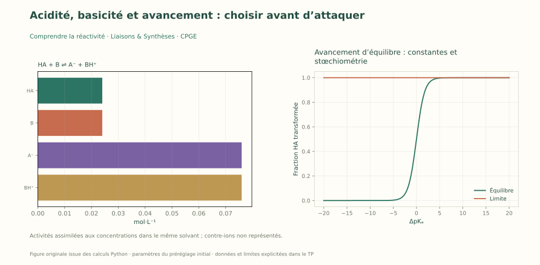

Activités assimilées aux concentrations dans le même solvant ; contre-ions non représentés.

## SN2 : cinétique bimoléculaire et inversion de Walden

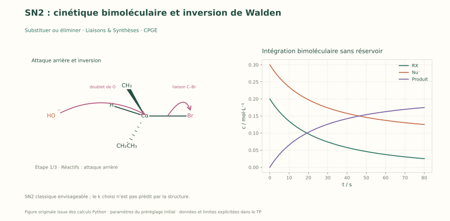

SN2 classique envisageable ; le k choisi n’est pas prédit par la structure.

## SN1 : intermédiaire, solvolyse et mémoire stéréochimique

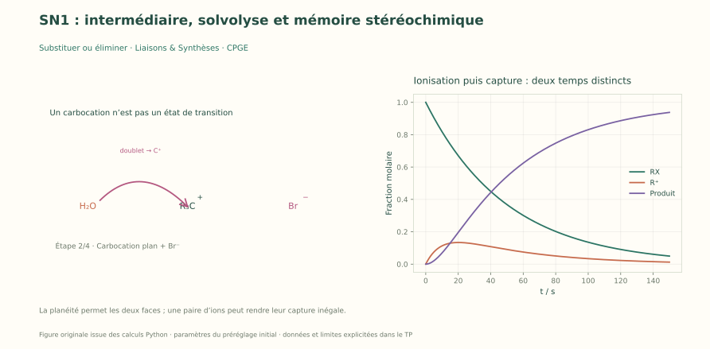

La planéité permet les deux faces ; une paire d’ions peut rendre leur capture inégale.

## SN1 / SN2 / E1 / E2 : une compétition explicite

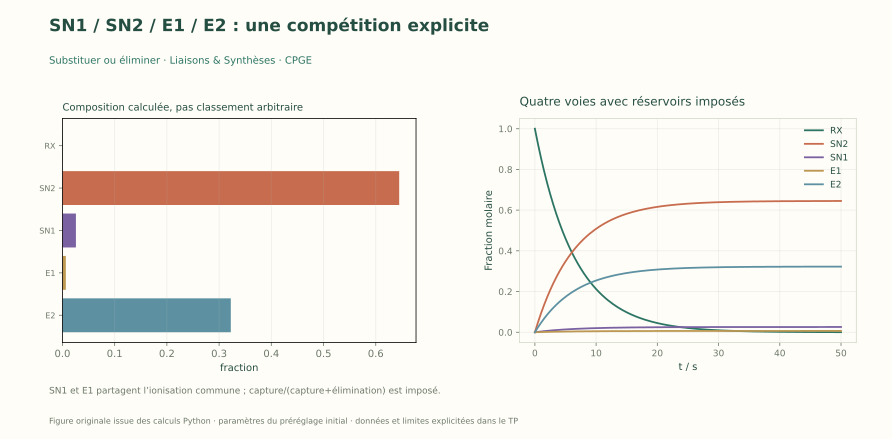

SN1 et E1 partagent l’ionisation commune ; capture/(capture+élimination) est imposé.

## E2 : anti-périplanarité et verrou cyclohexanique

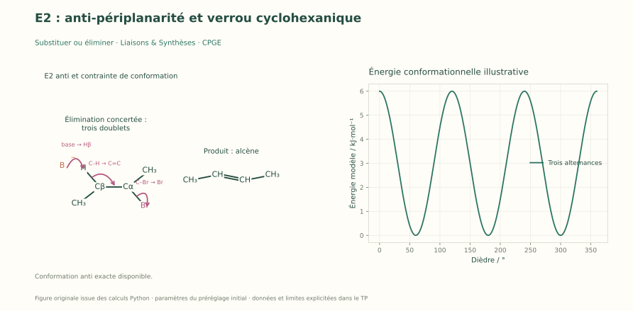

Conformation anti exacte disponible.

## Alcènes : régiochimie, stéréochimie et réarrangements

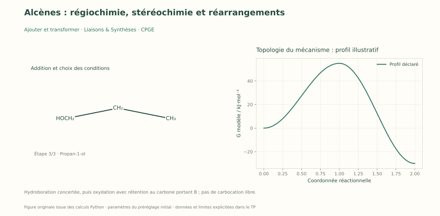

Hydroboration concertée, puis oxydation avec rétention au carbone portant B ; pas de carbocation libre.

## Alcynes : deux additions, réduction et tautomérie

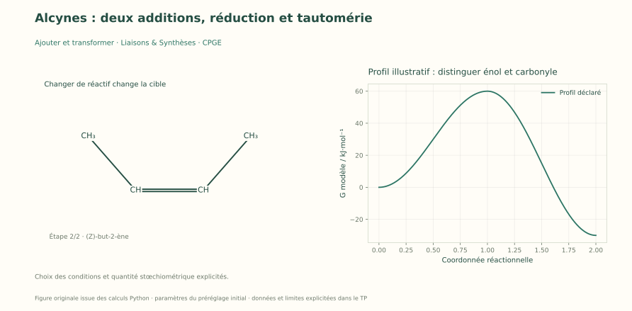

Choix des conditions et quantité stœchiométrique explicités.

## Radicaux : chaîne, effet peroxyde et sélectivité

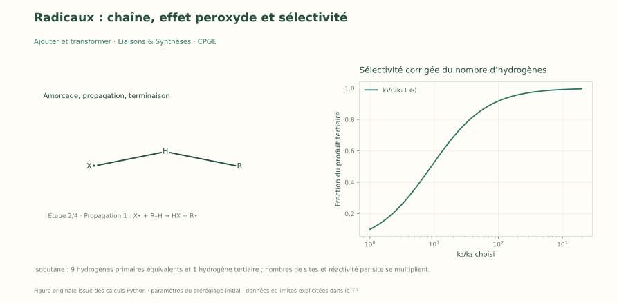

Isobutane : 9 hydrogènes primaires équivalents et 1 hydrogène tertiaire ; nombres de sites et réactivité par site se multiplient.

## Carbonyles : addition, substitution acyle et énolates

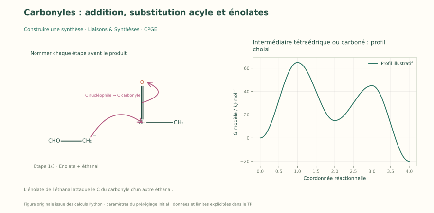

L’énolate de l’éthanal attaque le C du carbonyle d’un autre éthanal.

## Organomagnésiens : former C–C et survivre aux protons

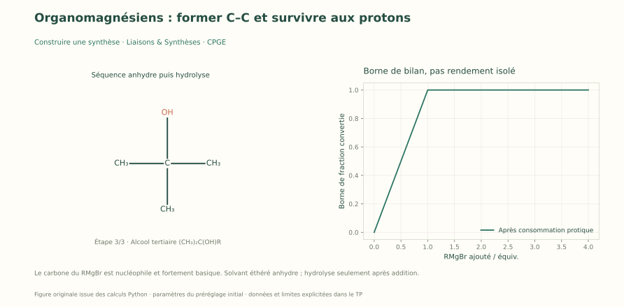

Le carbone du RMgBr est nucléophile et fortement basique. Solvant éthéré anhydre ; hydrolyse seulement après addition.

## Oxydoréduction : choisir une fonction et un réactif

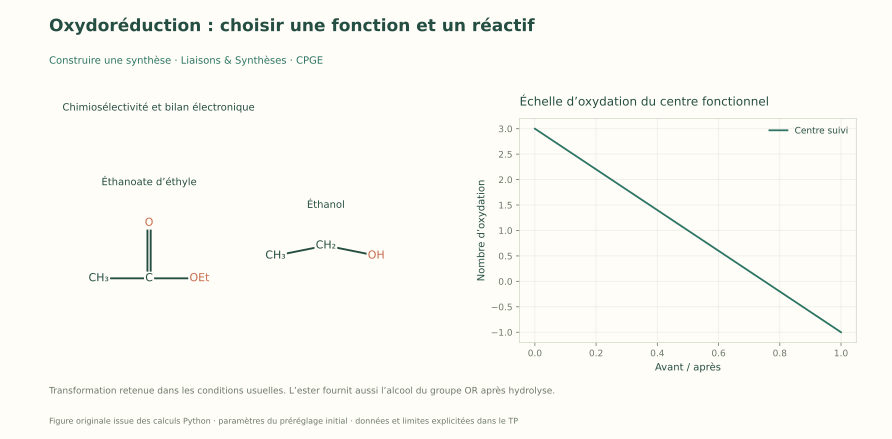

Transformation retenue dans les conditions usuelles. L’ester fournit aussi l’alcool du groupe OR après hydrolyse.

## SEA : orientation, activation et ordre de synthèse

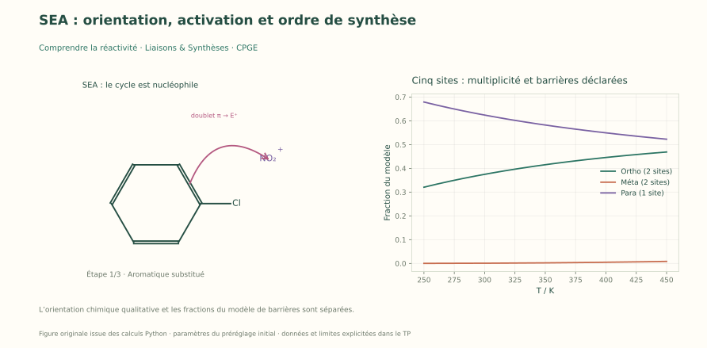

L’orientation chimique qualitative et les fractions du modèle de barrières sont séparées.

## Orbitales : CLOA, Hückel et Diels–Alder

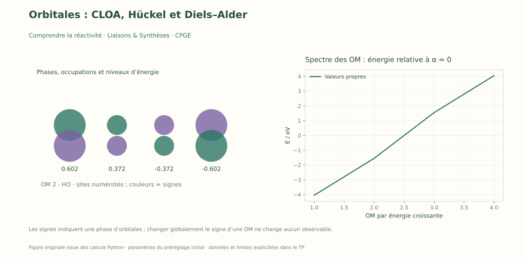

Les signes indiquent une phase d’orbitales ; changer globalement le signe d’une OM ne change aucun observable.

## Cinétique ou thermodynamique : deux sélectivités

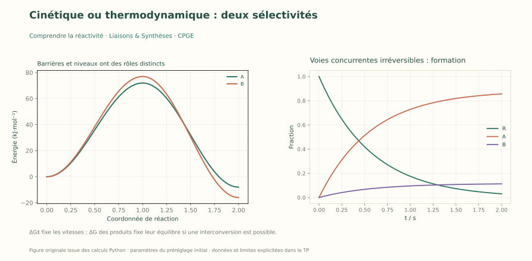

ΔG‡ fixe les vitesses ; ΔG des produits fixe leur équilibre si une interconversion est possible.
