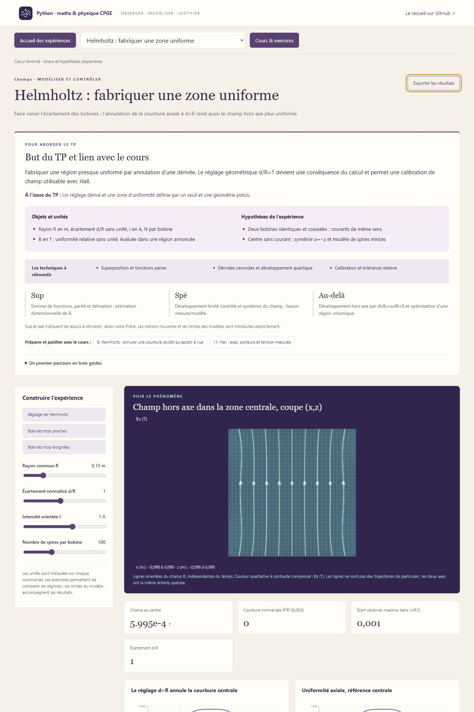
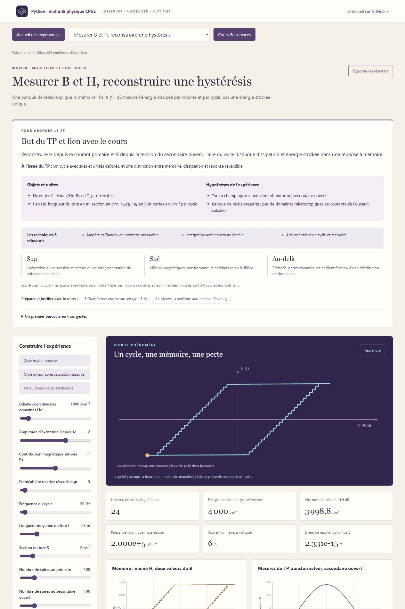

# Champs & Matière · Électromagnétisme

**Atelier 09 · Physique CPGE sup / spé / au-delà**

Une bobine façonne un champ ; un haut-parleur transforme un courant en mouvement ;
une interface et un milieu changent une onde. **24 laboratoires, 36 leçons,
48 exercices corrigés, 24 figures scientifiques et dix missions** relient ces
phénomènes aux symétries, aux équations de Maxwell et aux bilans d’énergie.



Chaque laboratoire commence par **son but, le résultat attendu, les techniques
du cours à réinvestir, les repères sup / spé / au-delà et trois premiers gestes**.
Les notions dépassant les attendus usuels d’une filière sont introduites et
signalées ; les trois niveaux constituent une progression, à adapter à sa classe.

## Les expériences

| Parcours | Laboratoires et questions |
| --- | --- |
| **Champs et symétries** | Deux charges et approximation dipolaire ; Gauss pour une sphère et un coaxial ; Oersted, Biot–Savart, spire et solénoïde finis ; réglage axial et hors axe des bobines d’Helmholtz. |
| **Transport et mesure** | Drude, réponse transitoire et conductivité complexe ; Hall avec porteurs signés et bornes explicites ; diffusion magnétique et effet de peau. |
| **Conversion d’énergie** | Barreau RL et cadre entrant dans un champ ; haut-parleur réciproque ; transformateur et hystérésis à domaines ; angle de charge synchrone ; glissement et bilan du moteur asynchrone. |
| **Maxwell et ondes** | Ondes progressive et stationnaire, polarisation elliptique, Poynting ; interface TE/TM, Brewster et réflexion totale ; guide TE₁₀ et coupure ; ouverture, pointage et diagramme sinc² ; plasma froid avec collisions. |
| **Réponse des milieux** | Lorentz et charges liées d’une sphère diélectrique ; Langevin, deux niveaux et diamagnétisme avec champ démagnétisant ; plaque London et Meissner ; rotation non réciproque de Faraday ; profil Kerr optique sech. |
| **Passerelles** | Rayonnement dipolaire, Rayleigh et Thomson ; MHD, diffusion, énergie et dynamo locale α², avec une ouverture sur le noyau externe terrestre. |



Les scènes proposent des cartes de champ orientées, une membrane couplée,
des moteurs, les rayons d’une interface, des champs transverses et des profils
de pénétration. **Une ligne de champ E ou B n’est pas une trajectoire de
particule.** Les animations sont ralenties ; les valeurs, unités et phases
physiques sont celles des modèles et des courbes.

## Lancer l’atelier

**Windows :** double-cliquer sur `Lancer_Electromagnetisme.cmd` à la racine du
dépôt. L’atelier s’ouvre dans le navigateur sur <http://127.0.0.1:8773>.
Le lanceur installe NumPy si nécessaire lors du premier démarrage.

**Python 3.10+**, sur Windows, macOS ou Linux :

```text
cd electromagnetisme
python -m pip install -r requirements.txt
python -X utf8 electromagnetisme.py
```

L’atelier fonctionne **hors ligne après installation** ; aucun calcul n’est
envoyé à un service distant. Fermer le terminal arrête le serveur. Le port peut
être choisi avec `--port 8775`, et `--no-browser` évite l’ouverture automatique.
Le bouton **Exporter les résultats** enregistre un instantané JSON comprenant
paramètres, courbes, mesures, étapes et hypothèses.

## Conventions et vérifications

- **Harmonique :** exp(ikz−iωt), champs réels = parties réelles. La branche
  passive donne Im k≥0 ; εr=n² dans les milieux usuels non magnétiques.
- **Hall :** I vers +x, B vers +z et UH=V(y=−w/2)−V(y=+w/2). Les signes du
  courant, des porteurs et des bornes précèdent le calcul.
- **Haut-parleur :** u=Ri+L di/dt+κv et F=κi. Le même κ impose la réciprocité
  et l’annulation des puissances de couplage dans le bilan total.
- **Hystérésis :** la mémoire provient de relais de domaines, avec une perte
  ∮H dB ; une courbe simplement décalée ne remplacerait pas cette mémoire.
- **Milieux :** peau résistive, Meissner d’équilibre et flux gelé idéal sont
  distingués, ainsi que Kerr optique, électro-optique et magnéto-optique.
- **MHD :** le mode α² est une solution d’un modèle local à coefficients
  prescrits. Rm>1 ne suffit pas à établir une dynamo terrestre.

**124 tests** confrontent les résultats à des symétries, limites, quadratures,
équations de Maxwell et bilans indépendants : passivité, flux R+T, pertes
Joule, conservation de puissance, raccordements, courants de London, énergie
du haut-parleur et partage des puissances du rotor.

```text
python -X utf8 -m unittest -v test_conversion test_ondes test_entree test_pedagogie test_serveur
```

La vérification GitHub couvre Python 3.10 et 3.12 sous Windows et Linux.
Matplotlib sert seulement à régénérer la [galerie vectorielle](illustrations/README.md) ;
les SVG sont fournis, et les laboratoires demandent uniquement NumPy.

## Lire, préparer et prolonger

[Guide de prise en main](LISEZ_MOI.md) · [Dix missions](PARCOURS.md) ·
[Cours et corrigés](COURS.md) · [Clarifications scientifiques](ERRATA.md).

Le point de départ est le recueil de **A. R., fiches P11 à P14**, transmis pour
ce travail. Les illustrations sont originales ; les pages du PDF ne sont pas
reproduites dans le dépôt. Les sources primaires et les programmes officiels
utilisés pour les repères de niveau figurent dans le cours.

Les ateliers [Fluides & Ondes](../mecanique_fluides/README.md),
[Physique statistique](../physique_statistique/README.md) et
[Physique quantique](../physique_quantique/README.md) prolongent respectivement
la MHD, les aimantations thermiques et les milieux quantiques.
