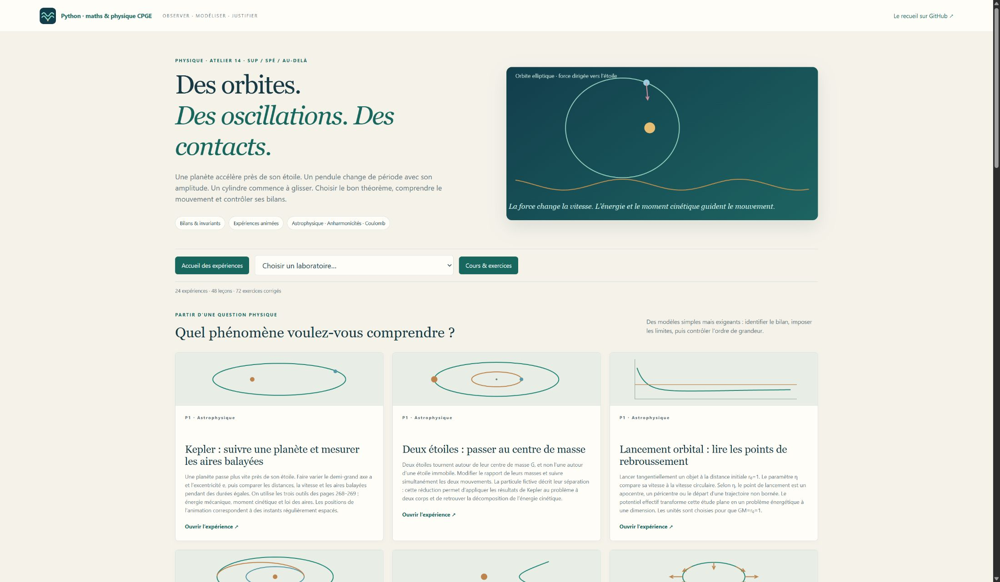

# Mécanique & Mouvements · Atelier 14

**24 laboratoires animés, 48 leçons, 72 exercices corrigés et 24 figures scientifiques.**
Un atelier de mécanique pour les CPGE scientifiques, organisé autour des fiches **P1, P2 et P3** du recueil de A. R. : choisir un système et un référentiel, appliquer le théorème adapté, puis confronter la prédiction aux mouvements et aux bilans.



Chaque expérience commence par son **but**, ses **objets, variables et unités**, ses hypothèses et les techniques à réinvestir. Trois repères **sup / spé / au-delà** permettent de préparer la manipulation. Trois actions guidées conduisent ensuite à une conclusion à justifier, avec des liens directs vers le cours.

## Les priorités du recueil

| Partie | Passages privilégiés | Expériences et prolongements |
| --- | --- | --- |
| **P1 · Points et systèmes** | Théorèmes et applications p.268–269 | Lois de Kepler et des aires ; deux étoiles et barycentre ; potentiel effectif et échappement ; Hohmann ; survol gravitationnel ; marées ; fusée et masse variable ; référentiel tournant et Coriolis. |
| **P2 · Oscillateurs** | Exercices **2, 3, 6 et surtout 7**, p.278–282 | Chaîne atomique et dispersion ; vibrations longitudinales de CO₂ ; pendule de Foucault ; pendule exact et non-isochronie ; harmoniques du pendule ; **deux ressorts transverses, changement des équilibres et terme quartique** ; oscillateur quartique ; Duffing forcé et réponse non linéaire. |
| **P3 · Solides** | Théorèmes p.286–287 ; exercices **1, 2 et surtout 3**, p.288–290 | Huygens et inerties ; théorèmes de König ; basculement d’une barre ; barre sur rotule ; **cylindre au bord d’une table et premier seuil de glissement** ; lois de Coulomb, freinage et changement de régime ; plan incliné ; gyroscope, précession et nutation. |

Les animations suivent les données calculées. La lecture peut être mise en pause ou déplacée sur la trajectoire. Le rythme d’affichage est adapté ; les temps physiques, les conventions et les unités sont explicités. Les scènes tridimensionnelles tournent en faisant glisser la souris.

Les graphiques permettent de comparer les régimes et les approximations : énergie et moment cinétique, période selon l’amplitude, portrait de phase, contenu harmonique, seuils d’adhérence, travail dissipé et invariants d’une toupie. Les résultats complets se téléchargent au format JSON.

## Situer les niveaux

Le socle de sup comprend notamment les bilans du point matériel, les forces centrales, le moment cinétique, l’énergie, la rotation autour d’un axe fixe et le pendule pesant avec étude numérique de la non-isochronie. La spé réinvestit en particulier les changements de référentiel et les lois de Coulomb, selon la filière. Les modes moléculaires, les tenseurs d’inertie, la rotation générale, le roulement, la méthode de Lindstedt et les bifurcations de Duffing sont accompagnés comme prolongements : les indications de niveau ne les présentent pas tous comme des exigences du programme.

Les simulations précisent leur portée : un modèle longitudinal classique de CO₂, des orbites à deux corps idéales, une marée linéarisée comparée au champ exact, ou une précession lente comparée aux équations complètes. Un calcul ne prolonge pas une hypothèse au-delà de sa validité. Pour le cylindre, la branche d’adhérence s’arrête dès que les lois de Coulomb imposent le glissement.

## Lancer l’atelier

**Python 3.10+ et NumPy.** Sous Windows, double-cliquer sur **`Lancer_Mecanique.cmd`**, à la racine du dépôt ou dans ce dossier. Le lanceur installe NumPy dans un environnement Python si nécessaire lors de la première utilisation.

Sous Linux ou macOS, dans ce dossier :

```bash
python3 -m venv .venv
source .venv/bin/activate
python -m pip install -r requirements.txt
python mecanique_classique.py
```

Ouvrir <http://127.0.0.1:8778>. Le serveur fonctionne sur l’ordinateur local. Les cours, expériences et illustrations fonctionnent **hors ligne après installation**. Matplotlib sert uniquement à régénérer les figures : `python -m pip install -r requirements-illustrations.txt`, puis `python mecanique_classique.py --export-illustrations`.

[Guide de lancement](LISEZ_MOI.md) · [Douze séances](PARCOURS.md) · [48 leçons](COURS.md) · [72 exercices corrigés](EXERCICES.md) · [Figures SVG](illustrations/README.md) · [Errata de formules vérifiées](ERRATA.md).

## Vérification et sources

Les tests confrontent les modèles à des lois et à des solutions indépendantes : équation de Newton, secteurs à temps égaux, invariants à deux corps, transfert Terre–Mars, dispersion d’une chaîne, période exacte, bilan énergétique, inerties connues, événement de glissement et invariants d’un gyroscope. Le serveur local et les exports sont également vérifiés.

```bash
python -X utf8 -m unittest discover -v
```

Source principale : extrait **Mécanique, P1–P3, p.265–290** du recueil de A. R. Les pages citées sont les pages imprimées. Le PDF personnel n’est pas redistribué. L’errata autorisé porte exclusivement sur les erreurs de formules vérifiées dans leur contexte.

Repères complémentaires : [programme officiel MPSI, 2021](https://cache.media.education.gouv.fr/file/SPE1-MEN-MESRI-4-2-2021/64/8/spe779_annexe_1373648.pdf) ; [programmes officiels de seconde année, dont MP, 2021](https://www.education.gouv.fr/sites/default/files/document/BO_31_MESRI_1417448.pdf-310026.pdf) ; [MIT OpenCourseWare, Vibrations and Waves](https://ocw.mit.edu/courses/8-03sc-physics-iii-vibrations-and-waves-fall-2016/pages/syllabus/). Les cours P1 donnent également les références NASA et ESA relatives aux transferts, à la propulsion et aux survols.
