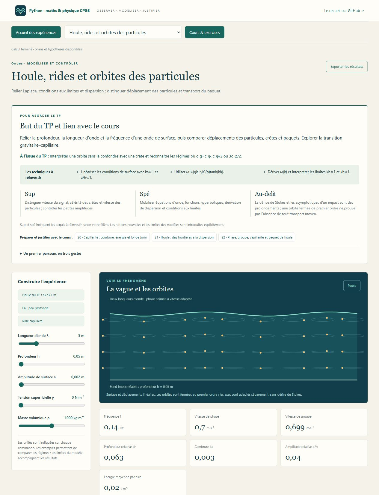
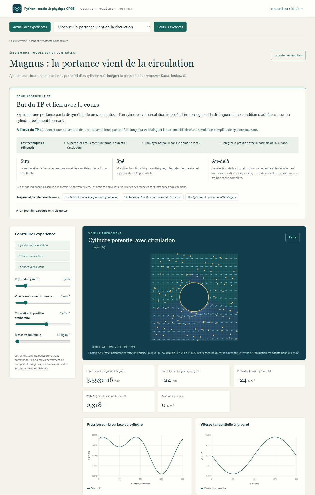

# Fluides & Ondes — du mouvement aux bilans

**Atelier 08 de [Python-maths-CPGE](../README.md)**, pour les CPGE scientifiques : **18 laboratoires, 28 leçons et 40 exercices corrigés**, construits à partir des fiches **P4, P6, P7 et P8** du recueil de **A. R.** Les calculs, les unités et les conditions de validité accompagnent les images.



## Des expériences pour choisir le bon modèle

- **Une paroi entraîne le fluide.** Distinguer rotation, cisaillement et extension ; construire la contrainte newtonienne et son bilan de dissipation. Comparer Couette pur, pression motrice et reflux.
- **Un capillaire change de rayon.** Retrouver Poiseuille, le débit en R⁴ et la résistance hydraulique. Relier puissance de pression et dissipation.
- **Le mouvement pénètre dans le fluide.** Comparer démarrage de Stokes en demi-espace et Couette entre deux parois ; construire la similitude de Blasius et contrôler son domaine laminaire.
- **Une pompe alimente une conduite.** Décomposer Bernoulli généralisé : charge cinétique, altitude, pertes, rendement et énergie mécanique transférée. Une approximation de régime ne devient pas une loi universelle.
- **Une sphère tombe, un tourbillon se forme.** Comparer Stokes et une corrélation de traînée ; tracer la pression de Rankine, puis étudier le cylindre avec circulation prescrite et l’effet Magnus.
- **Une vague se propage dans une cuve.** Partir de Laplace et des conditions au fond et à la surface ; comparer eau profonde, eau peu profonde et rides capillaires, vitesse de phase et vitesse de groupe.
- **Le son rencontre une interface ou un conduit.** Construire les coefficients de pression, la conservation du flux énergétique, les modes transverses, le seuil de propagation et la diffraction d’une fente.
- **Les disciplines se répondent.** Relier acoustique à la compressibilité thermodynamique, hydrostatique à l’atmosphère et MHD au freinage de Hartmann et aux ondes d’Alfvén.
- **Navier–Stokes met les bilans à l’épreuve.** Explorer Taylor–Green périodique en 2D, dissipation et rotationnel, puis comprendre ce que demande le problème du millénaire en 3D.

Chaque TP commence par **son but et son lien avec le cours**, un résultat attendu, les techniques à réinvestir, les entrées **sup / spé / au-delà**, et des boutons vers les leçons utiles. Un premier parcours en trois gestes guide de la prédiction à l’expérience puis à la justification. Les extensions sont signalées ; les acquis dépendent de la filière.



## Lancer l’atelier

**Python 3.10+ et NumPy**. Sous Windows, double-cliquer sur **Lancer_Mecanique_Fluides.cmd** à la racine du dépôt. Après installation des dépendances, l’atelier fonctionne hors ligne sur <http://127.0.0.1:8772>.

```text
python -m pip install -r requirements.txt
python -X utf8 mecanique_fluides.py
```

[Première ouverture](LISEZ_MOI.md) · [Missions et parcours](PARCOURS.md) · [Cours imprimable et corrections](COURS.md) · [Conventions et clarifications](ERRATA.md) · [Galerie scientifique](illustrations/README.md).

## Lire les résultats

Les scènes sont animées à vitesse adaptée et les déplacements peuvent être amplifiés ; les valeurs physiques se lisent sur les courbes et les indicateurs. Les modèles exacts sous leurs hypothèses, les intégrations numériques et les corrélations expérimentales sont distingués. Les bornes de saisie empêchent les valeurs non finies ; un avertissement physique explicite les régimes où une formule cesse d’être appropriée.

La MHD présente un modèle d’Hartmann avec conditions électriques déclarées et une onde d’Alfvén idéale. Rankine décrit un tourbillon horizontal idéalisé ; Magnus utilise une circulation prescrite, sans prétendre calculer celle d’un objet réel en rotation. Taylor–Green 2D n’est pas une simulation d’explosion 3D ni une preuve du problème du millénaire. Le statut de l’annonce de septembre 2026 est présenté avec la [source officielle Clay](https://www.claymath.org/news/navier-stokes-announcement/).

## Fichiers et vérifications

| Fichier | Rôle |
| --- | --- |
| `mecanique_fluides.py` | Serveur local, contrôle des requêtes et export des résultats. |
| `catalogue.py` | Paramètres, unités et expériences préconstruites. |
| `modeles.py` | Lois physiques, intégrations, bilans et courbes. |
| `cours.py` et `reperes.py` | Leçons, corrections et introductions des TP. |
| `app.js`, `index.html`, `style.css` | Scènes animées et interface hors ligne. |
| `illustrations.py` | Génération des figures SVG scientifiques autonomes. |
| `test_modeles.py`, `test_pedagogie.py`, `test_serveur.py` | Invariants, limites physiques, cohérence pédagogique et échanges locaux. |

```text
python -X utf8 -m unittest -v test_modeles test_pedagogie test_serveur
python -X utf8 export_cours.py
python -m pip install -r requirements-illustrations.txt
python -X utf8 mecanique_fluides.py --export-illustrations
```

Matplotlib est facultatif et sert seulement à régénérer les figures SVG ; les fichiers fournis se lisent sans cette bibliothèque.

Les vérifications du dépôt exécutent cet atelier sous Windows et Linux, avec Python 3.10 et 3.12. Le PDF de travail reste un document source local ; les figures et développements de cet atelier sont originaux.
