# Galerie scientifique : mécanique des fluides et acoustique

Seize illustrations vectorielles originales couvrent les dix-huit TP. Les axes, conventions et hypothèses sont indiqués dans chaque figure. Les schémas ne reprennent aucune image du PDF privé.

## Suivre une particule ou figer le champ ?

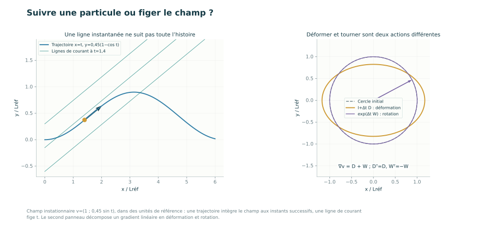

Champ instationnaire v=(1 ; 0,45 sin t), dans des unités de référence : une trajectoire intègre le champ aux instants successifs, une ligne de courant fige t. Le second panneau décompose un gradient linéaire en déformation et rotation.

Laboratoires : `cinematique`.

## Déformation, contraintes et dissipation

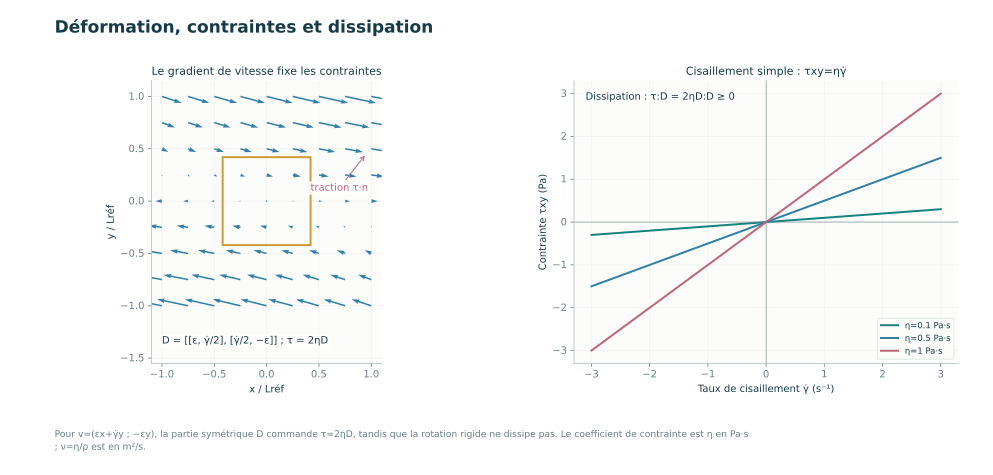

Pour v=(εx+γ̇y ; −εy), la partie symétrique D commande τ=2ηD, tandis que la rotation rigide ne dissipe pas. Le coefficient de contrainte est η en Pa·s ; ν=η/ρ est en m²/s.

Laboratoires : `newtonien`.

## Couette et Poiseuille : les conditions aux limites décident

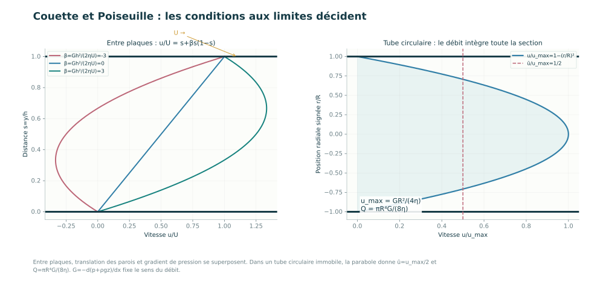

Entre plaques, translation des parois et gradient de pression se superposent. Dans un tube circulaire immobile, la parabole donne ū=u_max/2 et Q=πR⁴G/(8η). G=−d(p+ρgz)/dx fixe le sens du débit.

Laboratoires : `couette`, `poiseuille`.

## Une paroi, deux parois : deux problèmes de diffusion

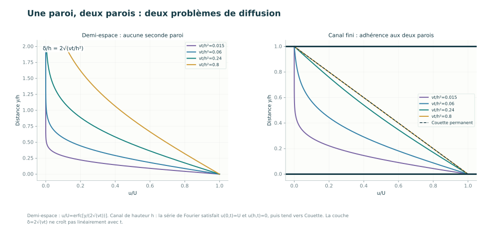

Demi-espace : u/U=erfc[y/(2√(νt))]. Canal de hauteur h : la série de Fourier satisfait u(0,t)=U et u(h,t)=0, puis tend vers Couette. La couche δ=2√(νt) ne croît pas linéairement avec t.

Laboratoires : `diffusion`.

## Blasius : une couche limite qui s’épaissit en √x

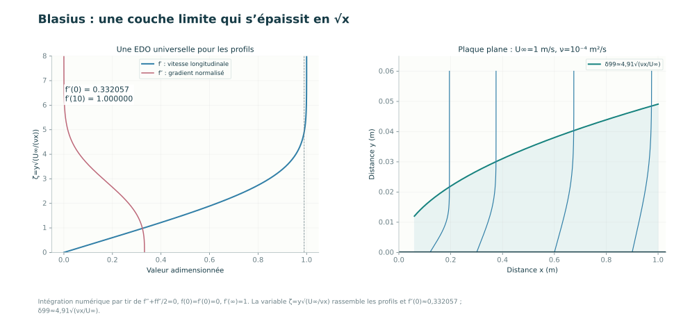

Intégration numérique par tir de f‴+ff″/2=0, f(0)=f′(0)=0, f′(∞)=1. La variable ζ=y√(U∞/νx) rassemble les profils et f″(0)≈0,332057 ; δ99≈4,91√(νx/U∞).

Laboratoires : `blasius`.

## Venturi : accélération et bilan de charge

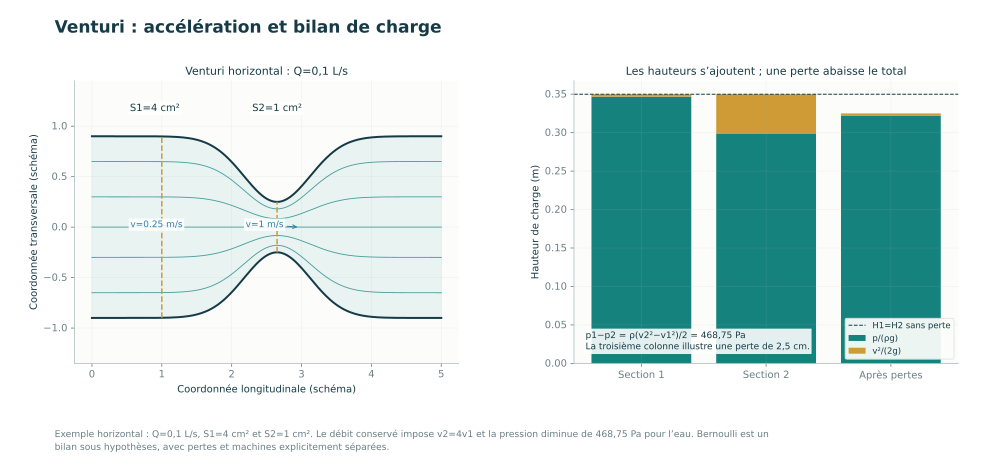

Exemple horizontal : Q=0,1 L/s, S1=4 cm² et S2=1 cm². Le débit conservé impose v2=4v1 et la pression diminue de 468,75 Pa pour l’eau. Bernoulli est un bilan sous hypothèses, avec pertes et machines explicitement séparées.

Laboratoires : `bernoulli`.

## Sphère lente : champ de Stokes et vitesse limite

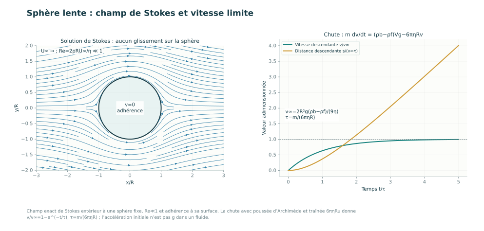

Champ exact de Stokes extérieur à une sphère fixe, Re≪1 et adhérence à sa surface. La chute avec poussée d’Archimède et traînée 6πηRu donne v/v∞=1−e^(−t/τ), τ=m/(6πηR) ; l’accélération initiale n’est pas g dans un fluide.

Laboratoires : `sphere`.

## Rotation locale, circulation et portance

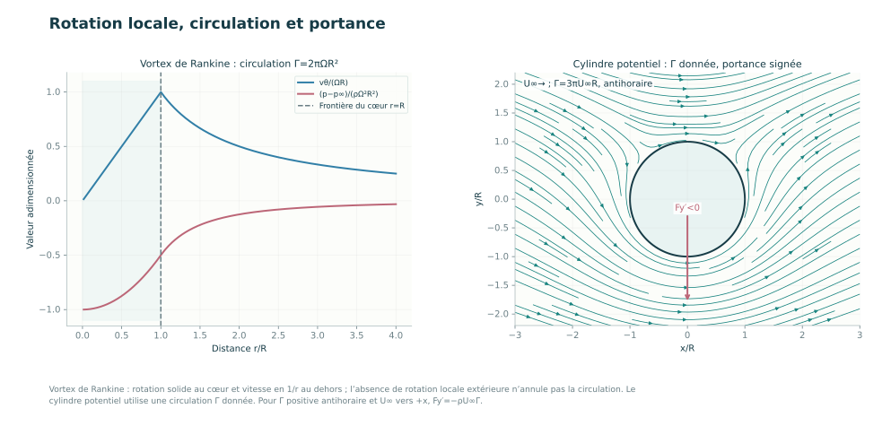

Vortex de Rankine : rotation solide au cœur et vitesse en 1/r au dehors ; l’absence de rotation locale extérieure n’annule pas la circulation. Le cylindre potentiel utilise une circulation Γ donnée. Pour Γ positive antihoraire et U∞ vers +x, Fy′=−ρU∞Γ.

Laboratoires : `vortex`, `magnus`.

## Houle : phase, groupe et orbites de particules

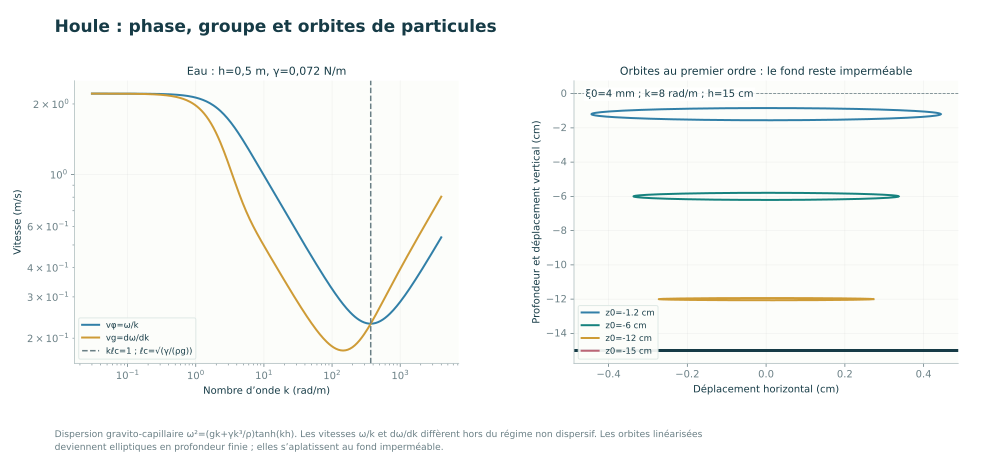

Dispersion gravito-capillaire ω²=(gk+γk³/ρ)tanh(kh). Les vitesses ω/k et dω/dk diffèrent hors du régime non dispersif. Les orbites linéarisées deviennent elliptiques en profondeur finie ; elles s’aplatissent au fond imperméable.

Laboratoires : `houle`.

## Interface acoustique : amplitudes et énergie

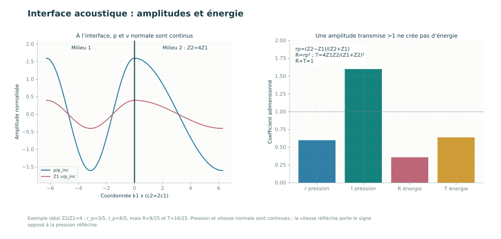

Exemple idéal Z2/Z1=4 : r_p=3/5, t_p=8/5, mais R=9/25 et T=16/25. Pression et vitesse normale sont continues ; la vitesse réfléchie porte le signe opposé à la pression réfléchie.

Laboratoires : `acoustique`.

## Guide sonore : mode transverse et coupure

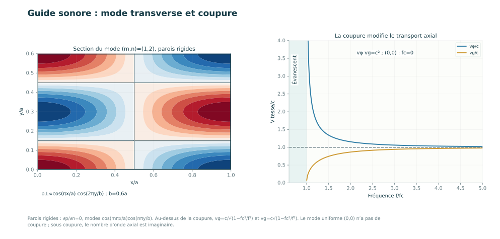

Parois rigides : ∂p/∂n=0, modes cos(mπx/a)cos(nπy/b). Au-dessus de la coupure, vφ=c/√(1−fc²/f²) et vg=c√(1−fc²/f²). Le mode uniforme (0,0) n’a pas de coupure ; sous coupure, le nombre d’onde axial est imaginaire.

Laboratoires : `conduit`.

## Diffraction et stroboscope : mesurer sans surinterpréter

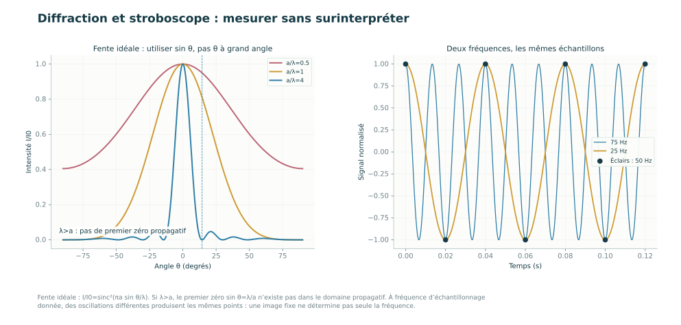

Fente idéale : I/I0=sinc²(πa sin θ/λ). Si λ>a, le premier zéro sin θ=λ/a n’existe pas dans le domaine propagatif. À fréquence d’échantillonnage donnée, des oscillations différentes produisent les mêmes points : une image fixe ne détermine pas seule la fréquence.

Laboratoires : `diffraction`.

## Son et échanges thermiques : comparer les échelles

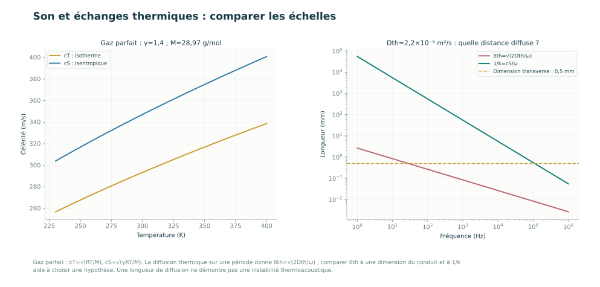

Gaz parfait : cT=√(RT/M), cS=√(γRT/M). La diffusion thermique sur une période donne δth=√(2Dth/ω) ; comparer δth à une dimension du conduit et à 1/k aide à choisir une hypothèse. Une longueur de diffusion ne démontre pas une instabilité thermoacoustique.

Laboratoires : `thermo`.

## Hartmann : le champ freine et dissipe

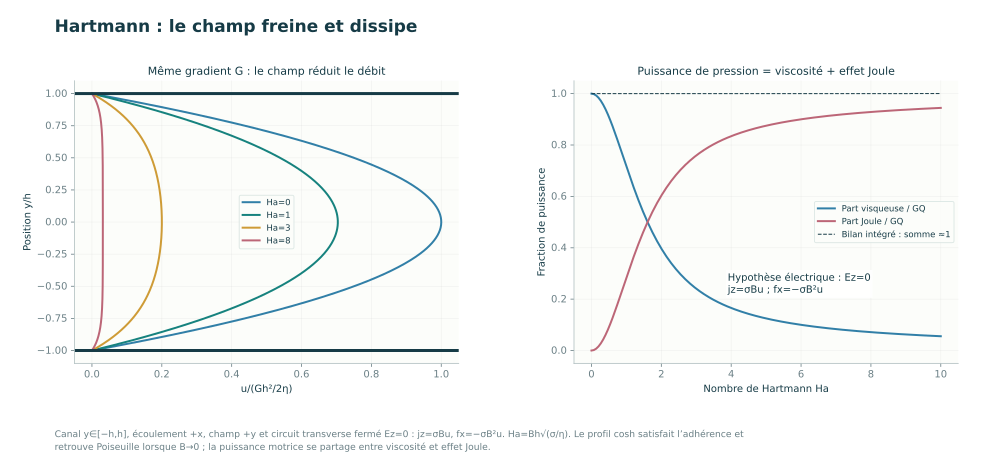

Canal y∈[−h,h], écoulement +x, champ +y et circuit transverse fermé Ez=0 : jz=σBu, fx=−σB²u. Ha=Bh√(σ/η). Le profil cosh satisfait l’adhérence et retrouve Poiseuille lorsque B→0 ; la puissance motrice se partage entre viscosité et effet Joule.

Laboratoires : `mhd`.

## Taylor–Green : un bilan contrôlé, une question générale distincte

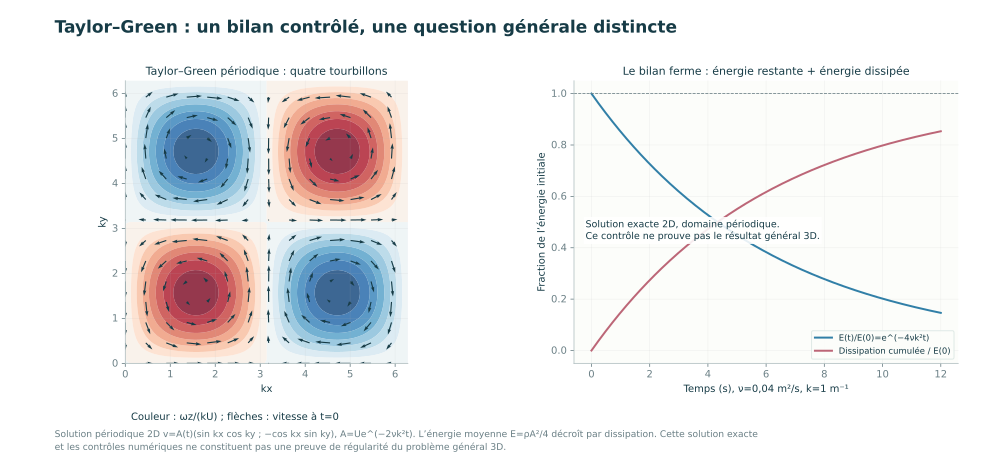

Solution périodique 2D v=A(t)(sin kx cos ky ; −cos kx sin ky), A=Ue^(−2νk²t). L’énergie moyenne E=ρA²/4 décroît par dissipation. Cette solution exacte et les contrôles numériques ne constituent pas une preuve de régularité du problème général 3D.

Laboratoires : `navier`.

## Deux équilibres : rotation et atmosphère

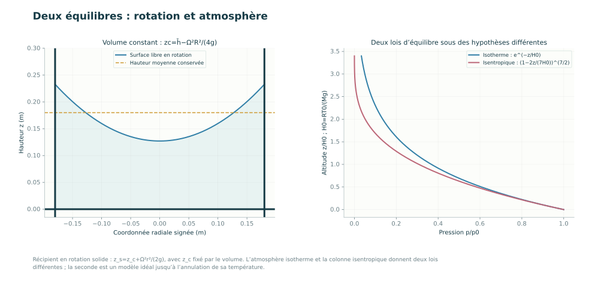

Récipient en rotation solide : z_s=z_c+Ω²r²/(2g), avec z_c fixé par le volume. L’atmosphère isotherme et la colonne isentropique donnent deux lois différentes ; la seconde est un modèle idéal jusqu’à l’annulation de sa température.

Laboratoires : `hydrostatique`.
