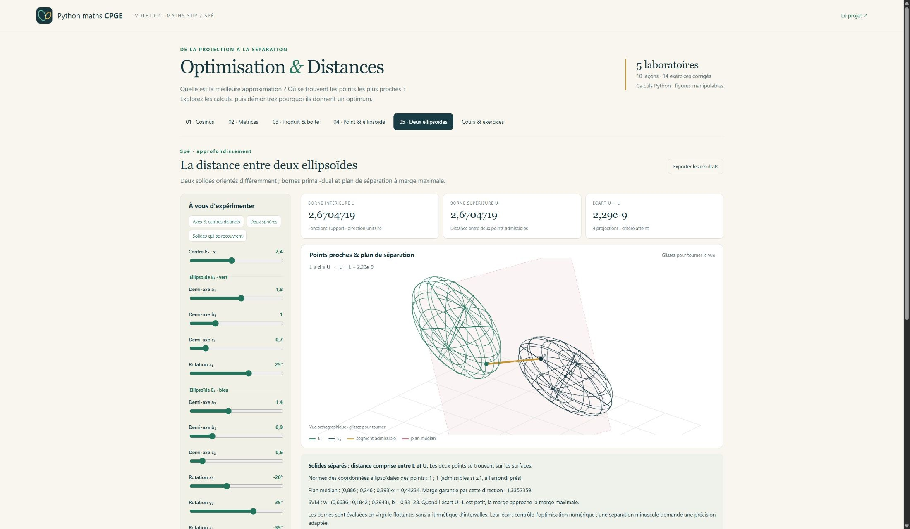

# Volet 02 · Optimisation & Distances

Un programme Python illustré pour **maths sup et maths spé** : **5 laboratoires**, **10 leçons** et **14 exercices corrigés**.

- **TP cosinus** : approximation affine L², meilleure droite uniforme, degrés et poids variables, descente de gradient.
- **Exercice 4** : projection des matrices, distance de Frobenius et dimension maximale d'un espace diagonalisable.
- **Matrices antisymétriques de déterminant 1** : ensemble vide en dimension impaire, distance exacte √n en dimension paire, sur ℝ ou ℂ.
- **Exercice 6** : ellipsoïde, produits pondérés et boîte de volume maximal.
- **Distances géométriques** : minimum et maximum point–surface ; minimum entre deux ellipsoïdes disjoints orientés, bornes numériques et séparation SVM.

**Démarrer sous Windows :** double-cliquer sur `Lancer_Optimisation.cmd` à la racine du dépôt.
Python 3.10+ est requis ; le lanceur installe NumPy à la première ouverture si nécessaire.
L'atelier s'ouvre sur <http://127.0.0.1:8766> et fonctionne ensuite hors ligne.

[Guide complet et lancement tous systèmes](LISEZ_MOI.md) ·
[Parcours en 60 minutes](PARCOURS.md) ·
[Cours et corrections](COURS.md) ·
[5 figures SVG](illustrations)

**29 tests** vérifient le moteur et le serveur. Les extrema du point sont globaux ; les bornes entre ellipsoïdes
sont évaluées en virgule flottante. Les conventions surface/solide sont expliquées dans le cours.

[Retour aux deux volets de Python-maths-CPGE](../README.md)
