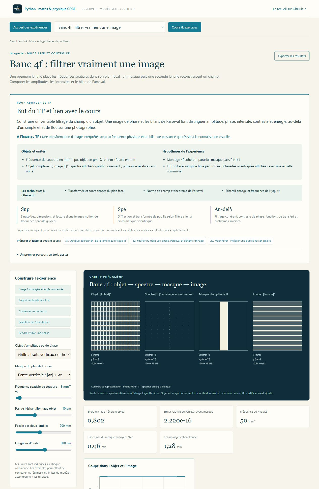

# Lumière & Images · Optique CPGE

**Atelier 10 de Python-maths-CPGE · optique géométrique et ondulatoire.**



**24 laboratoires interactifs, 36 leçons, 48 exercices corrigés, 24 figures
scientifiques et dix missions**, à partir des fiches **P9 et P10** du recueil de
A. R. Chaque TP commence par son but, les objets et unités, les hypothèses,
les techniques à réinvestir, les repères **sup / spé / au-delà**, les leçons
associées et un premier parcours **prédire → expérimenter → justifier**.

## Observer, régler, mesurer

| Banc ou phénomène | Expérience et question physique |
| --- | --- |
| Descartes–Snell | Quand un rayon transmis disparaît-il ? Directions et bilan des flux, réflexion totale. |
| Lentille et Bessel | Images réelles, virtuelles ou à l’infini ; deux mises au point, Silbermann et incertitudes. |
| Lunette astronomique | Réglage afocal, grossissement, pupille et résolution : que gagne-t-on en changeant l’oculaire ? |
| Microscope | Image intermédiaire, intervalle optique, mise au point et ouverture numérique. |
| Œil réduit | Accommodation, myopie, hypermétropie, correction, flou rétinien et diffraction. |
| Fibre à saut d’indice | Cône d’acceptance, réflexions, trajets et retards ; repère ondulatoire monomode. |
| Mirage | Gradient d’indice : invariant de translation, trajectoire courbe et contrôle numérique. |
| Arc-en-ciel | Tracé dans une goutte, extrema de déviation, dispersion et arcs primaire/secondaire. |
| Prisme et goniomètre | Déviation minimale, indice et dispersion de Cauchy ; domaines d’émergence. |
| Aberration sphérique | Un miroir sphérique exact rassemble-t-il les rayons au même foyer ? |
| Fermat | Retrouver Snell en rendant stationnaire le chemin optique. |
| Young | Distinguer interfrange et enveloppe ; déséquilibre des fentes et sources indépendantes. |
| Réseau de fentes | Somme de N amplitudes, ordres absents et pouvoir de résolution d’un doublet. |
| Pupilles et apodisation | Rectangle, fente, transmittance cosinus : largeur centrale contre lobes secondaires. |
| Polarisation | Matrices de Jones, lame quart/demi-onde, ellipse, Malus et sphère de Poincaré. |
| Michelson | Translation du miroir, facteur deux, anneaux d’égale inclinaison et coin d’air. |
| Cohérence | Largeur spectrale, source étendue et battements du doublet de sodium. |
| Fabry–Perot | Coefficient d’Airy, largeur des résonances, finesse et intervalle spectral libre. |
| Optique de Fourier | Banc 4f : objet, transformée, masque et image ; transmission d’amplitude ou objet de phase. |
| Laser | Cavité stable, modes longitudinaux, seuil, pertes et saturation dans un modèle explicité. |
| Faisceau gaussien | Waist, longueur de Rayleigh, divergence et concentration de l’énergie. |
| Pupille et étoiles doubles | Tache d’Airy, critère de Rayleigh, obstruction centrale ; deux étoiles incohérentes. |
| Optique non linéaire | Génération à 2ω : désaccord de phase, faible conversion, déplétion et bilans de photons. |

La ligne **Lentille et Bessel** renvoie à deux TP distincts.
Un [aperçu de la lunette astronomique](apercu_telescope.png) montre les rayons,
les réglages et les grandeurs mesurées.
Les images, rayons et profils proviennent des calculs Python. Les couleurs de
représentation, l’étirement éventuel des axes et la compression de dynamique
des images sont explicités ; les intensités quantitatives restent sur les courbes.

## Un parcours de CPGE, avec des ouvertures guidées

Les notions nouvelles commencent par leurs objets, leur convention et un
problème concret. Les repères sup et spé indiquent les acquis à réinvestir
selon la filière ; les extensions ne sont pas présentées comme un programme
commun obligatoire. Les matrices de Jones, la théorie gaussienne des faisceaux,
le filtrage cohérent et les ondes couplées prolongent les techniques du cours.

Les expériences distinguent optique géométrique exacte, approximation de Gauss,
diffraction scalaire de Fraunhofer, imagerie cohérente et incohérente. Un fort
grossissement ne restaure pas les détails que la pupille a supprimés.

- [Ouvrir l’atelier sous Windows, Linux ou macOS](LISEZ_MOI.md).
- [Dix missions, de la mise au point à la conversion de fréquence](PARCOURS.md).
- [Cours et 48 exercices corrigés, lisibles sans lancer Python](COURS.md).
- [Galerie des figures originales](illustrations/README.md).
- [Errata demandé, limité aux formules vérifiées dans quatre points du PDF](ERRATA.md).

## Lancement

**Python 3.10+ et NumPy.** Double-cliquer sur `Lancer_Optique.cmd`.
L’application fonctionne hors ligne après installation sur <http://127.0.0.1:8774>.
Les résultats sont exportables avec les paramètres et hypothèses de l’expérience.

```text
python -m pip install -r requirements.txt
python -X utf8 optique.py
```

Le [guide](LISEZ_MOI.md) explique les commandes, le changement de port et la
régénération des figures. Matplotlib est facultatif : il sert seulement à
produire les figures déjà livrées.

## Sources, illustrations et contrôles

Les fiches P9/P10 constituent le point de départ du parcours : bancs,
goniomètre et Bessel, fibre, goutte d’eau et mirage ; Michelson et polarisation,
Young, doublet, diaphragmes, apodisation, réseau, Fabry–Perot et ONL.
Le PDF personnel n’est pas redistribué. Le cours, les figures et les scènes
de cet atelier sont originaux.

Le cours référence notamment les [notes d’optique du MIT](https://ocw.mit.edu/courses/2-71-optics-spring-2009/resources/lecture-notes/).
La [NASA explique le lien entre diamètre, longueur d’onde et résolution astronomique](https://science.nasa.gov/mission/webb/faqs-full/).
Les exemples de grandes ouvertures restent des **pupilles idéales** ; ils ne
reconstituent pas la pupille segmentée ni les aberrations d’un télescope réel.

Les tests comparent les calculs à des invariants, des sommes d’amplitudes et
des intégrales indépendantes, contrôlent les limites et les paramètres extrêmes,
puis vérifient les exports et le serveur. GitHub les exécute sous Windows et
Linux avec Python 3.10 et 3.12.

| Fichier | Rôle |
| --- | --- |
| `modeles_geometrie.py`, `modeles_ondes.py` | Tracés, champs, spectres et images. |
| `catalogue*.py`, `modeles.py` | Commandes publiques et validation. |
| `cours.py`, `reperes.py` | Leçons, corrections, buts et repères de chaque TP. |
| `visuals.js`, `app.js` | Scènes, courbes et navigation locale. |
| `illustrations.py` | Génération reproductible des figures SVG. |
| `optique.py` | Serveur local et export des résultats. |
