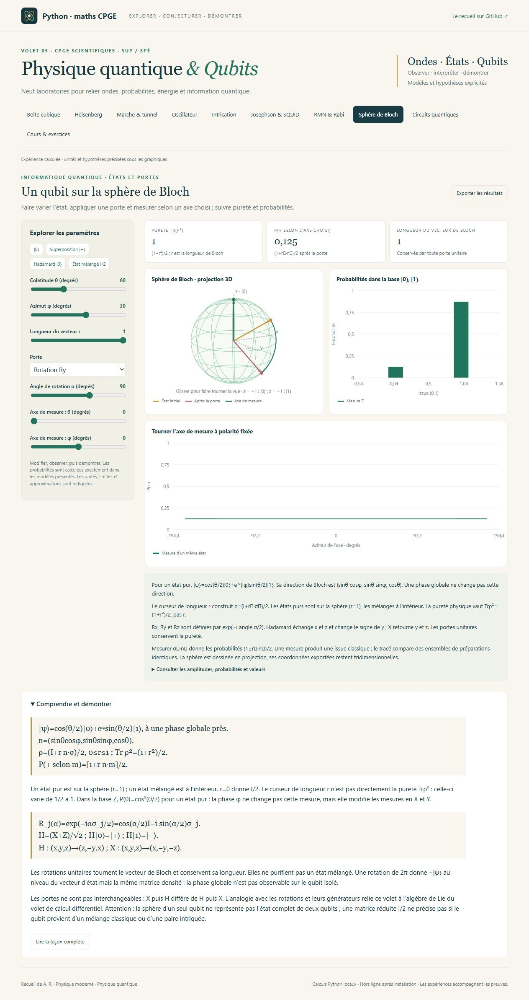
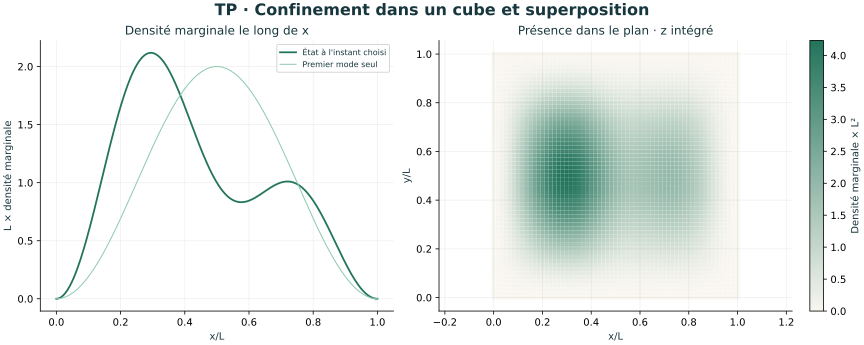
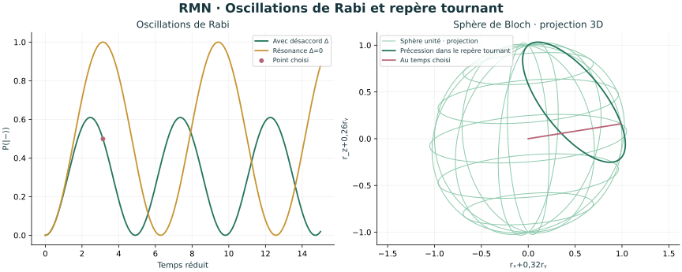

# Physique quantique & Qubits

Volet **05** de [Python-maths-CPGE](../README.md), pour les étudiants de **maths sup et maths spé** : **9 laboratoires interactifs, 18 leçons, 24 exercices corrigés, 7 séances et 9 illustrations scientifiques**.

Le parcours part des TP et des exercices 1 à 4 de l’extrait de physique quantique du recueil de **A. R.** (pages 471–479). Il ajoute l’oscillateur harmonique, la sphère de Bloch et une introduction aux circuits quantiques. Les extensions sont signalées selon les connaissances requises ; chaque modèle annonce ses unités et ses hypothèses.



## Ouvrir l’atelier

Sous Windows, double-cliquer sur **Lancer_Physique_Quantique.cmd** à la racine du dépôt. **Python 3.10+** est requis ; le lanceur installe NumPy si nécessaire. Le navigateur ouvre <http://127.0.0.1:8769>. Les calculs restent locaux et fonctionnent hors ligne après installation.

Sur Windows, Linux ou macOS :

```sh
cd physique_quantique
python -m pip install -r requirements.txt
python physique_quantique.py
```

Garder le terminal ouvert ; `Ctrl+C` arrête le programme. Selon le système, utiliser `python3`. Pour changer de port : `python physique_quantique.py --port 8771`. GitHub présente les sources et le cours ; ouvrir le HTML seul ne démarre pas les calculs Python.

[Guide de lancement](LISEZ_MOI.md) · [Parcours en sept séances](PARCOURS.md) · [Cours et corrections](COURS.md)

## Les neuf laboratoires

| Laboratoire | Manipulations et compétences |
| --- | --- |
| **Boîte cubique — TP** | Conditions aux parois ou périodiques ; énergie du fondamental, dégénérescences, superpositions et battements. Carte de densité marginale, avec la troisième coordonnée intégrée. |
| **Heisenberg — TP** | Gaussienne libre, covariance et étalement ; fente et diffraction ; confinement, hydrogène et énergie minimale de l’oscillateur. |
| **Marche et tunnel — exercices 1–2** | Amplitudes complexes, raccordement de ψ et ψ′, flux réfléchis/transmis, onde évanescente, résonances et limite au sommet de la barrière. |
| **Oscillateur harmonique** | Niveaux d’énergie, fonctions d’Hermite, nœuds et état cohérent dont la moyenne suit le mouvement classique. |
| **Intrication — TP** | État photonique de Bell, probabilités conjointes, marges, mélange classique, bruit blanc, CHSH et seuils distincts d’intrication/violation. |
| **Josephson et SQUID — exercice 3** | Courant commandé par la phase, fréquence sous tension, quantum de flux, modulation du courant critique et asymétrie des deux jonctions. |
| **RMN et Rabi — exercice 4** | Résonance, désaccord, impulsions π et π/2, précession de Bloch dans le repère tournant ; conversions SI séparées pour un proton. |
| **Sphère de Bloch** | État pur ou mélangé, portes H/X/Rx/Ry/Rz, axe de mesure et probabilités. La sphère se fait tourner en glissant sur le graphique. |
| **Circuits quantiques** | Préparer une paire de Bell avec H et CNOT ; suivre les amplitudes de Grover sur quatre états et comprendre pourquoi trop d’itérations réduit la réussite. |

Les curseurs recalculent les courbes en Python. Des expériences préréglées facilitent les comparaisons ; le bouton **Exporter les résultats** enregistre les paramètres, les valeurs, les amplitudes et les données des courbes au format JSON.

## Observer, puis démontrer

Le cours distingue une densité de probabilité d’une matrice densité, un état stationnaire d’une superposition et une borne d’une estimation. Il présente les preuves de normalisation, séparation des variables, Heisenberg, conservation du courant et rotations unitaires.

Quelques précautions structurent les expériences :

- La boîte aux parois infinies impose `ψ=0`, sans dérivée périodique ; une boîte périodique décrit un autre problème.
- Une fente rectangulaire idéale donne un profil sinc² dont la variance en impulsion diverge. L’angle du premier zéro et un écart type sont deux grandeurs différentes.
- La marche sous le seuil possède une onde évanescente avec transmission nulle ; une barrière de largeur finie permet une transmission non nulle.
- Pour une marche, `T` est un rapport de courants, avec le facteur de vitesse ; le raccourci `T=|t|²` vaut pour les deux milieux extérieurs identiques de la barrière.
- Les valeurs RMN en teslas, hertz et secondes sont distinctes des paramètres réduits des courbes. Le champ transverse indiqué est circulaire.
- CHSH est une prédiction du modèle quantique simulé. Les marges locales restent indépendantes du réglage distant. Les circuits sont idéaux, avec un ordre de bits explicite `|q₀q₁⟩`.

Le cours propose un pont vers la physique statistique : les niveaux de la boîte et de l’oscillateur servent ensuite au comptage des états thermiques.

## Illustrations autonomes





Les [neuf figures SVG](illustrations/README.md) sont réutilisables pour accompagner un cours. Elles sont produites par Matplotlib à partir des mêmes modèles, sans reproduire les images du PDF. Pour les régénérer :

```sh
python -m pip install -r requirements-illustrations.txt
python physique_quantique.py --export-illustrations
```

Matplotlib est facultatif pour l’application. Le cours autonome se régénère avec `python export_cours.py`.

## Vérifications et sources

```sh
python -X utf8 -m unittest -v test_modeles test_serveur
```

**77 tests**, dont 70 tests scientifiques : quadratures et transformée de Fourier indépendantes, résidus de Schrödinger, quatre équations de raccordement, dégénérescences, courants, positivité des matrices densité, transposition partielle, CHSH, unitarité et Grover. Sept tests supplémentaires vérifient le serveur et les exports. Les vérifications automatiques couvrent Windows et Linux avec Python 3.10 et 3.12.

Les constantes sont celles de la [table officielle NIST/CODATA 2022](https://physics.nist.gov/cuu/Constants/Table/allascii.txt). Les sources pédagogiques primaires MIT et IBM sont détaillées dans [le cours](COURS.md). L’extrait personnel du recueil sert de fil conducteur ; il n’est pas inclus dans les fichiers publics.

| Fichier | Rôle |
| --- | --- |
| [modeles.py](modeles.py) | États, observables, probabilités, spectres et modèles physiques NumPy. |
| [cours.py](cours.py) | Leçons, preuves et exercices interactifs. |
| [physique_quantique.py](physique_quantique.py) | Serveur HTTP sur la boucle locale et commandes de lancement. |
| [illustrations.py](illustrations.py) | Figures scientifiques SVG. |
| [test_modeles.py](test_modeles.py) et [test_serveur.py](test_serveur.py) | Vérifications indépendantes. |
