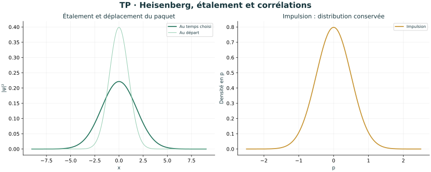
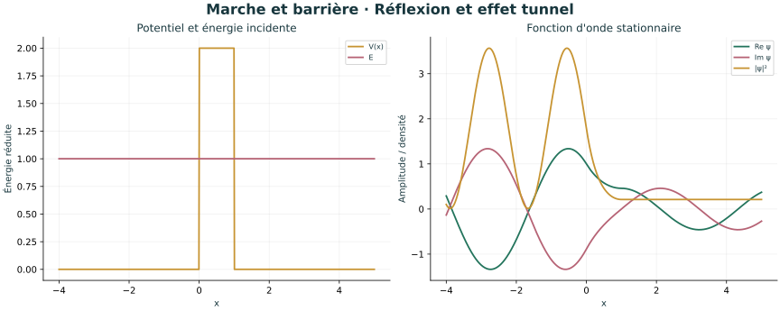
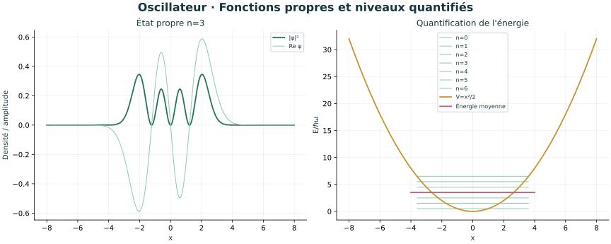
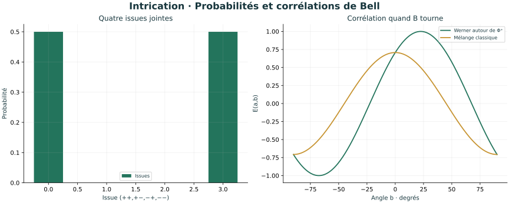
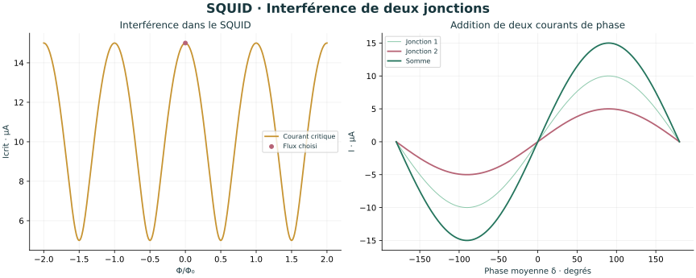
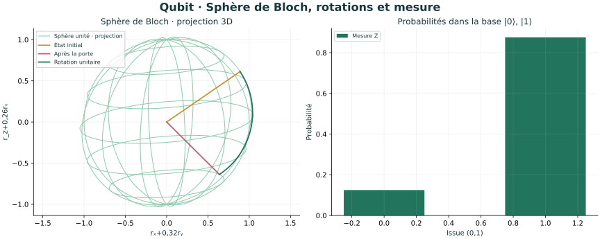
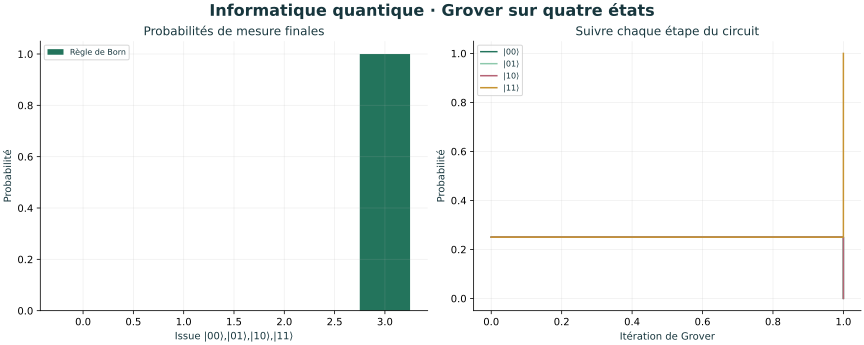

# Neuf illustrations scientifiques — physique quantique

Ces figures accompagnent le [parcours](../PARCOURS.md) et le [cours](../COURS.md). Elles sont produites par Matplotlib à partir des modèles Python de l’atelier. Les unités et approximations figurent dans chaque laboratoire.

## Boîte cubique : superposition et densité marginale


## Heisenberg : gaussienne libre



## Barrière : réflexion et tunnel



## Oscillateur : niveau n = 3



## Intrication : probabilités de Bell



## SQUID : deux jonctions différentes



## RMN : Rabi avec désaccord


## Bloch : rotation du qubit



## Informatique : une itération de Grover



Pour régénérer ces illustrations depuis le dossier `physique_quantique` :

```sh
python -m pip install -r requirements-illustrations.txt
python physique_quantique.py --export-illustrations
```
