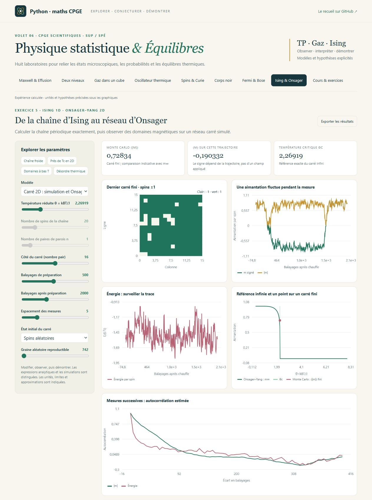
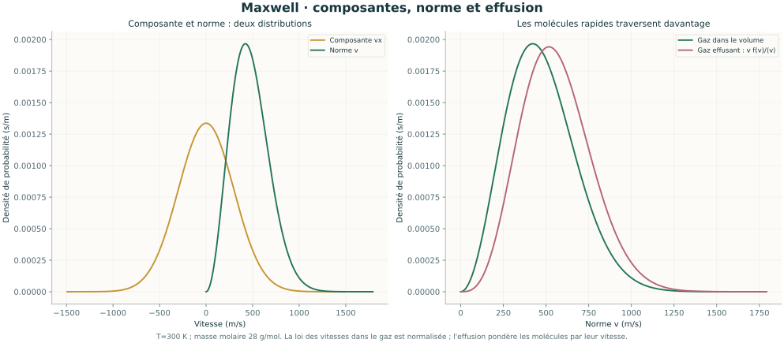
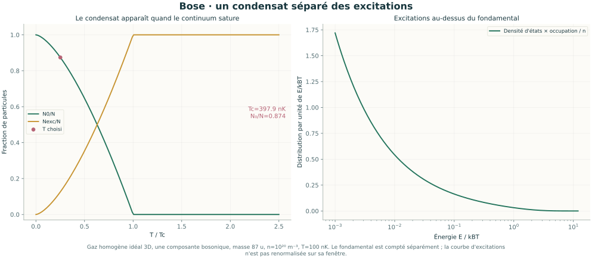
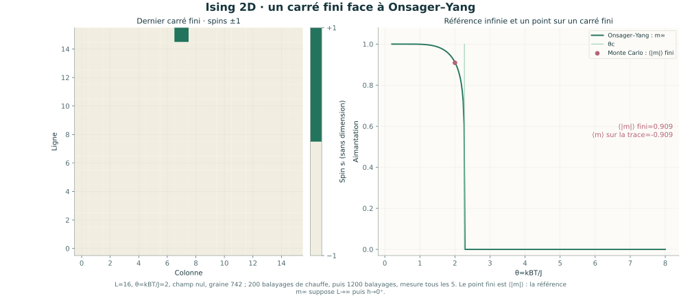

# Physique statistique & Équilibres

Volet **06** de [Python-maths-CPGE](../README.md), pour les étudiants de **maths sup et maths spé** : **8 laboratoires interactifs, 16 leçons, 24 exercices corrigés, 7 séances et 10 illustrations scientifiques**.

Le parcours suit l’extrait de physique statistique du recueil de **A. R.** (pages imprimées 434–442), avec priorité aux expériences du **TP**. Il relie les niveaux de la boîte cubique et de l’oscillateur du [volet quantique](../physique_quantique/README.md) aux états thermiques. Les approfondissements Fermi/Bose et Ising 2D sont guidés et signalés.



## Ouvrir l’atelier

Sous Windows, double-cliquer sur **Lancer_Physique_Statistique.cmd** à la racine du dépôt. **Python 3.10+** est requis ; le lanceur installe NumPy si nécessaire. Le navigateur ouvre <http://127.0.0.1:8770>. Les calculs restent locaux et fonctionnent hors ligne après installation.

Sur Windows, Linux ou macOS :

```sh
cd physique_statistique
python -m pip install -r requirements.txt
python physique_statistique.py
```

Garder le terminal ouvert ; `Ctrl+C` arrête le programme. Selon le système, utiliser `python3`. Pour changer de port : `python physique_statistique.py --port 8772`. GitHub présente les sources et le cours ; ouvrir le HTML seul ne démarre pas les calculs Python.

[Guide de lancement](LISEZ_MOI.md) · [Parcours en sept séances](PARCOURS.md) · [Cours et corrections](COURS.md) · [Clarifications du recueil](ERRATA.md)

## Les huit laboratoires

| Laboratoire | Manipulations et compétences |
| --- | --- |
| **Maxwell & Effusion — TP** | Distinguer composante et norme des vitesses ; vitesse probable, moyenne et quadratique ; pression cinétique ; fuite exponentielle à température fixée ; échange entre deux volumes à températures différentes. |
| **Deux niveaux — exercice 2** | Comparer comptage microcanonique, entropie de Boltzmann et populations canoniques. Énergie, fluctuations, capacité de Schottky ; extension à trois niveaux dégénérés. |
| **Gaz dans un cube — TP, exercice 4** | Somme des niveaux quantiques, convergence de la coupure, longueur thermique et partition classique. Gaz parfait monoatomique, pression et limite d’équipartition. |
| **Oscillateur thermique — exercice 3** | Partition quantique, énergie de point zéro, gel de la capacité à basse température et limite classique. Compter les termes quadratiques supplémentaires du recueil. |
| **Spins & Curie** | Système à deux niveaux dans un champ ; aimantation, saturation, loi de Curie et capacité thermique. Les spins de ce laboratoire sont indépendants. |
| **Corps noir — exercice 1** | Spectres de Planck par longueur d’onde et fréquence, jacobien, Wien et Stefan–Boltzmann ; fraction énergétique dans le visible 390–780 nm. |
| **Fermi & Bose — TP** | Gaz électronique à densité fixée, potentiel chimique et énergie de Fermi ; gaz atomique bosonique, température critique, population condensée et états excités. Comparaison BE/FD/MB au même potentiel chimique. |
| **Ising & Onsager — exercice 5 et extension** | Chaîne périodique exacte : parois, niveaux, dégénérescences et fonction de partition. Réseau carré : domaines magnétiques, Metropolis reproductible, fluctuations et référence d’Onsager–Yang. |

Les curseurs recalculent les courbes en Python. Des expériences préréglées facilitent les comparaisons ; **Exporter les résultats** enregistre les paramètres, les valeurs, les tableaux, les courbes et les mesures de simulation au format JSON.

## Observer, puis démontrer

Le cours explique la fonction de partition à partir des microétats, les dérivées donnant énergie et fluctuations, les intégrales gaussiennes, le comptage quantique et les limites classiques. Les probabilités de microétats, populations de niveaux, dégénérescences et occupations de modes sont distinguées.

- La relation poreuse `P₁/√T₁=P₂/√T₂` concerne l’état stationnaire, après le transitoire. L’effusion suppose des volumes thermostatés et un trou en régime moléculaire.
- Les deux niveaux localisés donnent `Z=zᴺ`. Le facteur de Gibbs `1/N!` appartient au gaz classique de particules identiques, sous ses propres hypothèses.
- L’énergie de point zéro reste dans `U` de l’oscillateur et disparaît de `C`. Le comptage classique inclut trois termes de translation ; des termes internes supplémentaires doivent inclure leurs contributions cinétiques.
- Le condensat idéal homogène 3D est séparé de l’intégrale des états excités. À température positive sous `T_c`, sa fraction est `1−(T/T_c)^(3/2)` ; un gaz piégé demande une autre densité d’états.
- La chaîne Ising 1D est calculée exactement. Le carré est une **simulation finie**, avec préparation et espacement des mesures. Les propositions paresseuses évitent certains cycles du damier ; les mesures restent corrélées, surtout près du seuil critique.
- La référence d’Onsager–Yang décrit le carré **infini, isotrope et sans champ**. La moyenne simulée `⟨|m|⟩` diffère de l’aimantation spontanée thermodynamique. Une courbe ou un pic ne constitue pas une preuve de transition.

Les [17 clarifications](ERRATA.md) précisent les facteurs, signes, conventions et hypothèses du PDF. Chaque leçon comporte un lien vers l’expérience correspondante ; chaque exercice dispose d’un corrigé et d’un réglage reproductible.

## Illustrations autonomes







Les [dix figures SVG](illustrations/README.md) sont réutilisables pour accompagner un cours. Elles sont produites par Matplotlib à partir des modèles de l’atelier. Pour les régénérer :

```sh
python -m pip install -r requirements-illustrations.txt
python physique_statistique.py --export-illustrations
```

Matplotlib est facultatif pour l’application. Le cours autonome se régénère avec `python export_cours.py`.

## Vérifications et sources

```sh
python -X utf8 -m unittest -v test_modeles test_ising test_serveur
```

**72 tests**, dont 65 tests scientifiques : comptages exhaustifs des niveaux et chaînes de spins ; moments et intégrales Maxwell ; pression, effusion et conservation de matière ; quadratures FD/BE, seuil de Bose et jacobien de Planck ; stationnarité de Boltzmann de Metropolis et comparaison de simulation avec l’équilibre exact sur un carré 2×2. Sept tests supplémentaires vérifient le serveur local et les exports. Les vérifications automatiques couvrent Windows et Linux avec Python 3.10 et 3.12.

Les constantes viennent de [NIST/CODATA 2022](https://physics.nist.gov/cuu/Constants/Table/allascii.txt). Les références primaires MIT, Onsager et Yang sont détaillées dans [le cours](COURS.md). L’extrait personnel du recueil sert de fil conducteur ; il n’est pas inclus dans les fichiers publics.

| Fichier | Rôle |
| --- | --- |
| [modeles.py](modeles.py) | États thermiques, gaz, oscillateur, Maxwell, rayonnement et occupations NumPy. |
| [ising.py](ising.py) | Chaîne exacte et réseau carré simulé. |
| [cours.py](cours.py) | Leçons, preuves et exercices interactifs. |
| [physique_statistique.py](physique_statistique.py) | Serveur HTTP local et commandes de lancement. |
| [illustrations.py](illustrations.py) | Figures scientifiques SVG. |
| [test_modeles.py](test_modeles.py), [test_ising.py](test_ising.py) et [test_serveur.py](test_serveur.py) | Vérifications indépendantes. |
