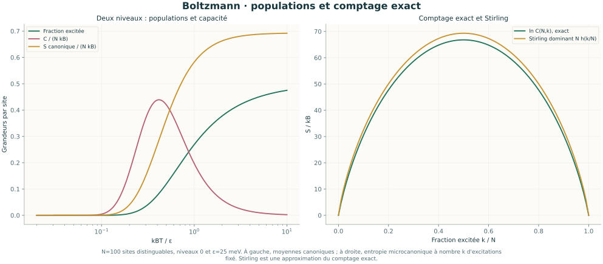
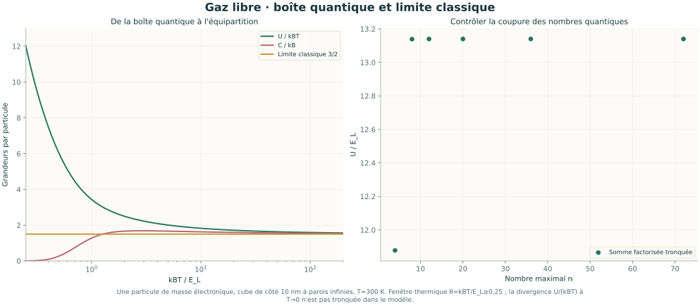
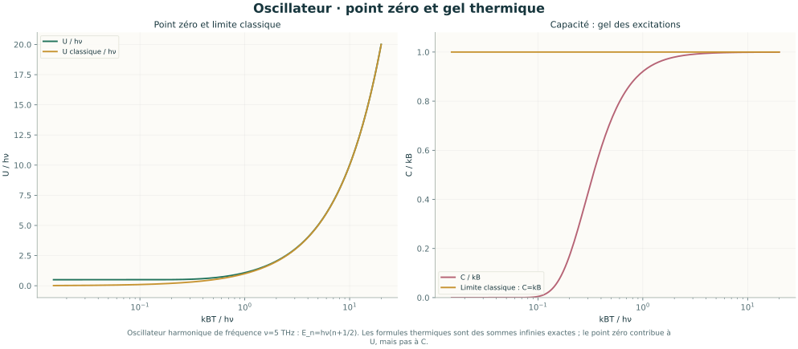
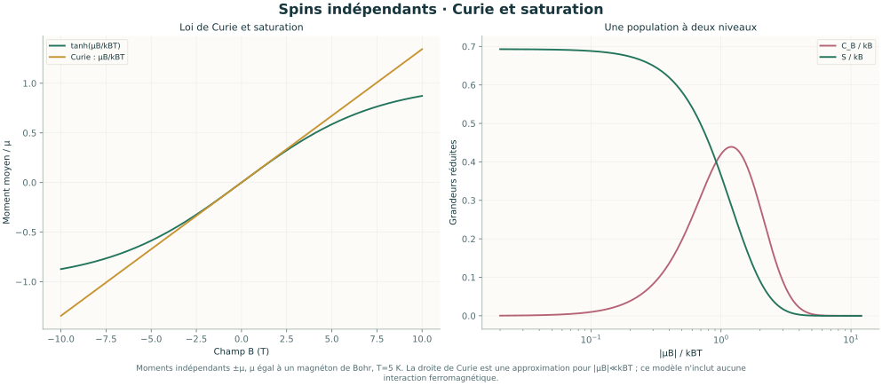
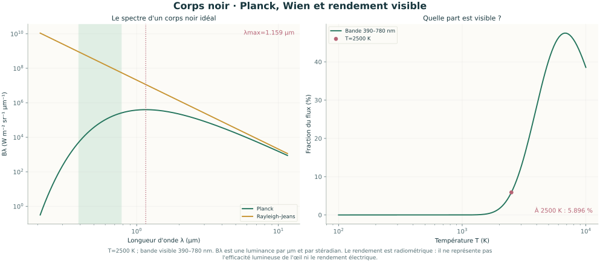
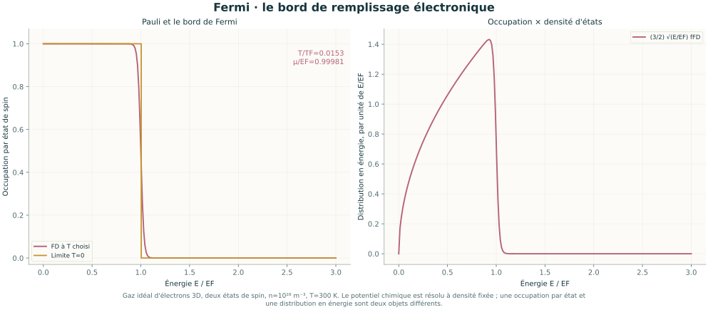
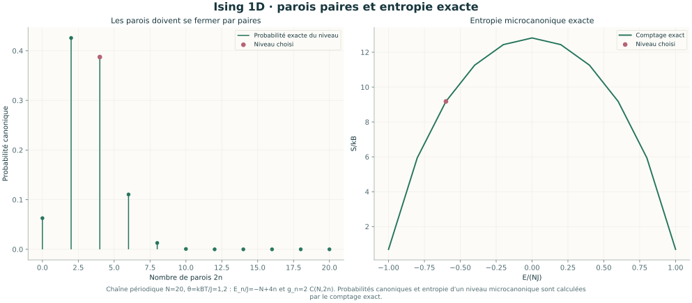

# Dix illustrations scientifiques — physique statistique

Ces figures autonomes accompagnent le [parcours](../PARCOURS.md) et le [cours](../COURS.md). Elles sont produites par Matplotlib à partir des modèles Python de l'atelier ; les unités, les paramètres et les limites des comparaisons sont indiqués sous les graphiques.

## Maxwell : une composante et une norme ne suivent pas la même loi


T=300 K ; masse molaire 28 g/mol. La loi des vitesses dans le gaz est normalisée ; l'effusion pondère les molécules par leur vitesse.

## Deux niveaux : réponse thermique et entropie de configuration



N=100 sites distinguables, niveaux 0 et ε=25 meV. À gauche, moyennes canoniques ; à droite, entropie microcanonique à nombre k d'excitations fixé. Stirling est une approximation du comptage exact.

## Boîte quantique : retrouver l'équipartition et contrôler la coupure



Une particule de masse électronique, cube de côté 10 nm à parois infinies, T=300 K. Fenêtre thermique θ=kBT/E_L≥0,25 ; la divergence U/(kBT) à T→0 n'est pas tronquée dans le modèle.

## Oscillateur : séparer l'énergie de point zéro et la capacité



Oscillateur harmonique de fréquence ν=5 THz : E_n=hν(n+1/2). Les formules thermiques sont des sommes infinies exactes ; le point zéro contribue à U, mais pas à C.

## Paramagnétisme : la loi de Curie cesse d'être une droite globale



Moments indépendants ±μ, μ égal à un magnéton de Bohr, T=5 K. La droite de Curie est une approximation pour |μB|≪kBT ; ce modèle n'inclut aucune interaction ferromagnétique.

## Corps noir : le spectre et la part énergétique visible



T=2500 K ; bande visible 390–780 nm. Bλ est une luminance par μm et par stéradian. Le rendement est radiométrique : il ne représente pas l'efficacité lumineuse de l'œil ni le rendement électrique.

## Bose–Einstein : saturation du continuum et fraction condensée


Gaz homogène idéal 3D, une composante bosonique, masse 87 u, n=10²⁰ m⁻³, T=100 nK. Le fondamental est compté séparément ; la courbe d'excitations n'est pas renormalisée sur sa fenêtre.

## Fermi–Dirac : le gaz d'électrons et sa densité d'états



Gaz idéal d'électrons 3D, deux états de spin, n=10²⁸ m⁻³, T=300 K. Le potentiel chimique est résolu à densité fixée ; une occupation par état et une distribution en énergie sont deux objets différents.

## Ising carré : un réseau fini et la référence infinie


L=16, θ=kBT/J=2, champ nul, graine 742 ; 200 balayages de chauffe, puis 1200 balayages, mesure tous les 5. Le point fini est ⟨|m|⟩ : la référence m∞ suppose L→∞ puis h→0⁺.

## Ising chaîne : les parois se ferment par paires



Chaîne périodique N=20, θ=kBT/J=1,2 : E_n/J=−N+4n et g_n=2 C(N,2n). Probabilités canoniques et entropie d'un niveau microcanonique sont calculées par le comptage exact.

Les deux illustrations Ising distinguent le comptage exact de la chaîne finie, une simulation du carré fini et les résultats exacts d'Onsager–Yang pour le réseau infini. Les statistiques Bose et Fermi emploient leurs masses et dégénérescences propres ; un gaz bosonique atomique n'est pas un gaz électronique.

Pour régénérer les SVG depuis le dossier `physique_statistique` :

```sh
python -m pip install -r requirements-illustrations.txt
python physique_statistique.py --export-illustrations
```
