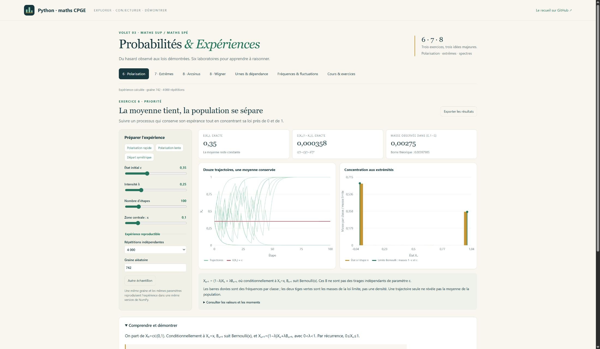
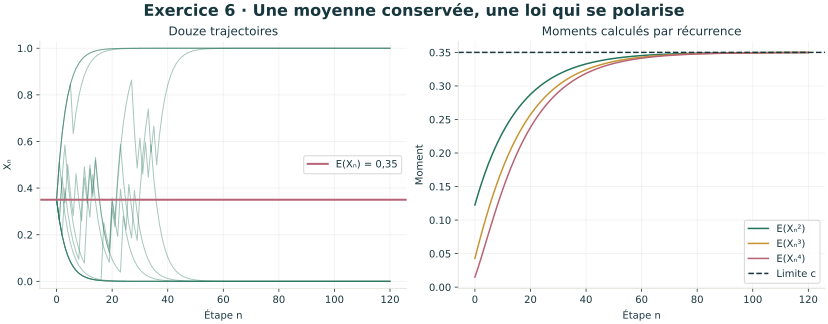
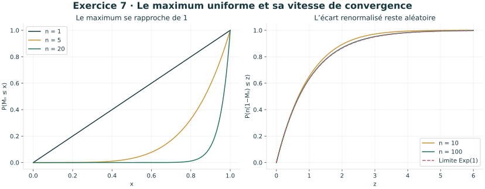
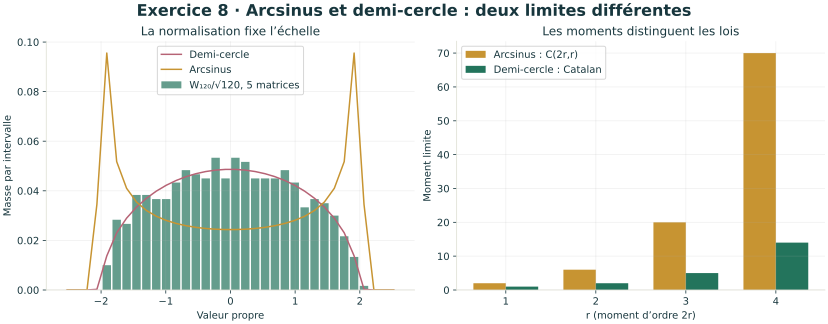

# Volet 03 · Probabilités & Expériences

**Six laboratoires interactifs pour maths sup et maths spé**, à partir de la fiche M12
du recueil de A. R., avec une priorité aux **exercices 6, 7 et 8**.



**12 leçons, 16 exercices corrigés, 6 figures scientifiques autonomes.**
Les calculs théoriques sont confrontés à des simulations reproductibles ; les preuves
expliquent ce que l’expérience permet de conjecturer.

| Laboratoire | Idée formatrice | Origine |
| --- | --- | --- |
| Polarisation | Espérance conservée, récurrence des moments, concentration vers Bernoulli | **Exercice 6** |
| Extrêmes uniformes | Répartition du maximum, statistiques d’ordre, vitesse exponentielle, estimation d’une borne | **Exercice 7** |
| Arcsinus & chemin | Sommes de Riemann, changement de variable, valeurs et vecteurs propres | **Exercice 8** |
| Wigner & moments | Matrices symétriques aléatoires, traces, demi-cercle, nombres de Catalan | **Exercice 8**, approfondissement |
| Urnes & dépendance | Hypergéométrique / binomiale, indicatrices et covariance | Exercice 4 |
| Fréquences & fluctuations | Marche aléatoire, grands nombres, Tchebychev et approximation normale | TP et exercice 5 |

## Démarrer

Sous Windows, double-cliquer sur **`Lancer_Probabilites.cmd`** à la racine du dépôt.
Python 3.10+ est nécessaire. Le lanceur prépare NumPy à la première ouverture,
qui demande alors Internet ; l’atelier fonctionne ensuite hors ligne.

Sur Windows, Linux ou macOS :

```console
cd probabilites_cpge
python -m pip install -r requirements.txt
python probabilites_cpge.py
```

Ouvrir <http://127.0.0.1:8767>. Garder le programme ouvert ; Ctrl+C l’arrête.
Selon l’installation, utiliser `python3` au lieu de `python`.

[Guide de lancement](LISEZ_MOI.md) · [Parcours de travail](PARCOURS.md) ·
[Cours et corrections](COURS.md) · [Galerie des figures](illustrations/README.md)

## Trois exercices prioritaires



L’exercice 6 est développé avec une preuve quantitative :
E[Xₙ(1−Xₙ)] = c(1−c)(1−λ²)ⁿ, puis concentration et convergence en loi vers Bernoulli(c).



L’exercice 7 s’étend au minimum, au k-ième ordre, à [0,θ], à l’écart renormalisé
n(1−Mₙ/θ) et à une estimation sans biais de θ. Le cours construit aussi un intervalle
de niveau exact 95 % dans ce modèle.



L’exercice 8 sépare deux modèles : le chemin déterministe Tₙ donne **arcsinus**,
tandis que Wₙ/√n donne le **demi-cercle** dans le modèle de Wigner proposé.
Le cours précise les hypothèses, la multiplicité des valeurs propres et le contrôle
des fluctuations nécessaire à une convergence en probabilité. Le théorème général
de Wigner est admis en approfondissement.

## Vérifier et régénérer

```console
python -X utf8 -m unittest -v test_mathematiques
python export_cours.py
python -m pip install -r requirements-illustrations.txt
python probabilites_cpge.py --export-illustrations
```

**39 tests** : dénombrements indépendants, arbre exact rationnel du processus,
moments, spectres comparés à la diagonalisation, intégrales numériques et serveur local.
Les vérifications automatiques du dépôt couvrent Windows et Linux, Python 3.10 et 3.12.

## Sources et portée

Source principale : `MemoCPGEScientifAR2027-Proba.pdf`, fiche M12, pagination imprimée
114, 118–119 et 121–122. Le PDF original n’est pas redistribué dans le dépôt.
Les corrections détaillées et les prolongements sont rédigés pour cet atelier.
La mention X/ENS MP B 2026 est celle du recueil fourni.

Pour Wigner : [notes de A. Boutet de Monvel et A. Khorunzhy diffusées par le MIT](https://web.mit.edu/18.325/www/rmt.pdf).
Les martingales, les intervalles statistiques et les matrices aléatoires sont des extensions
signalées ; les adapter à la filière suivie. Les simulations ne remplacent pas les démonstrations.

[Revenir aux trois volets](../README.md)
