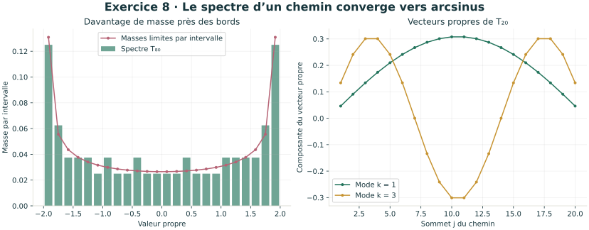
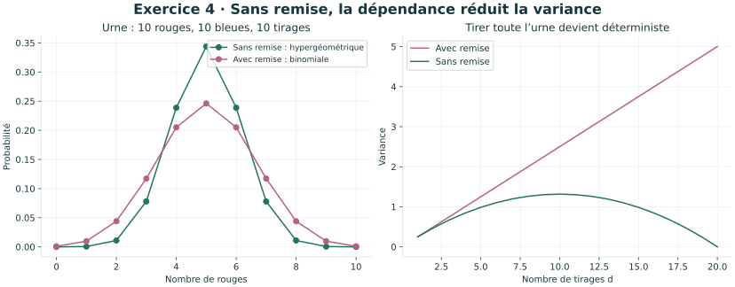
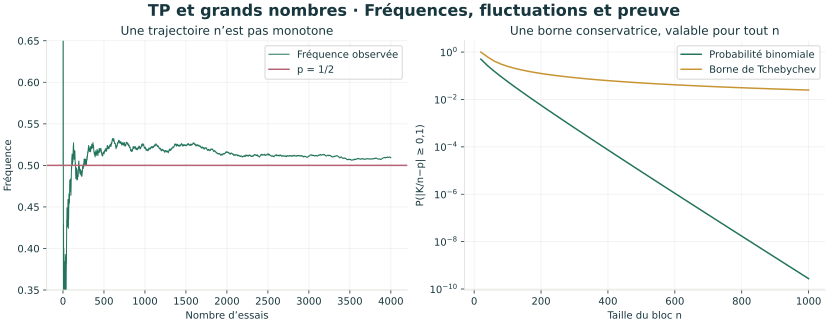

# Six figures scientifiques à réutiliser

Chaque SVG est autonome et peut être ouvert dans un navigateur, imprimé ou intégré
à un cours. Les figures sont générées par NumPy et Matplotlib à partir des modèles.









Depuis le dossier `probabilites_cpge` :

```console
python -m pip install -r requirements-illustrations.txt
python illustrations.py
```

Les simulations de ces figures utilisent une graine fixe. Les lignes théoriques
sont distinguées des observations. Les approximations et modèles sont détaillés
dans [le cours](../COURS.md).
