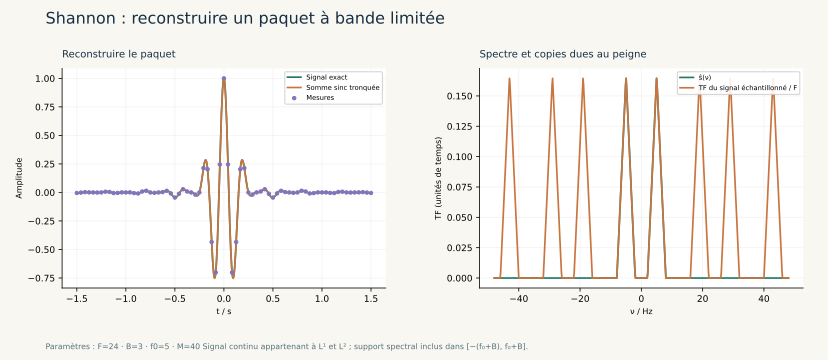

# Séries & Signaux · CPGE sup / spé

**Atelier 12 · sixième volet de mathématiques · analyse du signal.**



**30 laboratoires interactifs, 60 leçons, 60 exercices corrigés et 30 figures scientifiques originales**, à partir des fiches **M10 et M11**, pages **98 à 111** du recueil de A. R. Les objectifs, les variables, les unités, les hypothèses et les techniques du cours précèdent chaque TP, avec des repères **sup / spé / au-delà** et trois premières manipulations guidées.

L’application Python s’ouvre dans le navigateur. Elle fonctionne hors ligne après installation de NumPy ; les courbes, bilans et scènes proviennent des calculs. Les cours et corrections sont aussi disponibles dans [COURS.md](COURS.md) et [EXERCICES.md](EXERCICES.md).

## Ouvrir l’atelier

Sous Windows, double-cliquer sur **`Lancer_Series_Signaux.cmd`**, à la racine du dépôt ou dans ce dossier. Python **3.10 ou plus récent** est nécessaire. Le lanceur prépare un environnement Python et installe NumPy si besoin.

Sous Linux ou macOS, depuis ce dossier :

```bash
python3 -m venv .venv
source .venv/bin/activate
python -m pip install -r requirements.txt
python series_transformees_signal.py
```

L’adresse locale est <http://127.0.0.1:8776>. Le serveur reste ouvert pendant l’utilisation ; `Ctrl+C` le ferme. Un autre port se choisit avec `--port 8781`.

## Les priorités du recueil

| Passage | Laboratoires et techniques |
| --- | --- |
| TP p.99, suite plus démonstrative | **Le pic qui échappe au maillage** : `fₙ(x)=nx/(1+n²x²)`, maximum exact `1/2` en `1/n`, convergence simple et uniforme sur les compacts éloignés de zéro. La **concentration d’une unité d’aire** montre ensuite pourquoi l’interversion exige des hypothèses. Le TP d’origine reste disponible pour l’annulation de l’ordre deux et la convergence normale. |
| Exercice 4, p.103–104 | **Une EDO fabrique les coefficients** : développement de `arcsin(x)/√(1−x²)`, récurrence, unicité, rayon et reste. |
| Exercice 5, p.103–104 | **Une série entière à l’échelle e²x** : rayon infini et équivalent `exp(e²x)`, calcul en logarithmes, concentration des termes et troncature insuffisante. |
| Exercice 10, p.103 et 105 | **Binôme généralisé**, puis **pendule non linéaire** : intégration d’une série, intégrale elliptique, énergie et période hors de l’approximation des petites oscillations. |
| Exercice 11, p.103 et 105 | **Additionner des aires positives** : décomposition de `t/sinh(t)`, interversion justifiée, somme sur les entiers impairs et encadrement du reste. |
| Exercice 12, p.103 et 105 | **Une domination pour des signaux complexes** : fonctions à saut, parties réelle et imaginaire, intégrales et majorant indépendant de n. |
| TP p.107 | **RC : pas, impulsion, rampe et état initial** ; **gain, phase et trois harmoniques** ; **intégrale de Dirichlet par régularisation d’Abel**. |
| Page essentielle 108 | **Convolution de portes**, **noyau de Poisson**, **Poisson sur une gaussienne**, **Shannon sur un paquet à bande limitée**, **repliement et filtre antirepliement**, **corrélation et temps de vol**. |
| Séries de Fourier p.110–111 | Créneau, triangle, rampe : demi-somme aux sauts, **Gibbs et Fejér**, **Parseval**, sommes en `1/n²` et `1/n⁴`. |

## Un véritable parcours d’analyse du signal

Les notions du cours aboutissent à une chaîne complète : construire un signal, comprendre son spectre, filtrer avant la mesure, échantillonner, reconstruire, analyser une acquisition et extraire une information.

- **Mesurer** : FFT, fuite spectrale, Hann et Blackman, gain cohérent, largeur des lobes, durée d’acquisition et ajout de zéros.
- **Localiser** : spectrogramme d’un chirp, compromis entre précision temporelle et fréquentielle ; la carte provient des FFT locales.
- **Transmettre** : modulation d’amplitude, bandes latérales, démodulation synchrone et erreurs de phase ou de fréquence.
- **Détecter** : impulsion codée, réception bruitée, intercorrélation, retard et distance aller-retour.
- **Débruiter** : moyenne glissante et filtre récursif, variance du bruit résiduel et distorsion du signal utile séparées.

Les repères de niveau indiquent des acquis à réinvestir selon la filière, et des prolongements explicitement introduits. Les distributions, le théorème de Shannon, les intégrales elliptiques et la STFT ne sont pas présentés comme uniformément exigibles dans toutes les filières.

## Conventions et lecture des expériences

Fourier en **Hz** : `ŝ(ν)=∫ℝ s(t) exp(−2iπνt) dt`, inverse avec `exp(+2iπνt)` et sans facteur. Laplace **unilatérale** : `S(p)=∫₀∞ s(t) exp(−pt) dt`, avec la causalité et le domaine de convergence précisés. Dans Python, `sinc(u)=sin(πu)/(πu)` ; celle notée `sin(z)/z` dans le recueil vaut `sinc(z/π)`.

La FFT représente une acquisition finie : son pas natif vaut `F/N=1/T`. L’ajout de zéros densifie la courbe sans allonger l’observation. DC et Nyquist ne sont pas doublés dans le spectre monolatéral. La reconstruction de Shannon emploie un nombre fini de mesures : son erreur de troncature reste distincte d’un éventuel repliement.

Les normes, maxima et aires décisifs sont calculés analytiquement lorsque les formules le permettent. Les quadratures et la trajectoire du pendule sont signalées comme numériques. Le curseur animé est une aide à la lecture des courbes ; la scène du pendule suit une trajectoire calculée.

Les résultats courants se téléchargent en **JSON**, avec leurs paramètres, les séries de points, les métriques et les hypothèses. La [galerie SVG](illustrations/README.md) sert aux révisions et aux présentations. Les [errata autorisés](ERRATA.md) concernent uniquement des erreurs de formules vérifiées dans le contexte de cet extrait.

[Premiers parcours et missions](PARCOURS.md) · [Correspondance avec le recueil](MATRICE_RECUEIL.md) · [Guide de lancement](LISEZ_MOI.md).

## Vérifier et réutiliser le programme

```bash
python -X utf8 -m unittest -v test_series test_transformees test_signal test_entree test_pedagogie test_serveur
```

Les tests confrontent les modèles à des intégrales indépendantes, des équations différentielles, des bilans de Parseval et des identités analytiques. GitHub vérifie Windows et Ubuntu, avec Python 3.10 et 3.12.

Pour régénérer les figures, installer le complément Matplotlib :

```bash
python -m pip install -r requirements-illustrations.txt
python series_transformees_signal.py --export-illustrations
```

Les fichiers `catalogue_*.py` définissent les expériences ; `modeles_*.py` portent les calculs, `cours.py` les démonstrations et exercices, `reperes.py` les introductions guidées. Aucune copie du PDF source n’est distribuée.
