# Galerie scientifique

Trente figures originales, calculées avec les modèles de l’atelier. Les paramètres et le cadre du modèle figurent dans chaque légende.

## 1. Le pic qui échappe au maillage

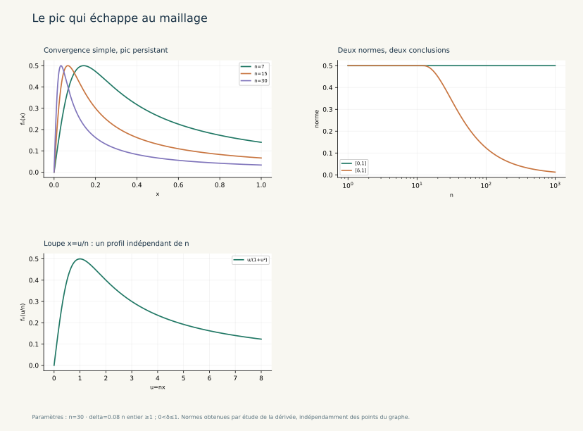

Paramètres : n=30 · delta=0.08. n entier ≥1 ; 0<δ≤1. Normes obtenues par étude de la dérivée, indépendamment des points du graphe.

## 2. La limite perd une unité d’aire

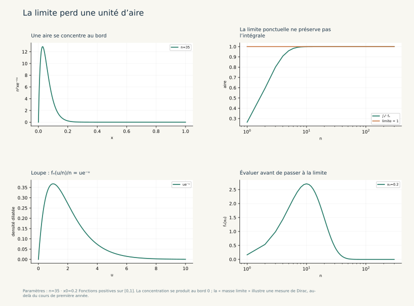

Paramètres : n=35 · x0=0.2. Fonctions positives sur [0,1]. La concentration se produit au bord 0 ; la « masse limite » illustre une mesure de Dirac, au-delà du cours de première année.

## 3. Deux termes qui s’annulent

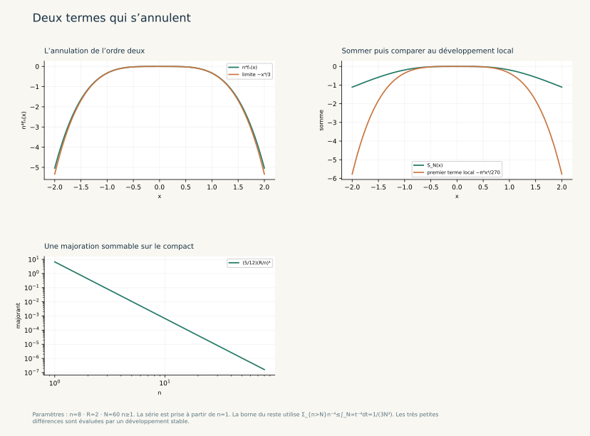

Paramètres : n=8 · R=2 · N=60. n≥1. La série est prise à partir de n=1. La borne du reste utilise Σ_{n>N}n⁻⁴≤∫_N∞t⁻⁴dt=1/(3N³). Les très petites différences sont évaluées par un développement stable.

## 4. Dériver une série sur un compact

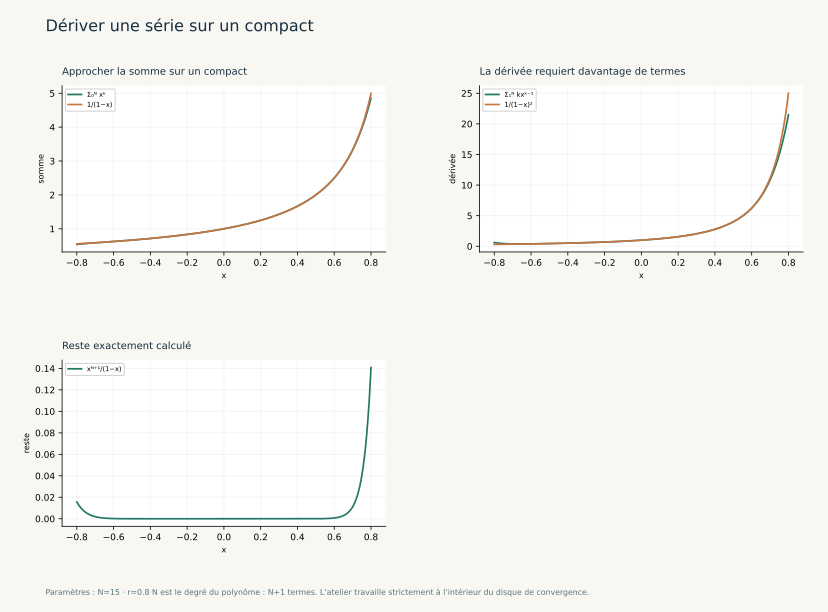

Paramètres : N=15 · r=0.8. N est le degré du polynôme : N+1 termes. L’atelier travaille strictement à l’intérieur du disque de convergence.

## 5. Une EDO fabrique les coefficients

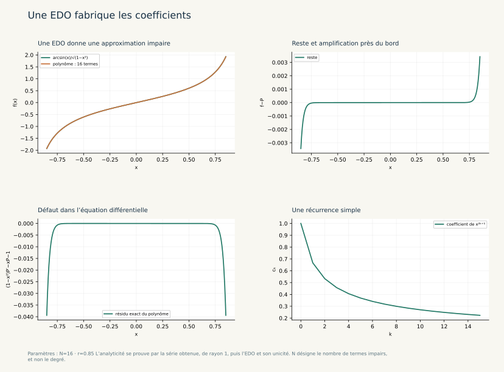

Paramètres : N=16 · r=0.85. L’analyticité se prouve par la série obtenue, de rayon 1, puis l’EDO et son unicité. N désigne le nombre de termes impairs, et non le degré.

## 6. Une série entière à l’échelle e²x

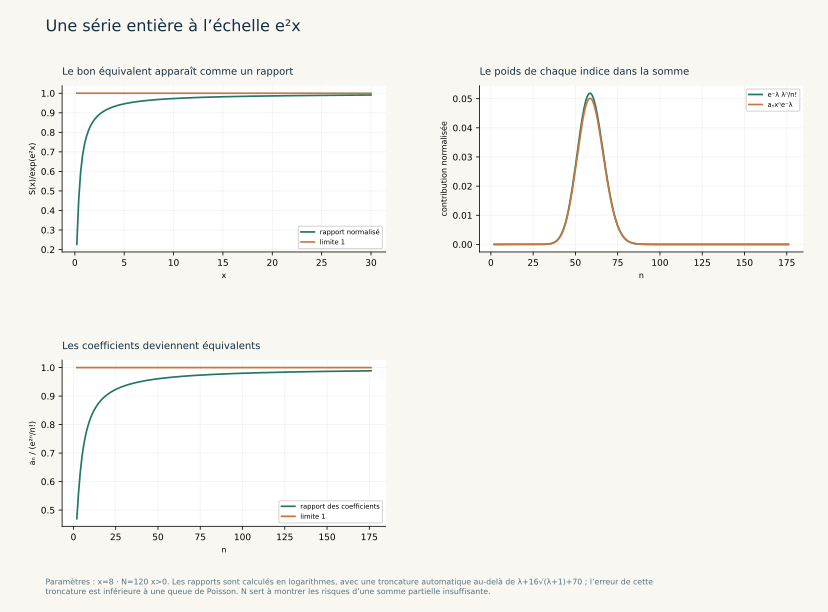

Paramètres : x=8 · N=120. x>0. Les rapports sont calculés en logarithmes, avec une troncature automatique au-delà de λ+16√(λ+1)+70 ; l’erreur de cette troncature est inférieure à une queue de Poisson. N sert à montrer les risques d’une somme partielle insuffisante.

## 7. Au-delà du binôme polynomial

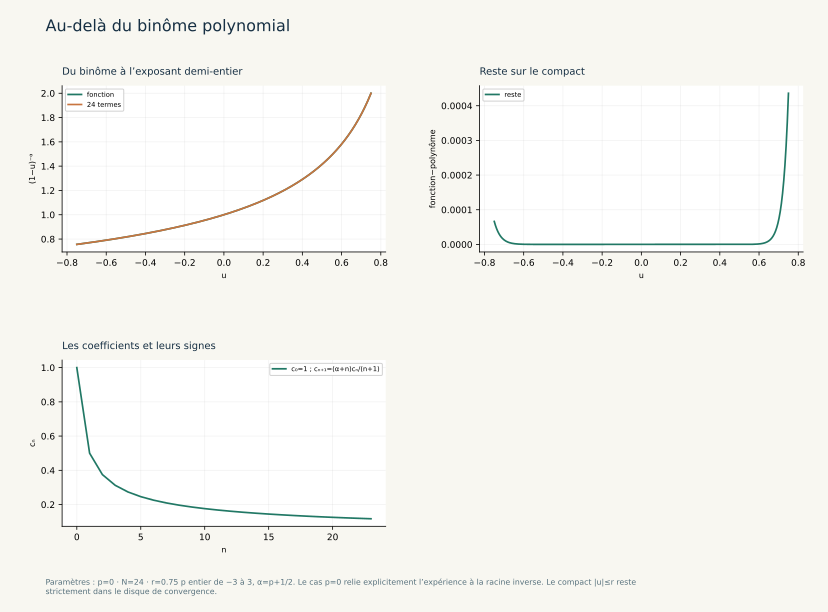

Paramètres : p=0 · N=24 · r=0.75. p entier de −3 à 3, α=p+1/2. Le cas p=0 relie explicitement l’expérience à la racine inverse. Le compact |u|≤r reste strictement dans le disque de convergence.

## 8. La période du pendule devient elliptique

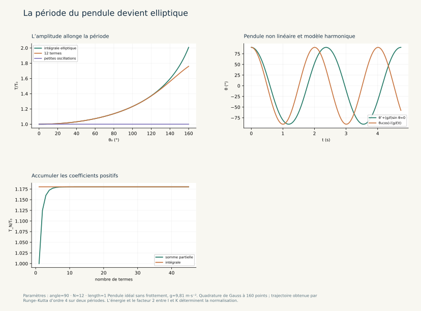

Paramètres : angle=90 · N=12 · length=1. Pendule idéal sans frottement, g=9,81 m·s⁻². Quadrature de Gauss à 160 points ; trajectoire obtenue par Runge–Kutta d’ordre 4 sur deux périodes. L’énergie et le facteur 2 entre I et K déterminent la normalisation.

## 9. Additionner des aires positives

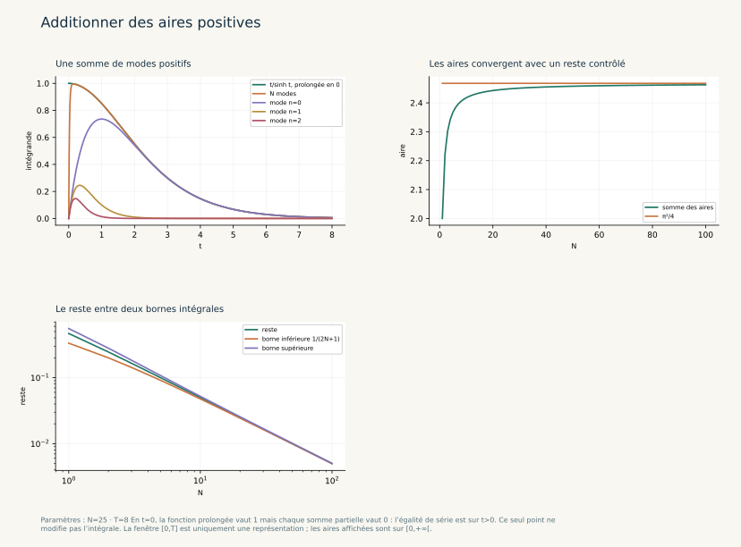

Paramètres : N=25 · T=8. En t=0, la fonction prolongée vaut 1 mais chaque somme partielle vaut 0 : l’égalité de série est sur t>0. Ce seul point ne modifie pas l’intégrale. La fenêtre [0,T] est uniquement une représentation ; les aires affichées sont sur [0,+∞[.

## 10. Une domination pour des signaux complexes

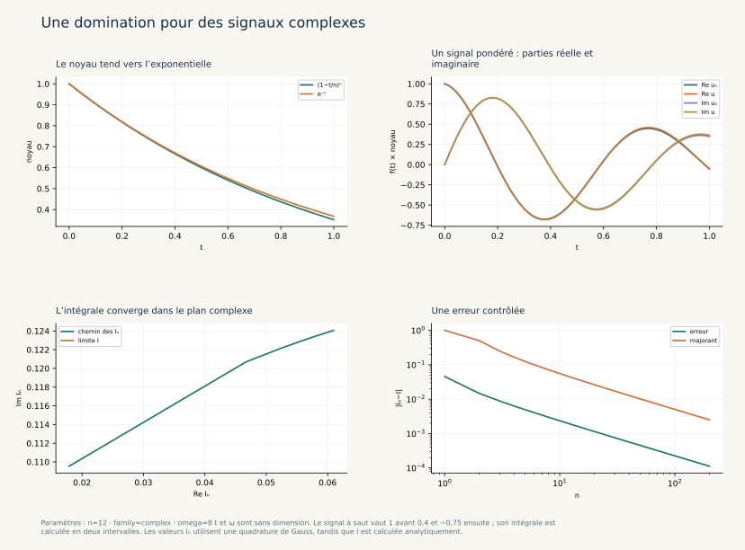

Paramètres : n=12 · family=complex · omega=8. t et ω sont sans dimension. Le signal à saut vaut 1 avant 0,4 et −0,75 ensuite ; son intégrale est calculée en deux intervalles. Les valeurs Iₙ utilisent une quadrature de Gauss, tandis que I est calculée analytiquement.

## 11. RC : du calcul de Laplace à la réponse temporelle

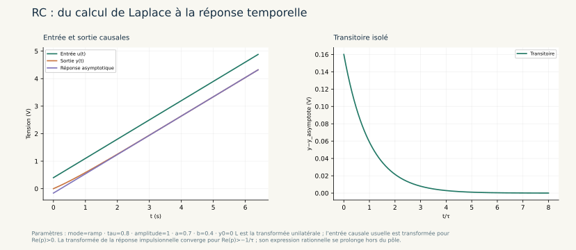

Paramètres : mode=ramp · tau=0.8 · amplitude=1 · a=0.7 · b=0.4 · y0=0. L est la transformée unilatérale ; l’entrée causale usuelle est transformée pour Re(p)>0. La transformée de la réponse impulsionnelle converge pour Re(p)>−1/τ ; son expression rationnelle se prolonge hors du pôle.

## 12. RC : gain, phase et déformation de trois harmoniques

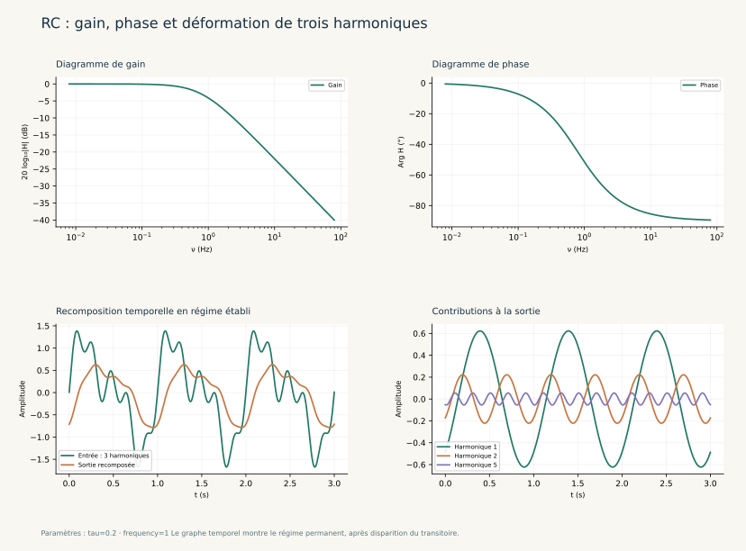

Paramètres : tau=0.2 · frequency=1. Le graphe temporel montre le régime permanent, après disparition du transitoire.

## 13. RLC : pôles, amortissement et trois régimes

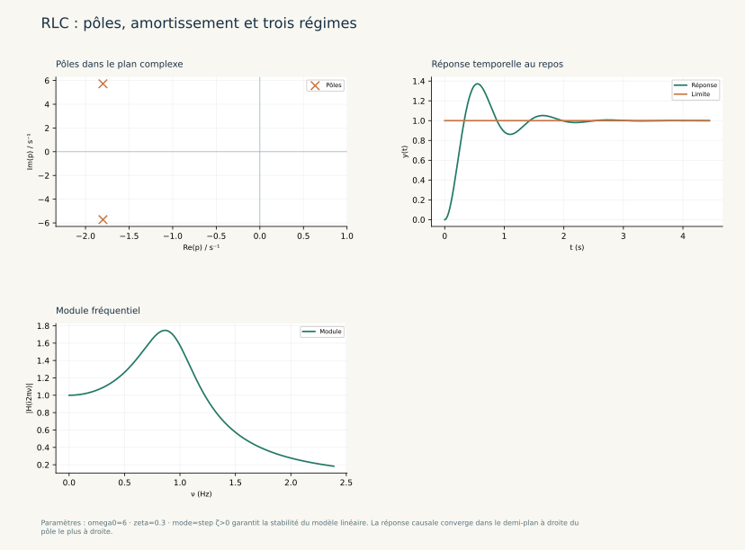

Paramètres : omega0=6 · zeta=0.3 · mode=step. ζ>0 garantit la stabilité du modèle linéaire. La réponse causale converge dans le demi-plan à droite du pôle le plus à droite.

## 14. L’intégrale de Dirichlet par régularisation d’Abel

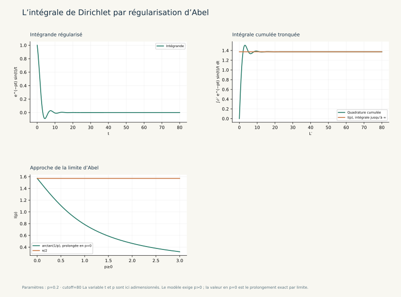

Paramètres : p=0.2 · cutoff=80. La variable t et p sont ici adimensionnés. Le modèle exige p>0 ; la valeur en p=0 est le prolongement exact par limite.

## 15. Porte, sinus cardinal et phase d’une translation

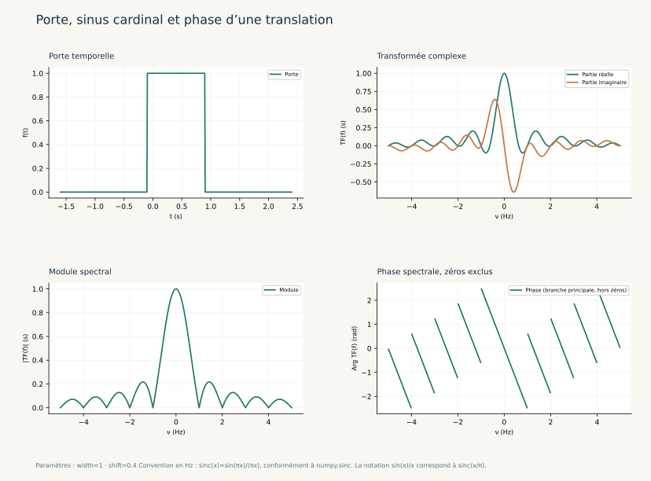

Paramètres : width=1 · shift=0.4. Convention en Hz : sinc(x)=sin(πx)/(πx), conformément à numpy.sinc. La notation sin(x)/x correspond à sinc(x/π).

## 16. Gaussienne : Fourier et incertitude temps–fréquence

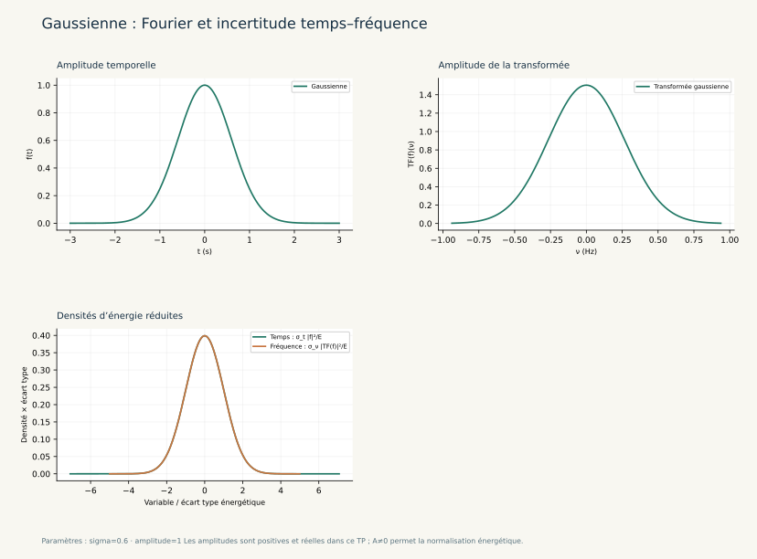

Paramètres : sigma=0.6 · amplitude=1. Les amplitudes sont positives et réelles dans ce TP ; A≠0 permet la normalisation énergétique.

## 17. Convoluer : l’aire d’un recouvrement mobile

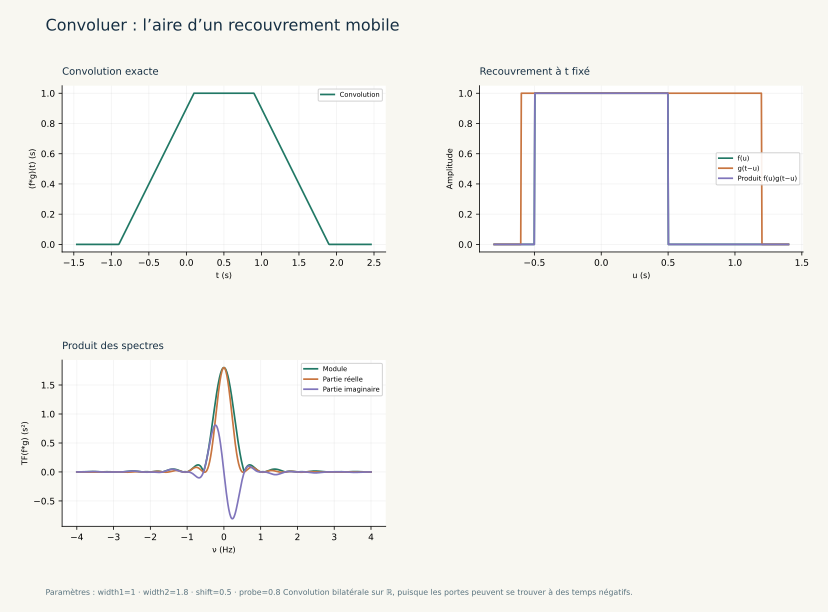

Paramètres : width1=1 · width2=1.8 · shift=0.5 · probe=0.8. Convolution bilatérale sur ℝ, puisque les portes peuvent se trouver à des temps négatifs.

## 18. Synthèse de Fourier : Gibbs et moyennes de Fejér

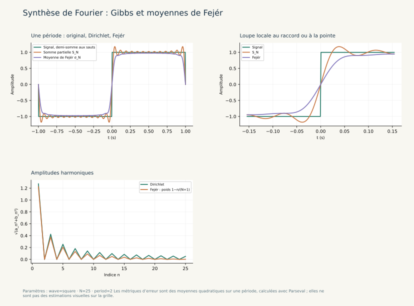

Paramètres : wave=square · N=25 · period=2. Les métriques d’erreur sont des moyennes quadratiques sur une période, calculées avec Parseval ; elles ne sont pas des estimations visuelles sur la grille.

## 19. Parseval : énergie, harmoniques et sommes classiques

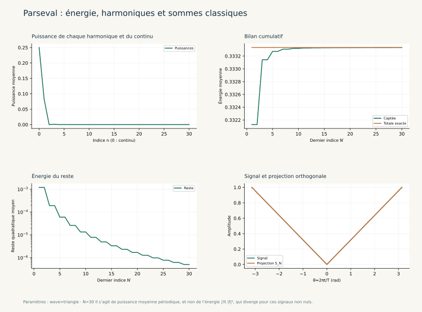

Paramètres : wave=triangle · N=30. Il s’agit de puissance moyenne périodique, et non de l’énergie ∫ℝ |f|², qui diverge pour ces signaux non nuls.

## 20. Noyau de Poisson : convergence normale et lissage

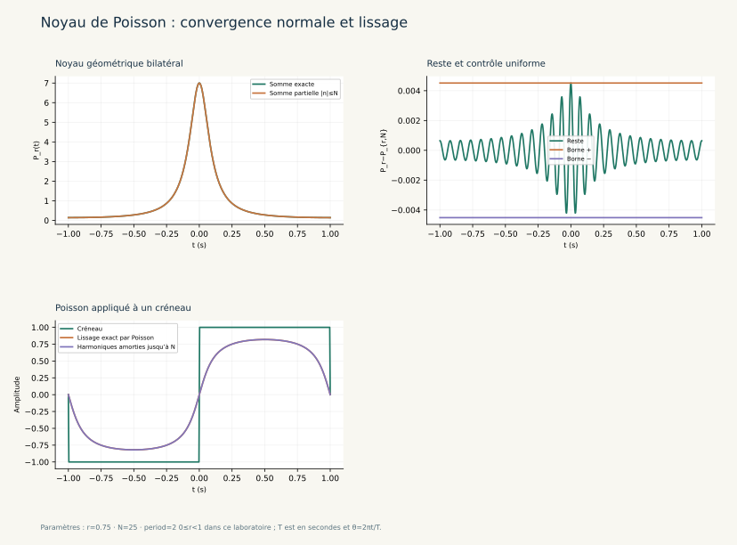

Paramètres : r=0.75 · N=25 · period=2. 0≤r<1 dans ce laboratoire ; T est en secondes et θ=2πt/T.

## 21. Poisson : une gaussienne, deux descriptions

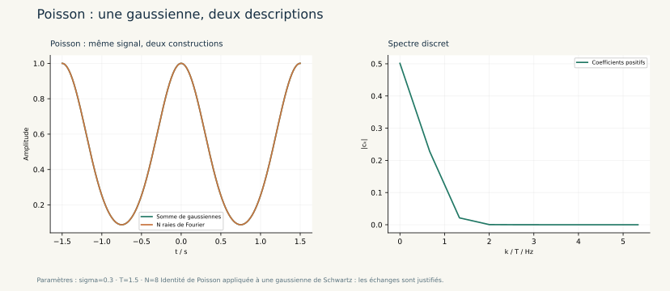

Paramètres : sigma=0.3 · T=1.5 · N=8. Identité de Poisson appliquée à une gaussienne de Schwartz : les échanges sont justifiés.

## 22. Shannon : reconstruire un paquet à bande limitée

Paramètres : F=24 · B=3 · f0=5 · M=40. Signal continu appartenant à L¹ et L² ; support spectral inclus dans [−(f₀+B), f₀+B].

## 23. Repliement : deux fréquences, les mêmes mesures

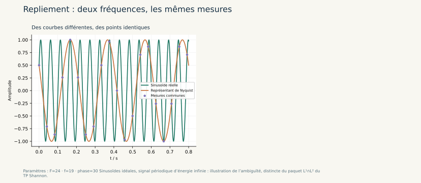

Paramètres : F=24 · f=19 · phase=30. Sinusoïdes idéales, signal périodique d’énergie infinie : illustration de l’ambiguïté, distincte du paquet L¹∩L² du TP Shannon.

## 24. Avant la mesure : le filtre antirepliement

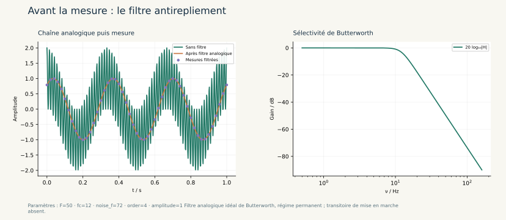

Paramètres : F=50 · fc=12 · noise_f=72 · order=4 · amplitude=1. Filtre analogique idéal de Butterworth, régime permanent ; transitoire de mise en marche absent.

## 25. FFT : fuite spectrale et fenêtrage

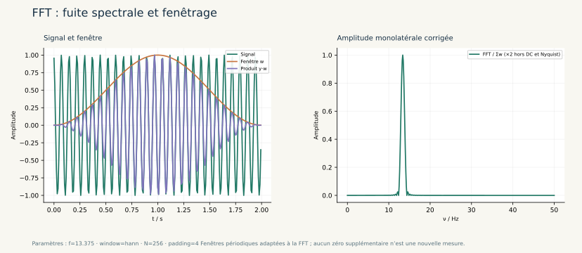

Paramètres : f=13.375 · window=hann · N=256 · padding=4. Fenêtres périodiques adaptées à la FFT ; aucun zéro supplémentaire n’est une nouvelle mesure.

## 26. Résolution : voir deux fréquences proches

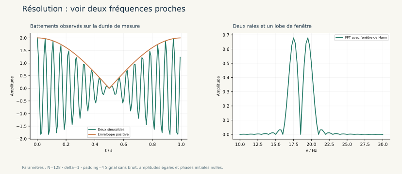

Paramètres : N=128 · delta=1 · padding=4. Signal sans bruit, amplitudes égales et phases initiales nulles.

## 27. Spectrogramme : suivre un chirp

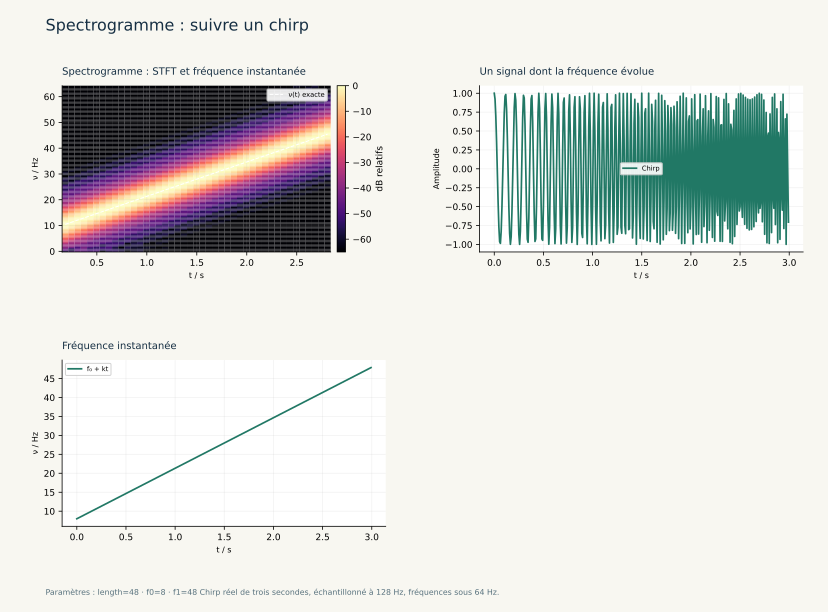

Paramètres : length=48 · f0=8 · f1=48. Chirp réel de trois secondes, échantillonné à 128 Hz, fréquences sous 64 Hz.

## 28. Modulation : traduire le spectre d’un message

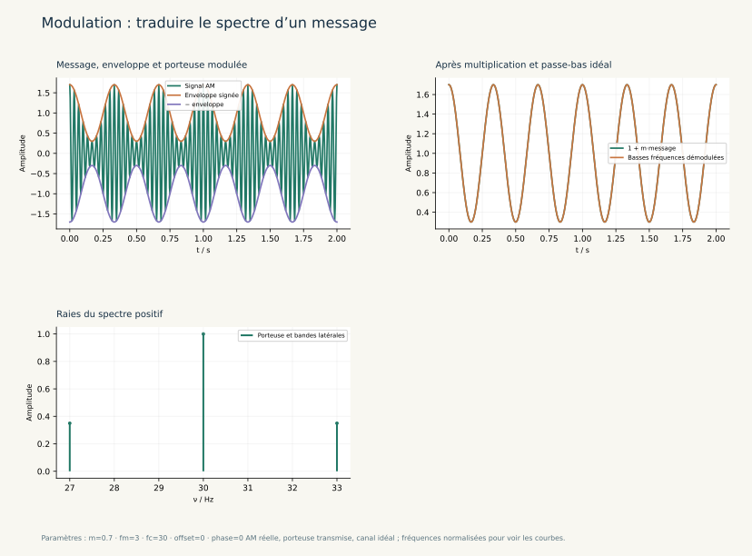

Paramètres : m=0.7 · fm=3 · fc=30 · offset=0 · phase=0. AM réelle, porteuse transmise, canal idéal ; fréquences normalisées pour voir les courbes.

## 29. Corrélation : mesurer un temps de vol

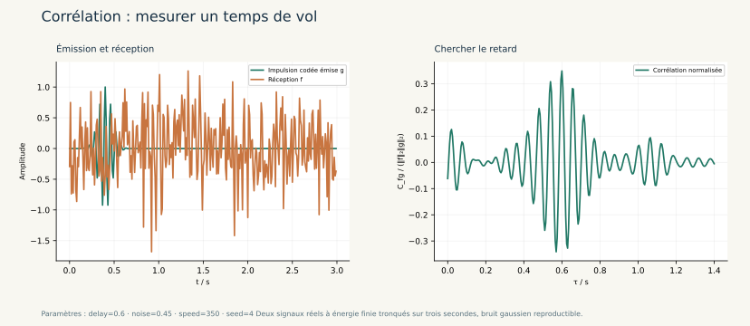

Paramètres : delay=0.6 · noise=0.45 · speed=350 · seed=4. Deux signaux réels à énergie finie tronqués sur trois secondes, bruit gaussien reproductible.

## 30. Débruiter : réduction du bruit et déformation

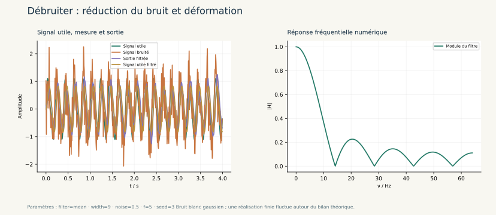

Paramètres : filter=mean · width=9 · noise=0.5 · f=5 · seed=3. Bruit blanc gaussien ; une réalisation finie fluctue autour du bilan théorique.
