# Galerie scientifique · Topologie & Ensembles

Trente figures originales, calculées avec les modèles. Les critères topologiques exacts sont expliqués dans chaque TP ; le dessin est une représentation finie.

## 1. Une boule change de forme, pas de définition

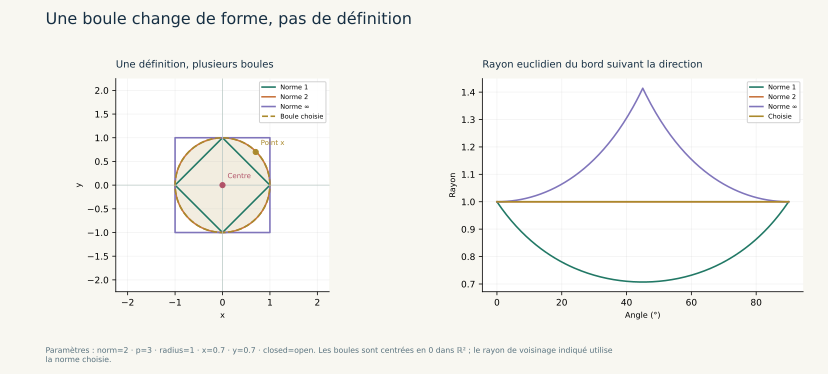

Paramètres : norm=2 · p=3 · radius=1 · x=0.7 · y=0.7 · closed=open. Les boules sont centrées en 0 dans ℝ² ; le rayon de voisinage indiqué utilise la norme choisie.

## 2. Intérieur, adhérence et frontière au microscope

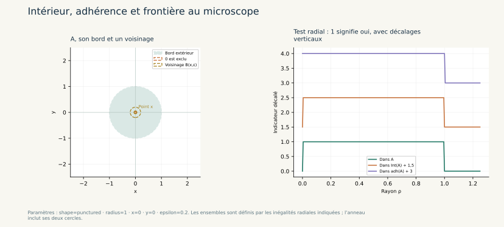

Paramètres : shape=punctured · radius=1 · x=0 · y=0 · epsilon=0.2. Les ensembles sont définis par les inégalités radiales indiquées ; l’anneau inclut ses deux cercles.

## 3. Le point absent où tous les points s’accumulent

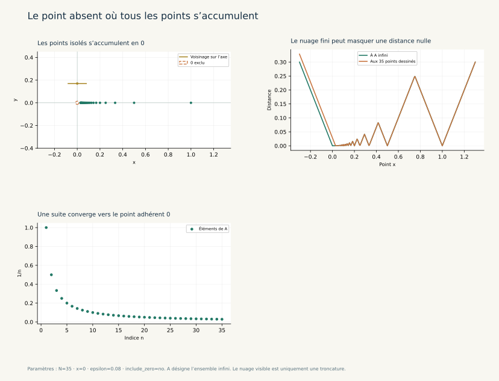

Paramètres : N=35 · x=0 · epsilon=0.08 · include_zero=no. A désigne l’ensemble infini. Le nuage visible est uniquement une troncature.

## 4. Ouvert dans un intervalle, au bord de ℝ

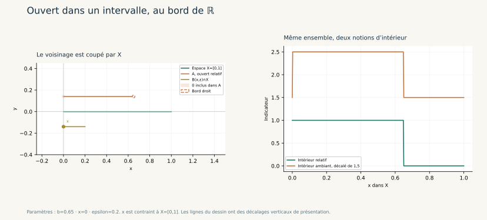

Paramètres : b=0.65 · x=0 · epsilon=0.2. x est contraint à X=[0,1]. Les lignes du dessin ont des décalages verticaux de présentation.

## 5. La limite d’ensembles perd une propriété

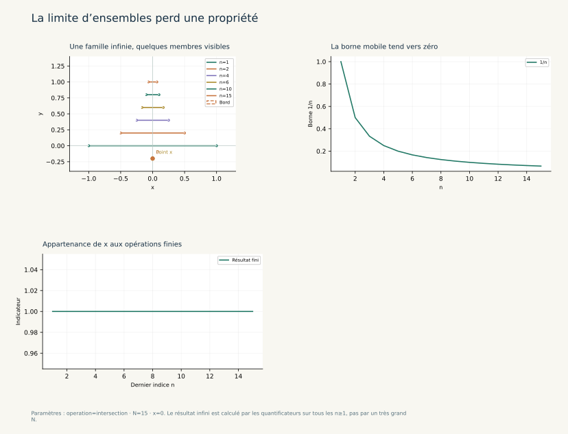

Paramètres : operation=intersection · N=15 · x=0. Le résultat infini est calculé par les quantificateurs sur tous les n≥1, pas par un très grand N.

## 6. Une distance continue, deux projections possibles

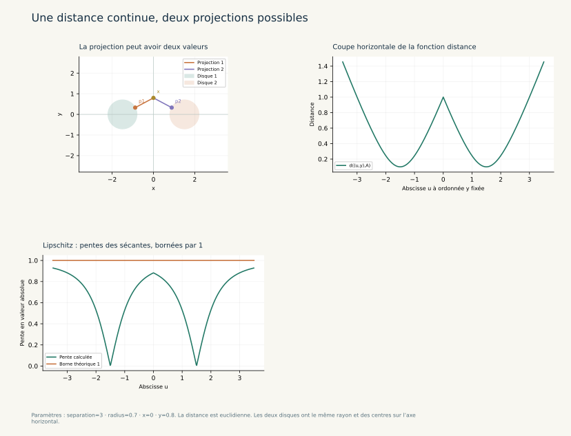

Paramètres : separation=3 · radius=0.7 · x=0 · y=0.8. La distance est euclidienne. Les deux disques ont le même rayon et des centres sur l’axe horizontal.

## 7. Un segment entier, pas seulement des points testés

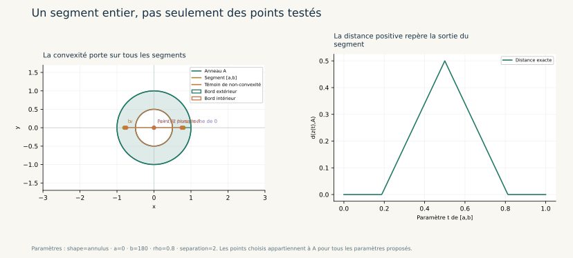

Paramètres : shape=annulus · a=0 · b=180 · rho=0.8 · separation=2. Les points choisis appartiennent à A pour tous les paramètres proposés.

## 8. Fabriquer le plus petit convexe

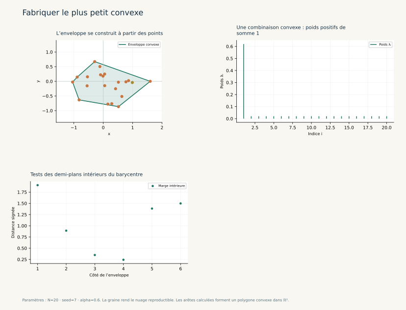

Paramètres : N=20 · seed=7 · alpha=0.6. La graine rend le nuage reproductible. Les arêtes calculées forment un polygone convexe dans ℝ².

## 9. Une projection unique et une inéquation

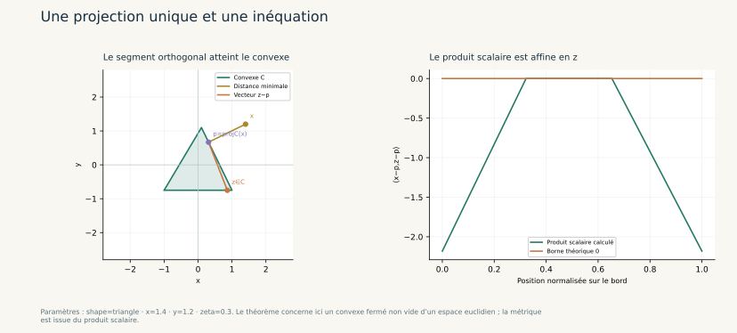

Paramètres : shape=triangle · x=1.4 · y=1.2 · zeta=0.3. Le théorème concerne ici un convexe fermé non vide d’un espace euclidien ; la métrique est issue du produit scalaire.

## 10. Contourner un trou, séparer deux composantes

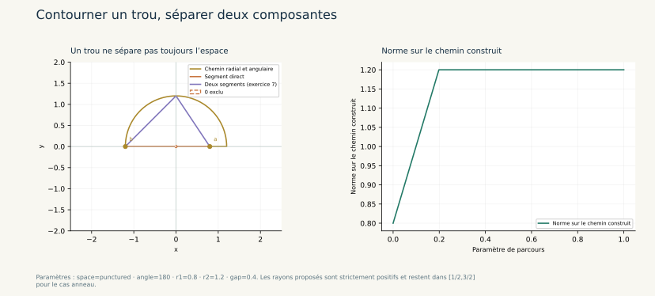

Paramètres : space=punctured · angle=180 · r1=0.8 · r2=1.2 · gap=0.4. Les rayons proposés sont strictement positifs et restent dans [1/2,3/2] pour le cas anneau.

## 11. Deux valeurs d’adhérence, deux extractions

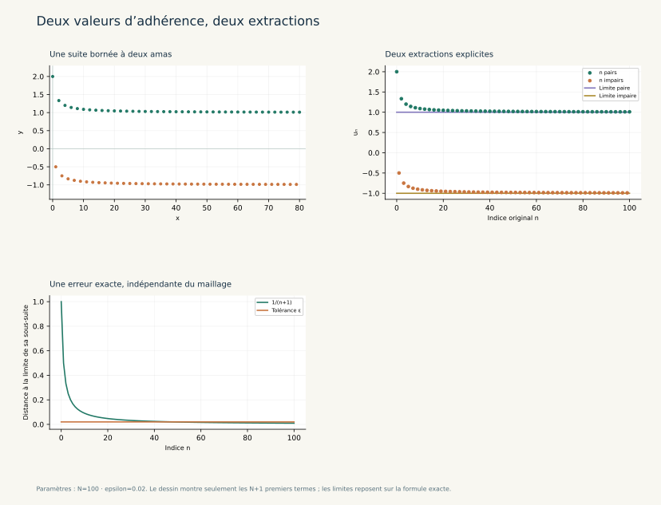

Paramètres : N=100 · epsilon=0.02. Le dessin montre seulement les N+1 premiers termes ; les limites reposent sur la formule exacte.

## 12. Le TP : extraire sans répéter un indice

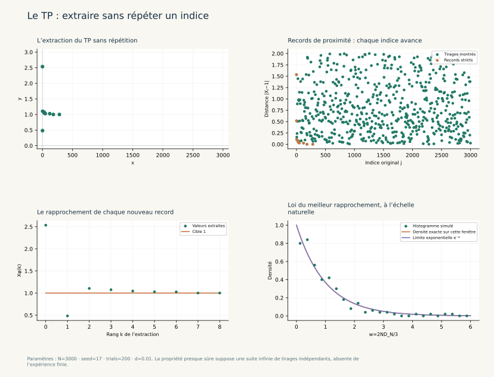

Paramètres : N=3000 · seed=17 · trials=200 · d=0.01. La propriété presque sûre suppose une suite infinie de tirages indépendants, absente de l’expérience finie.

## 13. Héron : Cauchy dans ℚ, limite dans ℝ

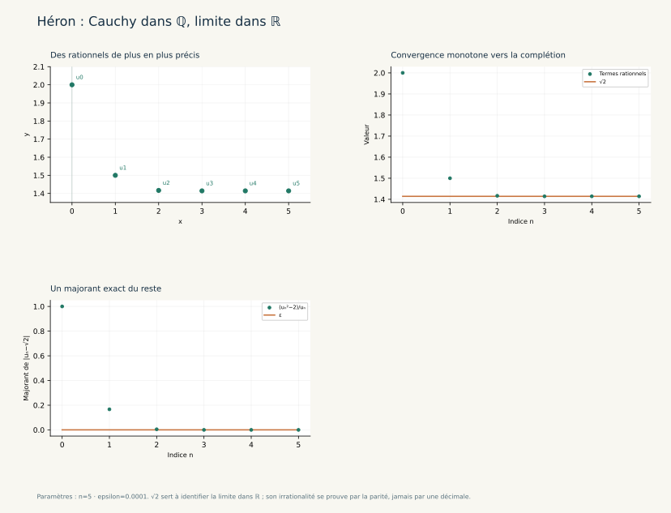

Paramètres : n=5 · epsilon=0.0001. √2 sert à identifier la limite dans ℝ ; son irrationalité se prouve par la parité, jamais par une décimale.

## 14. Un recouvrement fini qui couvre vraiment

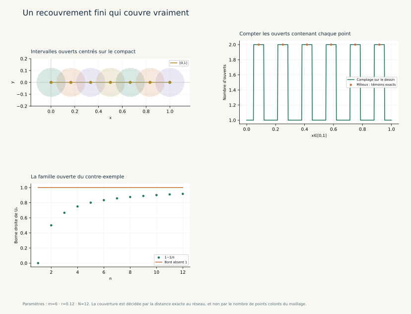

Paramètres : m=6 · r=0.12 · N=12. La couverture est décidée par la distance exacte au réseau, et non par le nombre de points colorés du maillage.

## 15. Maximum sur une ellipse, supremum sans maximum

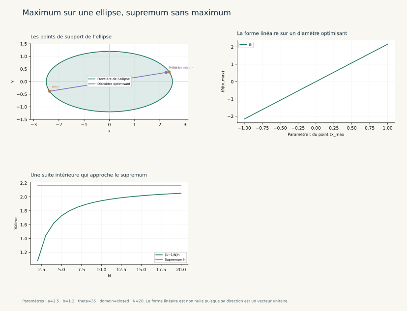

Paramètres : a=2.5 · b=1.2 · theta=35 · domain=closed · N=20. La forme linéaire est non nulle puisque sa direction est un vecteur unitaire.

## 16. Uniforme sur un compact, sans être lipschitzienne

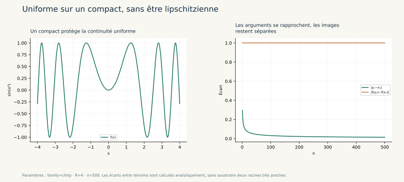

Paramètres : family=chirp · R=4 · n=500. Les écarts entre témoins sont calculés analytiquement, sans soustraire deux racines très proches.

## 17. La somme de deux compacts dessine un stade

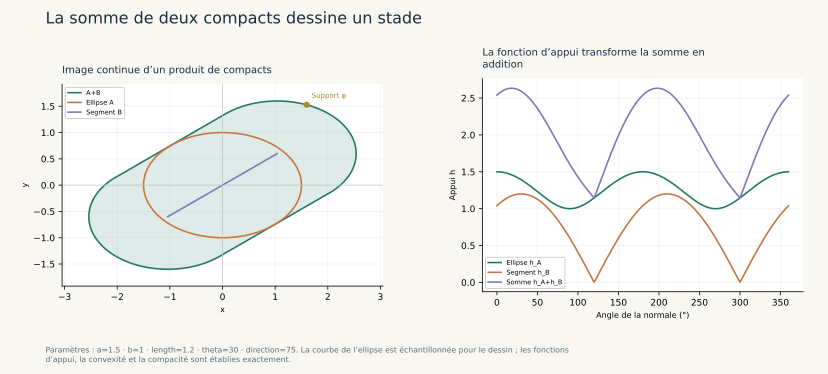

Paramètres : a=1.5 · b=1 · length=1.2 · theta=30 · direction=75. La courbe de l’ellipse est échantillonnée pour le dessin ; les fonctions d’appui, la convexité et la compacité sont établies exactement.

## 18. Toutes les applications linéaires sont continues

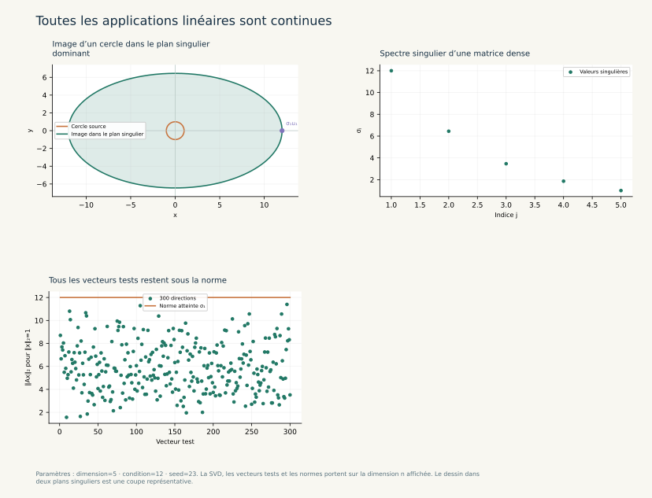

Paramètres : dimension=5 · condition=12 · seed=23. La SVD, les vecteurs tests et les normes portent sur la dimension n affichée. Le dessin dans deux plans singuliers est une coupe représentative.

## 19. Des normes qui cessent d’être équivalentes

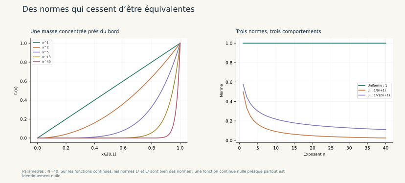

Paramètres : N=40. Sur les fonctions continues, les normes L¹ et L² sont bien des normes : une fonction continue nulle presque partout est identiquement nulle.

## 20. Une infinité de vecteurs séparés dans une boule

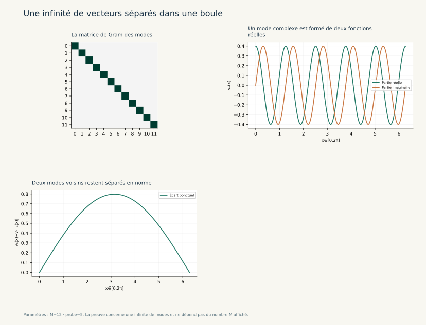

Paramètres : M=12 · probe=5. La preuve concerne une infinité de modes et ne dépend pas du nombre M affiché.

## 21. Dénombrer sans cesser d’être dense

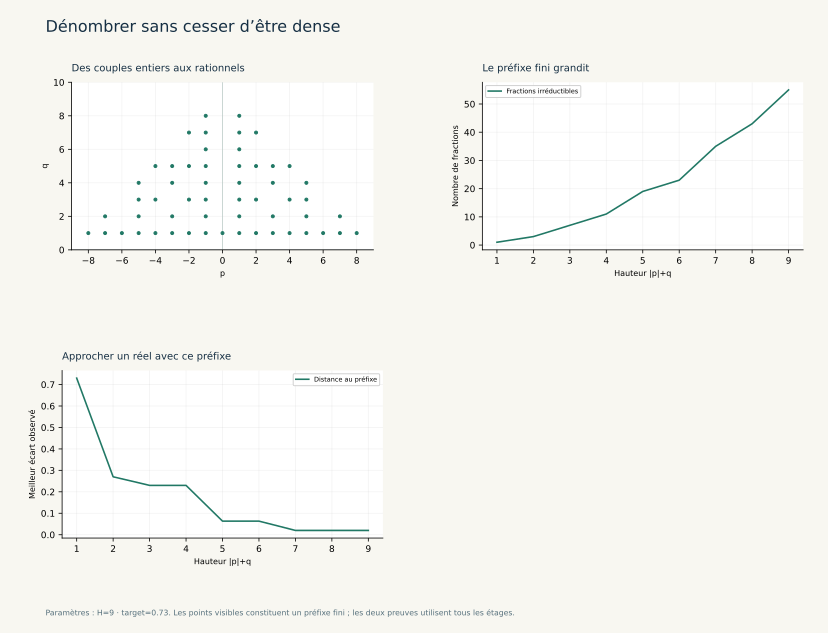

Paramètres : H=9 · target=0.73. Les points visibles constituent un préfixe fini ; les deux preuves utilisent tous les étages.

## 22. Une diagonale échappe à toute liste

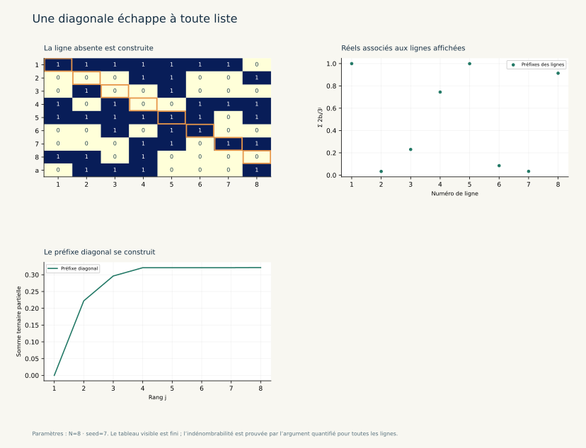

Paramètres : N=8 · seed=7. Le tableau visible est fini ; l’indénombrabilité est prouvée par l’argument quantifié pour toutes les lignes.

## 23. Un compact sans intervalle, pourtant indénombrable

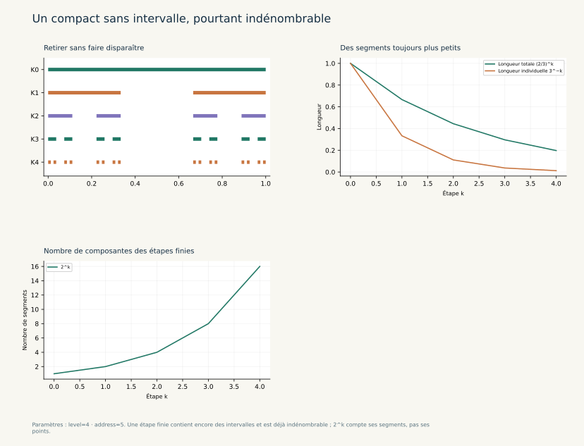

Paramètres : level=4 · address=5. Une étape finie contient encore des intervalles et est déjà indénombrable ; 2^k compte ses segments, pas ses points.

## 24. Deux ensembles denses qui ne se rencontrent pas

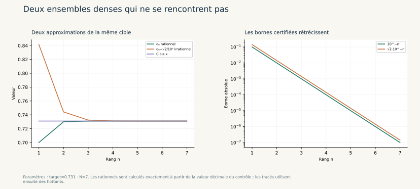

Paramètres : target=0.731 · N=7. Les rationnels sont calculés exactement à partir de la valeur décimale du contrôle ; les tracés utilisent ensuite des flottants.

## 25. Connexe ne signifie pas connexe par arcs

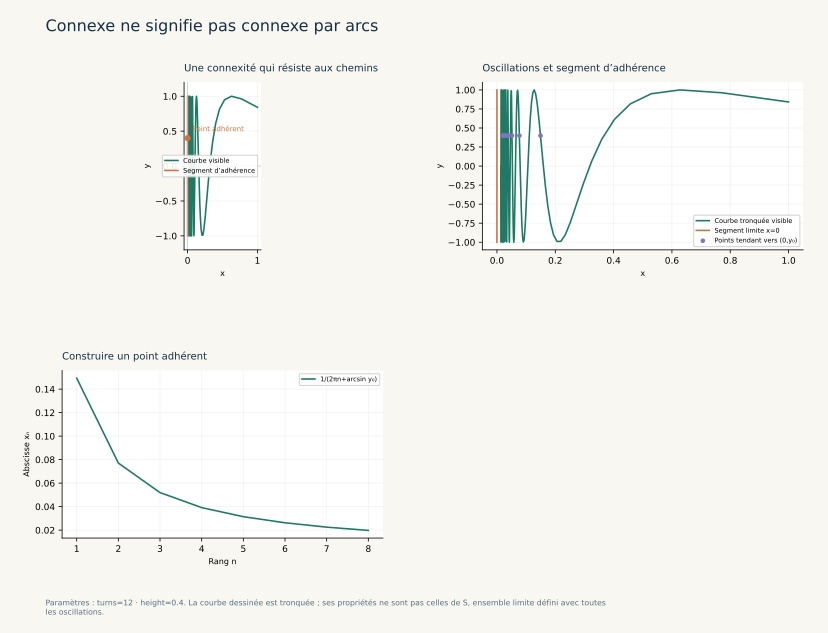

Paramètres : turns=12 · height=0.4. La courbe dessinée est tronquée ; ses propriétés ne sont pas celles de S, ensemble limite défini avec toutes les oscillations.

## 26. Le signe du déterminant sépare GL₄(ℝ)

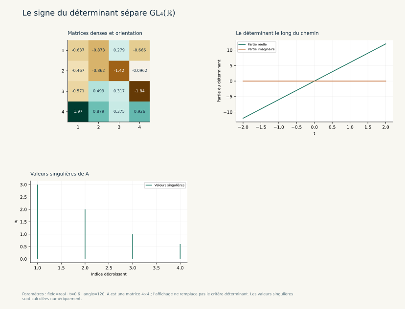

Paramètres : field=real · t=0.6 · angle=120. A est une matrice 4×4 ; l’affichage ne remplace pas le critère déterminant. Les valeurs singulières sont calculées numériquement.

## 27. O₄ compact, SL₄ fermé mais non borné

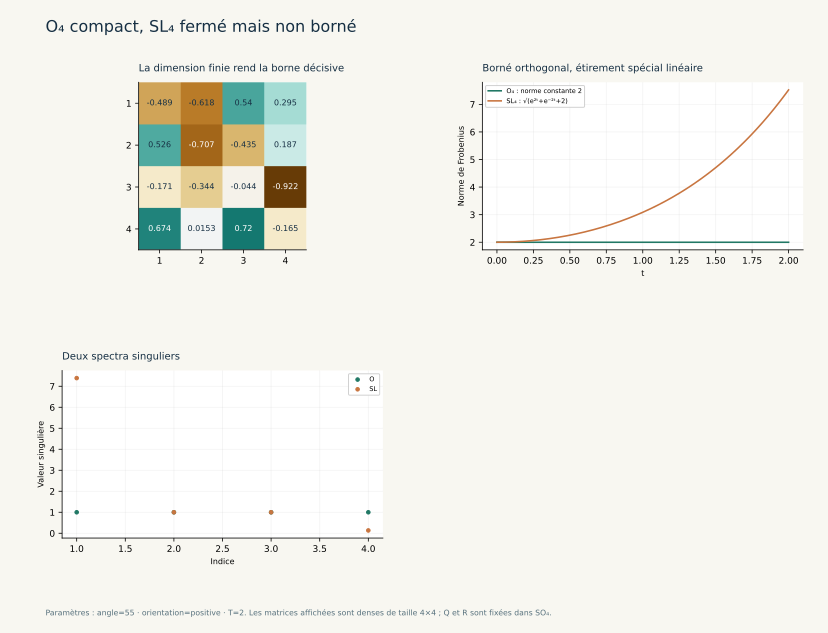

Paramètres : angle=55 · orientation=positive · T=2. Les matrices affichées sont denses de taille 4×4 ; Q et R sont fixées dans SO₄.

## 28. La complétude transforme une contraction en solution

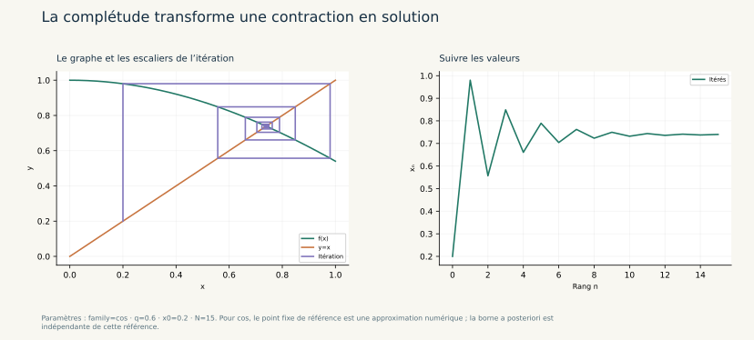

Paramètres : family=cos · q=0.6 · x0=0.2 · N=15. Pour cos, le point fixe de référence est une approximation numérique ; la borne a posteriori est indépendante de cette référence.

## 29. Des ensembles de niveau changent de connexité

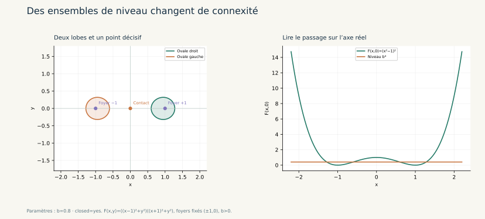

Paramètres : b=0.8 · closed=yes. F(x,y)=((x−1)²+y²)((x+1)²+y²), foyers fixés (±1,0), b>0.

## 30. Une bijection continue a-t-elle un inverse continu ?

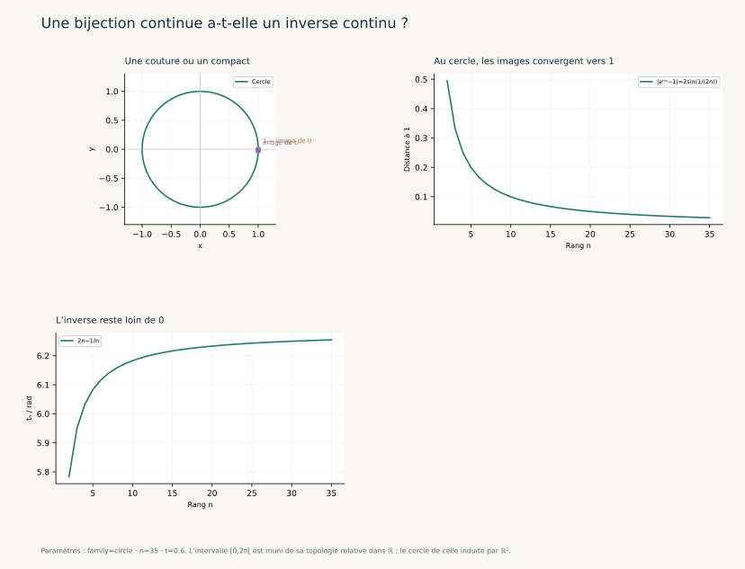

Paramètres : family=circle · n=35 · t=0.6. L’intervalle [0,2π[ est muni de sa topologie relative dans ℝ ; le cercle de celle induite par ℝ².
